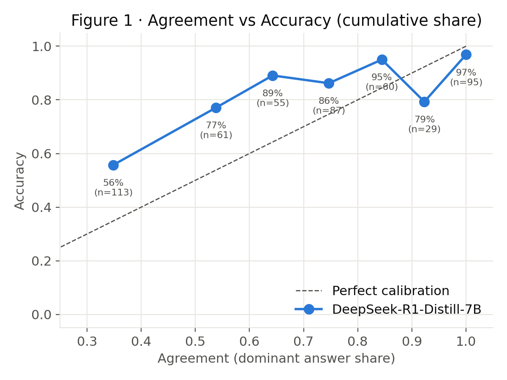
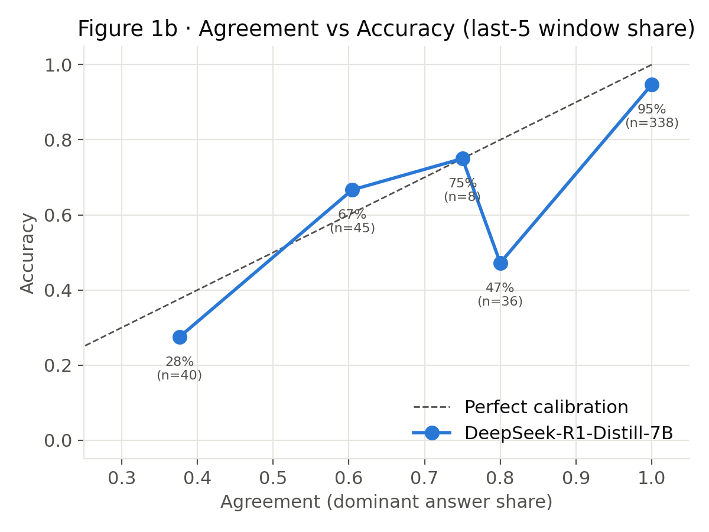
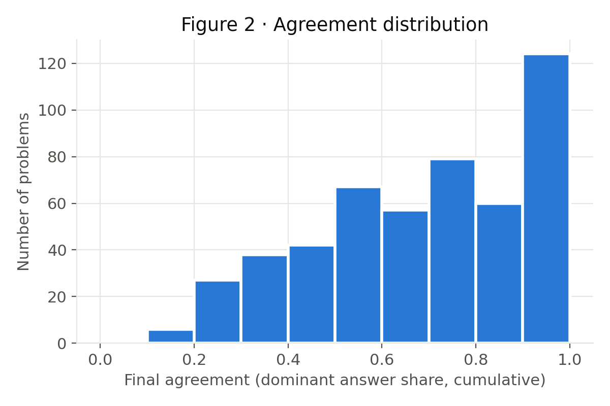
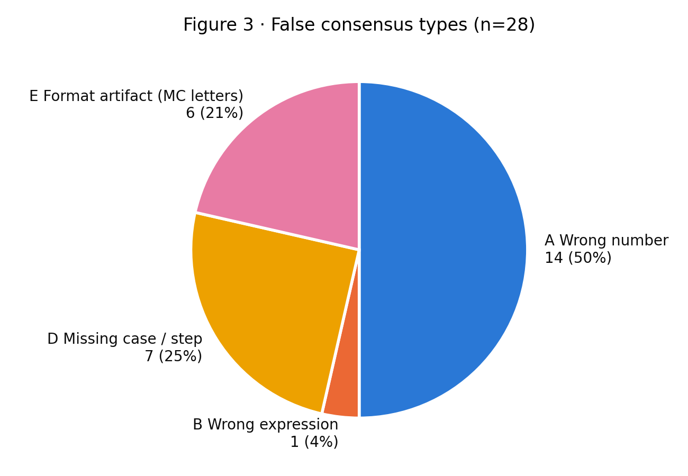
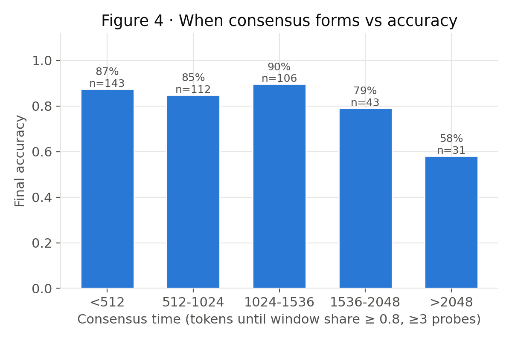
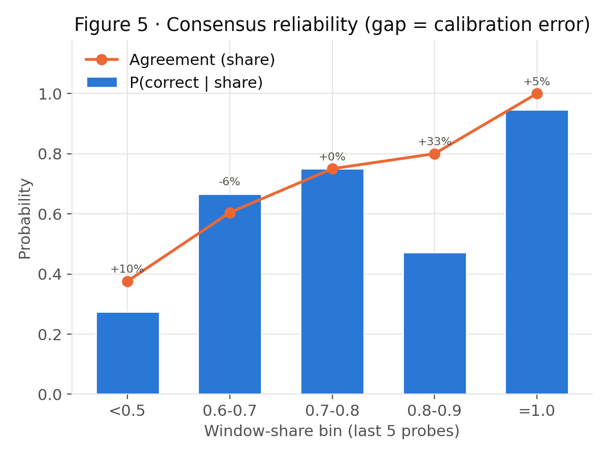

\newpage

# 执行摘要

本报告是 False Consensus 项目（plan.md）Stage 1–5 的首轮完整结果。我们在
**MATH500 全部 500 题**上，用 **DeepSeek-R1-Distill-Qwen-7B** 以纯记录模式
（Governor 不做任何干预）沿单条推理轨迹每 128 tokens 打一次探针（probe），
共记录 **8,739 个 probe**，然后离线分析 agreement 与 accuracy 的关系。

**核心结论：Agreement 不等于 Correctness，且"差多少"取决于在哪里测 agreement。**

1. **全轨迹完美共识几乎可信**：从第一个 probe 到最后全部一致（cumulative
   share = 1，非空答案）的 87 题中准确率 98.9%，真正的全程假共识只有 1 例。
2. **Governor 在线看到的"窗口共识"不可信**：最后 5 个 probe 一致的 338 题中
   准确率只有 93.5%，**22 例（6.5%）为 false consensus**。
3. **False consensus 的真实代价在早停**：模拟 Dynasor 式早停（连续 3 个
   probe 一致即停）会在 416/500 题触发，停机答案准确率 **69.2%**，而同批题
   继续推理到底可达 **85.6%** —— 损失 16.4 个百分点，换取平均 1,321 tokens
   节省；**128 题停在错误答案上**。
4. **翻盘极其普遍**：第一个 probe 答错的 375 题中 **76.3% 最终答对**；145 题
   曾形成与最终答案不同的"假稳定共识"，其中 65.5% 最终改对。早停会系统性地
   杀死这些翻盘。
5. **共识形成越晚越不可信**：<512 tokens 内形成共识的题准确率 87.4%，
   >2048 tokens 才形成的仅 58.1% —— 与 plan 中"越早形成越容易错"的猜想方向相反。
6. **方法论发现**：约 1/5 的早停错误源于 **probe 格式伪影**（非选择题却稳定
   输出 "B"/"D" 等选项字母）；6.3% 的 probe 答案为空（答案太长装不下 10 个
   probe token）。这两类信号都不是模型的真实信念，Governor++ 必须过滤。

# 背景与实验设置

## 研究问题

Governor/Dynasor 用 probe 之间的一致性（certaindex）作为提前停止推理的依据，
隐含假设是 **Agreement $\approx$ Correctness**。本项目第一阶段的任务就是检验这个假设：
模型能稳定形成一致意见、却仍然给出错误答案（false consensus）的情况有多少、
长什么样、什么时候发生。

## 设置（全部固定，按 plan.md）

| 项目 | 取值 |
|---|---|
| 模型 | DeepSeek-R1-Distill-Qwen-7B（vLLM 0.x, 1×A100-80G, prefix caching） |
| 数据集 | MATH500 全部 500 题 |
| Token budget | 3072 |
| Probe 间隔 | 128 tokens（每题最多 24 个 probe） |
| Probe 文本 | `**Final Answer**\n\n\[ \boxed{`，最多 10 tokens |
| 采样 | temperature 0.6，top_p 0.95，seed 42 |
| Governor | **关闭**（无 early stop / upgrade / decision，只记录） |

每题生成一条推理轨迹：生成 128 tokens → 打 probe 提取当前答案 → 继续生成 →
…… 直到自然结束或耗尽 budget。答案等价性用 Dynasor 的 `math_equal` 分组。

## 数据集规模（Stage 1 产出）

| 指标 | 数值 |
|---|---|
| 题目数 | 500 |
| Probe 总数（CSV 行数） | 8,739 |
| 空 probe 答案 | 553（6.3%，多为答案过长装不下） |
| 在 budget 内自然结束 | 309 题（61.8%） |
| 平均消耗 tokens | 2,275 |
| 最终准确率 | 81.2% |

产出文件：`probes.csv`（每 probe 一行：problem_id、token_position、probe_id、
probe_answer、share、entropy、unique_answers、dominant_answer、is_certain、
reasoning、final_answer、final_correct）+ `traj/`（500 条完整轨迹 JSON）。

# Stage 2：Agreement vs Accuracy

我们报告两种 agreement 定义：

- **Cumulative share**（plan.md 定义）：整条轨迹所有 probe 中多数答案的占比。
  注意 probe 数少时该值平凡地偏高（只有 1 个 probe 时恒为 1）。
- **Window share**：最后 5 个 probe 中非空答案的多数占比 —— 这是 Governor
  在线决策时真正看得到的信号。

## 校准表

Cumulative share（全轨迹）：

| share 区间 | n | 平均 share | 准确率 |
|---|---|---|---|
| <0.5 | 113 | 0.349 | 55.8% |
| 0.5–0.6 | 61 | 0.538 | 77.0% |
| 0.6–0.7 | 55 | 0.643 | 89.1% |
| 0.7–0.8 | 87 | 0.747 | 86.2% |
| 0.8–0.9 | 60 | 0.845 | 95.0% |
| 0.9–<1 | 29 | 0.923 | 79.3% |
| **=1.0** | **95** | **1.000** | **95.8%**（排除空串共识后 87 题 98.9%） |

Window share（最后 5 个 probe）：

| share 区间 | n | 平均 share | 准确率 |
|---|---|---|---|
| <0.5 | 40 | 0.376 | 27.5% |
| 0.6–0.7 | 45 | 0.604 | 66.7% |
| 0.8–0.9 | 36 | 0.800 | **47.2%** |
| **=1.0** | **338** | **1.000** | **93.5%** |

两个要点：(1) agreement 与 accuracy 总体单调正相关，certaindex 的方向性没错；
(2) 但 **share=1 也不等于 100% 正确**，且窗口 share 在 0.8–0.9 段严重高估
可信度（标称 80% 一致，实际只有 47.2% 正确）—— false consensus 成立。

{width=75%}

{width=75%}

{width=75%}

# Stage 3：False Consensus 案例与分类

## 案例导出

三类 false consensus 共导出 **134 个案例**（`false_consensus_cases.json/.md`）：

| 类型 | 定义 | 数量 |
|---|---|---|
| 全程假共识 | cumulative share=1（非空）且答错 | 1 |
| 窗口假共识 | 最后 5 probe 一致且答错 | 22 |
| 早停假共识 | Dynasor 式停机点答案错误 | 128 |

**唯一的全程假共识（P456）**：求 $f(n)=n$ 的所有整数解，正确答案 `-2, 1`。
24 个 probe 从头到尾全部回答 `1` —— 模型从未考虑过第二个根。这是最纯粹的
false consensus：完美一致、完全稳定、部分错误（漏根）。

**典型窗口假共识（P46）**：求最小的 $n$ 使 $z^4+z^2+1=0$ 的根都是 $n$ 次单位根，
正确答案 6。模型前 5 个 probe 都正确地回答 6，随后"想多了"改成 12 并在其余
19 个 probe 里稳定坚持 —— **正确的早期信念被推理过程自己推翻**（overthinking）。

## 分类（Type A–E）

对前 100 题的 28 个早停错误案例逐案人工分类（AI 辅助初分类，明细与每案理由
在 `classify_cases.py`，供复核修改）：

| Type | 含义 | 数量 | 占比 |
|---|---|---|---|
| A | 数字坍缩：稳定收敛到错误数字（算术/推导滑坡） | 14 | 50% |
| D | 推导遗漏：漏根 / 漏 case / 未验根 / 审错题 | 7 | 25% |
| E | 格式伪影：非选择题稳定输出 "B"/"D" 等字母 | 6 | 21% |
| B | 表达式坍缩：错误化简（如 $\cot x \to 0$） | 1 | 4% |
| C | 符号错误 | 0 | 0% |

{width=70%}

**Type E 值得单独强调**：概率题 P75（求乘积是 5 的倍数的概率，答案 11/36）
的 probe 序列是 `B, B, A, B, A, B, B, D, …` —— 模型在推理中途被 probe 打断时，
会幻觉出一个选择题的选项体系并稳定地"选"某个字母。这类"共识"与模型对数学
答案的信念无关，是 **probe 机制自身的伪影**，占早停错误的约 1/5。任何基于
probe agreement 的控制器都应先过滤此类答案形态。

# Stage 4：轨迹分析 —— 信念何时形成、是否翻盘

## 共识形成时间 vs 准确率

共识时间 = 窗口 share 首次 $\geq 0.8$（至少 3 个 probe）的 token 位置：

| 共识形成时间 | n | 最终准确率 |
|---|---|---|
| <512 tokens | 143 | 87.4% |
| 512–1024 | 112 | 84.8% |
| 1024–1536 | 106 | 89.6% |
| 1536–2048 | 43 | 79.1% |
| >2048 | 31 | **58.1%** |
| 从未形成 | 65 | — |

**结论与 plan 的猜想相反**：不是"越早形成越容易错"，而是**越晚形成越不可信**。
解释：能快速收敛的多是模型有把握的简单题；拖到 2048+ tokens 才勉强一致的，
多是能力边界上的难题，其"共识"质量本身就差。

{width=75%}

## Recovery（翻盘）

- **145 题**（29%）曾形成过与最终答案不同的 3-probe 稳定共识；其中 **95 题
  （65.5%）最终改成了正确答案**。"稳定"远不是"终局"。
- **Initial belief**：probe 1 就答对的只有 125/500（25%）。probe 1 答错的
  375 题中，**286 题（76.3%）最终翻盘答对**。

这两个数字共同说明：推理轨迹中的中期共识有很大概率被后续推理修正，
**任何在共识首次出现就停止的策略，都在系统性地没收翻盘的机会**。

# Stage 5：Consensus Reliability 与 Governor 模拟

## 可靠性指标

$$CR(s) = P(\text{correct} \mid \text{share}=s)$$

| 指标 | 数值 |
|---|---|
| CR(cumulative share=1) | 0.989 |
| CR(window share=1) | 0.935 |
| Consensus Calibration Error（cumulative，加权） | 0.149 |
| Consensus Calibration Error（window，加权） | 0.080 |

{width=75%}

## Governor 早停模拟（在同一份 log 上离线回放）

停机规则（Dynasor-CoT 默认思路）：连续 3 个 probe 答案一致、非空、且 probe
输出不含犹豫词（wait/but/hmm…）即停止。

| 指标 | 数值 |
|---|---|
| 触发停机 | 416/500 题（83.2%） |
| 停机答案准确率 | **69.2%** |
| 同批题跑到底的准确率 | **85.6%** |
| 准确率损失 | **16.4 个百分点** |
| 平均节省 tokens（停机题） | 1,321（约 43% budget） |
| 停在错误答案上 | **128 题** |

这就是 false consensus 的实际价格：以现行的"一致即停"，每 3.25 个停机就有
1 个停在错误答案上。

# 数据质量与评估修正（影响复现）

分析中发现并修正了三类上游评估问题（均已在 `analyze.py` 处理，logging 原始
数据不受影响）：

1. **`strip_string` 吞掉 `\text{...}`**：P97 参考答案 `\text{east}` 被剥成
   空串，模型答对被判错。修正：对 raw / stripped / unwrap 三种形态分别匹配。
2. **超长答案的空 probe 假共识**：P179（平面方程）、P408（向量）的答案装不进
   10 个 probe token，所有 probe 为空串，空串"一致"曾被计为完美共识。修正：
   一致性统计只认非空答案（窗口至少 3 个非空）。
3. **`math_equal` 不认 `x\in[-2,7]` 与 `[-2,7]` 等价**（P383）。修正：剥
   `x\in` 前缀后再比较。

这些修正合计影响约 1% 的判分，但恰好集中在 share=1 的关键区间 —— 若不修正，
"全程假共识"会被高估 4 倍（4 例 vs 实际 1 例）。

# 对 Governor++ 的启示与下一步

Stage 6 的设计原则应为 **Stop = Agreement AND Reliable**，本轮数据直接支持
以下 Reliable 信号（全部可在现有 log 上离线回放验证，无需重跑模型）：

1. **答案形态过滤**：字母型答案（Type E）与空串不计入共识 —— 立刻消掉约
   1/5 的错误停机；
2. **共识时间**：晚于 ~2048 tokens 才形成的共识不可信（58.1%），不应触发早停；
3. **窗口强度**：3-probe 窗口过于激进；加大窗口 / 提高门槛 / 要求熵持续下降；
4. **轨迹稳定性**：历史上换过答案的轨迹（145 题）局部一致也不可靠，应要求
   更长的稳定期。

**下一步**（对应 plan Week 3+）：

- 人工复核 28 例分类；对 500 题的 134 例做全量分类；
- Governor++ 原型：离线回放不同 stop 规则，画 accuracy–token Pareto 前沿；
- 多模型（Qwen、Llama distill）与多数据集（GSM8K / AIME24 / AMC23）复制
  本流程 —— 脚本已参数化，换 `--model` / `--dataset` 即可。

# 附录：产出物与复现

## 文件清单（`benchmark/FalseConsensus/`）

| 文件 | 内容 |
|---|---|
| `logging_run.py` | Stage 1 纯记录模式（可断点续跑） |
| `analyze.py` | Stage 2–5 分析与全部图表 |
| `classify_cases.py` | Stage 3 分类（含逐案理由）与 pie chart |
| `FINDINGS.md` | 结果总结 |
| `results/stage1_logging/probes.csv` | 8,739 行 probe 记录 |
| `results/stage1_logging/traj/` | 500 条完整轨迹 |
| `results/stage1_logging/analysis/` | 500 题分析：figures + report.md + 案例导出 |
| `results/stage1_logging/analysis_n100/` | 前 100 题存档（含分类） |

## 复现命令

```bash
# 服务器（~/Governor，venv ~/fc-venv，模型已在 HF cache）
bash ~/fc_launch.sh                      # 起 vLLM（GPU 7）+ logging（tmux）
python analyze.py --input results/stage1_logging
python classify_cases.py results/stage1_logging/analysis_n100
```

实验于 2026-07-22 完成；500 题 logging 全程约 21 分钟（单卡 A100，16 并发）。
