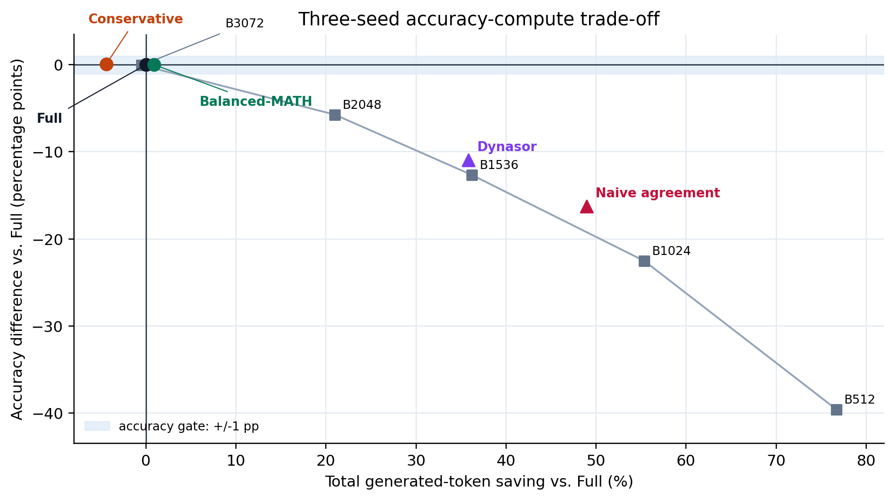
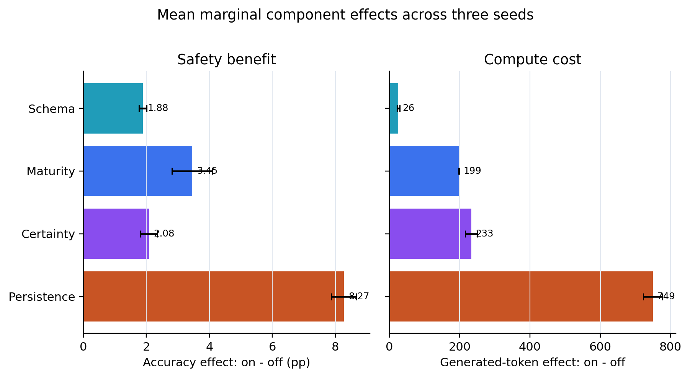

# 执行摘要

本轮完成了冻结协议下的 **DeepSeek-R1-Distill-Qwen-7B × MATH500 × seeds
43/44/45** 一次性 final evaluation。每个 seed 都覆盖 500 题，记录完整轨迹与
simple@32 probe，并离线回放 52 个方法，其中包括 Full、5 个固定预算点、naive
agreement、Dynasor 风格停止、两个冻结 Governor 规则、36 个 entropy 配置、6 个
majority 配置，以及 \(2^4=16\) 个组件因子格。

**结论很清楚：本轮证实了安全性，但没有证实目标幅度的节省。**

- **Conservative 保住准确率，但不省总生成 token。** 平均准确率 80.73%，比 Full
  高 0.07 个百分点，95% CI 为 \([-0.60,+0.73]\) 个百分点；然而将 probe decode
  计入后，总生成 token **增加 4.41%**，95% CI 为增加 2.92%-5.84%。
- **Balanced-MATH 是唯一落在 Full 左侧的冻结 Governor 点，但节省很小且不确定。**
  平均准确率与 Full 同为 80.67%；平均节省 0.88%，95% CI 为
  \([-0.78\%,+2.49\%]\)，区间跨 0，远低于预注册的 25% 下限。
- **激进基线确实节省 token，却明显损害准确率。** Naive agreement 节省 48.91%，
  但损失 16.27 个百分点；Dynasor 风格规则节省 35.78%，但损失 10.93 个百分点。
  这再次说明 agreement 可以用于排序风险，却不能单独充当安全停止条件。
- **组件实验解释了安全性来自哪里。** Persistence 的平均边际准确率收益最大
  （+8.27pp），但平均多用 749 个生成 token；Schema 仅多用 26 token，仍带来
  +1.88pp，是成本最低的安全过滤器。
- **继续推理的 recovery 价值远高于 overthinking 风险。** 达到统一共识定义的
  1,335 条轨迹中，错误共识后翻正确 233 次，正确共识后翻错误 32 次，原始计数比
  为 7.28:1。该结果是轨迹关联证据，不应解释为停止规则的因果效应。
- **提交门槛未通过。** DeepSeek 三 seed 证据块已经完整，但冻结协议还要求
  Qwen3-8B、两条正式 CertaIndex 基线，以及目标幅度的 token 节省。当前
  `primary_gate_pass=false`，不能把本轮写成完整跨模型确证。

\begingroup\small

| 冻结方法 | 准确率 | 相对 Full 准确率差 [95% CI] | 总生成 token 节省 [95% CI] | 判定 |
|---|---:|---:|---:|---|
| Full | 80.67% | 0.00pp | 0.00% | 参照 |
| Conservative | 80.73% | +0.07pp [-0.60, +0.73] | -4.41% [-5.84, -2.92] | 准确率过门，token 未过门 |
| Balanced-MATH | 80.67% | 0.00pp [-0.73, +0.67] | +0.88% [-0.78, +2.49] | 准确率过门，token 未过门 |

\endgroup

# 冻结协议与指标口径

## 一次性边界

协议版本为 `2026-07-25.1`，在新 seed 结果可见前冻结于 commit
`0dcc1b1b3e5eded098e90dc83bbbfa48dfdbda8b`。本轮没有根据 seed 43/44/45
结果修改规则参数；新增方法若要进入主结果，必须另行注册数据或 seed。因此，这里报告
的是**确证性评估**，不是在测试集上继续调参的 sweep。

| 项目 | 冻结值 |
|---|---|
| 模型 / 数据集 | `deepseek-ai/DeepSeek-R1-Distill-Qwen-7B` / MATH500 |
| 样本 | 500 题 × seeds 43、44、45，共 1,500 条独立生成轨迹 |
| 生成 | temperature 0.6；top_p 0.95；reasoning budget 3,072 |
| Probe | simple suffix；每 128 main tokens；输出上限 32 |
| Conservative | patience 8；固定 floor 1,024；certainty + schema |
| Balanced-MATH | patience 5；level 1-3 floor 768；level 4-5 floor 2,048；certainty + schema |

## 三个容易混淆的量

1. **Main decode tokens** 是主推理轨迹本身的输出。
2. **Probe decode tokens** 是周期性读出答案产生的额外输出。
3. **Total generated tokens** 是两者之和，也是本报告的主 compute 指标。其节省率为
   \(1-\text{method total}/\text{Full main total}\)。因此，主轨迹缩短并不自动等于
   总成本下降；如果 probe 足够多，净节省可以变成负数。

`stop coverage` 是规则触发早停的题占比。`false-stop rate` 的分母是已停止题，表示
停止时提交错误答案的比例，不是整个数据集的错误率。所有准确率差和 token 节省区间均
按 seed 先重采样、再在 seed 内成对重采样题目，使用 10,000 次分层 bootstrap 得到。

# 数据完整性与运行覆盖

三个 seed 均得到 500/500 条轨迹，通过严格 validator，且 evaluator 对每个 seed
产出 52 个方法汇总、16 个 factorial cell、32 行失败模式对照，以及 26,000 行
method-problem 明细。共执行 26,289 次 probe；自然结束 920 条，撞 3,072-token cap
580 条。仅有 5 次空 probe，应答为空的比例约 0.019%。

\begingroup\small

| Seed | Probe 数 | 自然结束 / cap | Wall time | Energy | Prefix cache hit |
|---:|---:|---:|---:|---:|---:|
| 43 | 8,660 | 313 / 187 | 79.9 min | 522 Wh | 98.97% |
| 44 | 8,834 | 302 / 198 | 64.5 min | 452 Wh | 98.98% |
| 45 | 8,795 | 305 / 195 | 71.8 min | 457 Wh | 98.97% |
| **合计** | **26,289** | **920 / 580** | **3.60 h** | **1.431 kWh** | **98.97%** |

\endgroup

GPU 峰值显存为 30,419 MiB，采样积分得到的 active GPU time 为 10,968 秒。Wall
time 还包括请求调度、答案解析和 CPU 评分长尾，因此不宜只用 wall time 推断 GPU
效率；能耗、利用率积分和请求级 cache 指标是更直接的运行证据。GPU 记录中没有采样
错误或服务指标错误，API key 已脱敏。

# 基线与 Governor 的 Accuracy-Compute Pareto

## 三 seed 主结果

{width=90%}

\begingroup\small

| 方法 | 准确率 | 相对 Full | Token 节省 | Coverage | False-stop |
|---|---:|---:|---:|---:|---:|
| Full | 80.67% | 0.00pp | 0.00% | 0.00% | 不适用 |
| Conservative | 80.73% | +0.07pp | -4.41% | 44.00% | 6.32% |
| Balanced-MATH | 80.67% | 0.00pp | +0.88% | 52.47% | 8.32% |
| Dynasor on simple@32 | 69.73% | -10.93pp | +35.78% | 80.47% | 28.59% |
| Naive agreement | 64.40% | -16.27pp | +48.91% | 91.53% | 35.47% |

\endgroup

两个 Governor 点的准确率都稳定在 Full 附近，而高 coverage 的 agreement 基线出现
10-16pp 的明显损失。这个差异不能只归因于 patience：冻结 Governor 还使用
minimum maturity、certainty 和 schema validity，以避免在答案尚未成熟、读出不确定
或答案结构无效时停止。

## 为什么 Conservative 反而更贵

三 seed 中 Conservative 的主轨迹均明显缩短，但每题还产生约 405 个 probe decode
tokens。其平均总生成量分别为 2,373、2,386、2,395，均高于对应 Full 的 2,259、
2,302、2,291。因此三个 seed 的净节省分别为 -5.06%、-3.63%、-4.54%，不是由单个
异常 seed 驱动。

Balanced-MATH 更早开放简单题停止，使 coverage 从 44.00% 提高到 52.47%，平均主
轨迹约 1,878 tokens；加上约 386 个 probe tokens 后，总量才略低于 Full。三个 seed
都位于 Full 左侧，但幅度只有 0.12%、1.66%、0.87%，bootstrap 区间仍跨 0。

## 固定预算对照

| 固定上限 | 准确率 | 相对 Full | 总 token 节省 |
|---:|---:|---:|---:|
| 512 | 41.07% | -39.60pp | 76.71% |
| 1,024 | 58.13% | -22.53pp | 55.35% |
| 1,536 | 68.00% | -12.67pp | 36.20% |
| 2,048 | 74.93% | -5.73pp | 20.96% |
| 3,072 | 80.60% | -0.07pp | -0.49% |

固定预算曲线说明 MATH500 的准确率增益在 2,048 tokens 后仍未耗尽。Balanced-MATH
能在接近 Full 的准确率下略微左移，优于统一 3,072 cap；但现有 probe 密度和读出成本
不足以达到预注册的 25%-30% 节省目标。

# \(2^4\) 组件实验：安全性由什么提供

因子格独立切换 schema validity、minimum maturity、certainty 和 persistence。下表是
某组件从 off 变为 on 后，在其余 \(2^3\) 个组合上取平均，再对三 seed 求均值的边际
效应。正的 token 差表示更贵，负的 coverage / false-stop 差表示停止更少但更安全。

{width=82%}

| 组件 | 准确率效应 | 总 token 效应 | Coverage 效应 | False-stop 效应 |
|---|---:|---:|---:|---:|
| Schema | +1.88pp | +26 | -2.48pp | -2.25pp |
| Maturity | +3.45pp | +199 | -3.38pp | -4.06pp |
| Certainty | +2.08pp | +233 | -12.76pp | -5.71pp |
| Persistence | +8.27pp | +749 | -29.31pp | -17.71pp |

结果支持以下机制解释：

- **Schema** 主要移除格式或任务结构无效的读出，成本很低，三 seed 的效应方向一致。
- **Maturity** 阻止规则在最低推理长度之前提交，保留了较多后续 recovery。
- **Certainty** 过滤带显式不确定性的读出，显著降低覆盖率，说明“不确定但一致”的
  checkpoint 并不少见。
- **Persistence** 要求共识连续存在，是最强的防错组件，也会错过最多真正可安全提前
  提交的题，因此代价最大。

这些是完整因子格上的**边际平均**，不是彼此独立的因果贡献；组件之间存在交互，四个
数字不能简单相加来预测某条规则。它们适合回答“哪个组件承担主要安全成本”，不适合
据此在已观察的三个 seed 上重新选参数。

# Recovery 与 Overthinking

统一机制定义使用最近 5 个 probe、至少 3 个有效数学答案、dominant share 至少 0.8。
第一次达到该共识时答案错而终局正确，记为 recovery；当时正确而终局错误，记为
overthinking。Haldane ratio 使用 \((R+0.5)/(O+0.5)\)，以减少小计数不稳定性。

| Seed | 达到 / 未达到共识 | Recovery | Overthinking | Stable correct | Persistent wrong | Haldane ratio [95% CI] |
|---:|---:|---:|---:|---:|---:|---:|
| 43 | 448 / 52 | 75 | 10 | 301 | 62 | 7.19 [4.14, 15.91] |
| 44 | 441 / 59 | 80 | 10 | 285 | 66 | 7.67 [4.33, 16.64] |
| 45 | 446 / 54 | 78 | 12 | 284 | 72 | 6.28 [3.81, 13.00] |
| **合计** | **1,335 / 165** | **233** | **32** | **870** | **200** | **原始计数比 7.28** |

在已达到共识的轨迹中，自然结束组有 149 次 recovery、3 次 overthinking、654 次
stable correct、16 次 persistent wrong；撞 cap 组分别为 84、29、216、184。也就是
说，persistent wrong 和 overthinking 几乎都集中在未自然收尾的轨迹里。MATH level
4-5 贡献了 159/200 的 persistent wrong 和 148/233 的 recovery，进一步说明难题既
更需要继续推理，也更容易在预算内保持错误。

该分析不能证明“继续生成”对单题必然有益，因为是否自然结束、是否撞 cap 与题目难度
高度相关。它能稳健支持的结论是：**在当前轨迹分布中，过早停止没收 recovery 的机会
远多于它避免 overthinking 的次数。**

# 提交门槛与边界

冻结协议对 Conservative 预注册了准确率平均下降不超过 1.5pp、总生成 token 至少
节省 12%、至少 2 个 seed 位于 Full 左侧；对 Balanced-MATH 预注册了准确率下降不
超过 3pp、总节省至少 25%、单模型下降不超过 5pp。协议整体还要求 DeepSeek 与
Qwen3-8B、完整方法集和正式 CertaIndex 基线。

\newpage

| Gate | 状态 | 原因 |
|---|:---:|---|
| Conservative accuracy | PASS | +0.07pp，相对 Full 无可见下降 |
| Conservative token / Pareto-left seeds | FAIL / FAIL | -4.41%；0/3 seed 正节省 |
| Balanced accuracy / per-model floor | PASS / PASS | 0.00pp；高于 -5pp floor |
| Balanced token | FAIL | +0.88%，低于 25% 下限 |
| Complete models / three seeds per model-method | FAIL | Qwen3-8B final-eval 未执行 |
| Formal baselines present / three seeds | FAIL | 两条 CertaIndex 独立流未执行 |
| **Primary gate** | **FAIL** | 完整性和 token 门槛均未满足 |

这里的 Dynasor 结果是在共同 simple@32 checkpoint 流上回放停止逻辑，适合做
prompt-matched 对照，但不等于协议中 interval 64、cap 20 的 faithful CertaIndex
独立运行。因此不能把它计作 formal baseline。

# 结论与下一步

本轮最可信的结论不是“Governor 已达到最终节省目标”，而是更窄也更有价值的三点：

1. 冻结 Governor 规则在 DeepSeek 三 seed 上把准确率稳定在 Full 附近，安全性结果
   不依赖某一个 seed。
2. 当前成本瓶颈已经从“主轨迹停不下来”转为“probe 读出本身太贵”。Conservative
   的主推理确实缩短，但被周期性 probe 完全抵消。
3. Persistence 提供最大安全增益，Schema 提供最高性价比；后续优化应优先减少读出
   频率或复用读出，而不是在这三个 seed 上放宽已冻结的安全阈值。

若继续按原协议推进，优先级应是：先补 Qwen3-8B 的 3 seed 完整流，再执行两条
CertaIndex 独立基线，最后重新聚合 submission gate。任何基于本报告现象设计的稀疏
probe、adaptive probe 或新 Governor 规则，都应标为 post-hoc，并在新注册的 seed
或数据集上验证。

# 复现索引

- 冻结协议：`benchmark/FalseConsensus/final_eval/protocol.json`
- 三 seed 结果：`benchmark/FalseConsensus/results/final_eval/deepseek7b_math500/`
- 聚合主表：`benchmark/FalseConsensus/results/final_eval/aggregate/model_seed_aggregate.csv`
- 逐 seed 表：`benchmark/FalseConsensus/results/final_eval/aggregate/per_seed_summary.csv`
- 机制表：`benchmark/FalseConsensus/results/final_eval/aggregate/mechanism_per_seed.csv`
- Gate：`benchmark/FalseConsensus/results/final_eval/aggregate/submission_gate.json`
- 聚合代码：`benchmark/FalseConsensus/final_eval/aggregate_runs.py`
- 报告制图：`benchmark/FalseConsensus/report/make_final_eval_report_figures.py`

本轮执行提交范围为 `85f991a` 至 `1ec2525`，分支
`final-eval-multiseed`，远端已同步至 `origin/final-eval-multiseed`。
