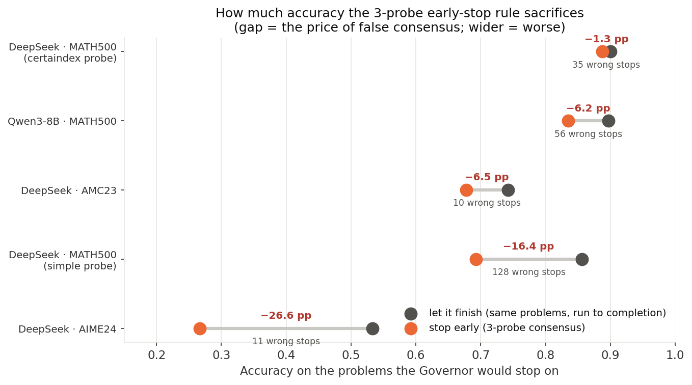
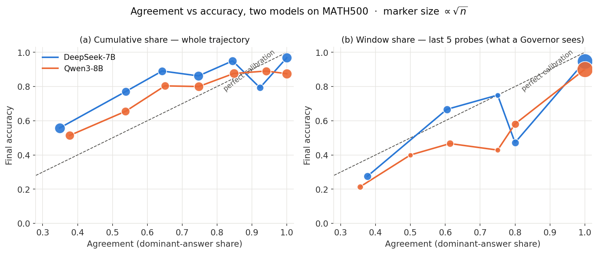
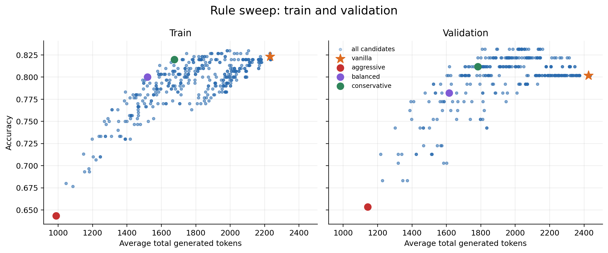
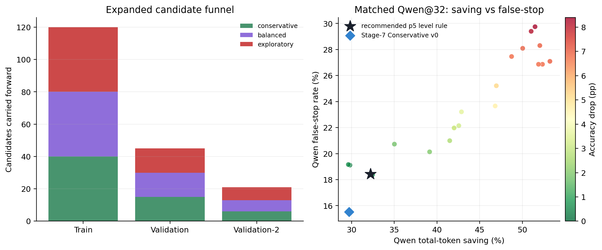
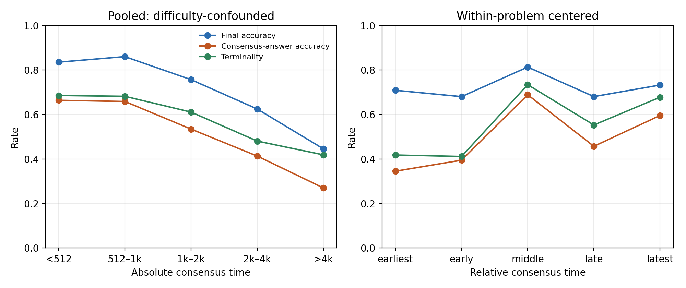
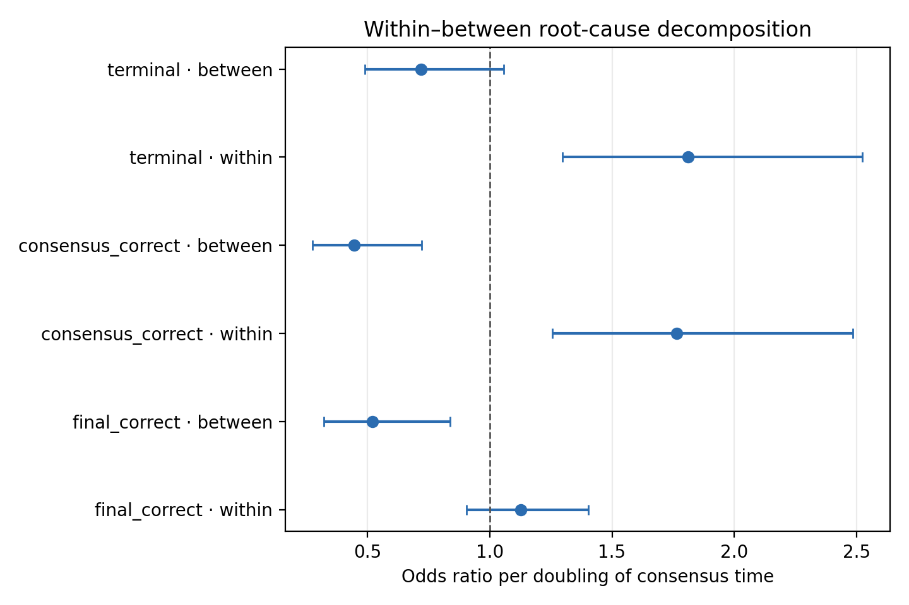

\newpage

# 执行摘要：我们现在知道了什么

**总发现：Agreement 是有用信号，但不是安全停止条件。** 可靠的 Governor
必须同时判断答案是否有效、当前共识是否正确、共识是否已经 terminal，以及继续
推理是否仍有 recovery 价值。

本轮围绕 `plan.md` 第 19 节的 teammate 五步 roadmap，得到六条主要结论：

1. **False consensus 稳定存在且可以跨模型、跨数据集复现。**  
   DeepSeek-7B 在 MATH500 上使用 naive 3-probe 一致即停，会把同批题准确率从
   85.6% 降到 69.2%，损失 16.4 个百分点；Qwen3-8B 和 AIME24 也复现同方向风险。

2. **Certaindex probe 的优势主要不是措辞读得更准，而是停得更晚。**  
   在共同触发的 306 题上，readout 主效应只有 +0.65pp，timing 主效应为
   +9.15pp；约 93% 的绝对主效应来自 timing。

3. **simple@32 是更好的 probe 底座。**  
   配合数学闭合 stop 后，它把空答案率从 6.34% 降到 0.60%，同时把平均每次
   probe 输出从 9.20 降到 6.43 tokens。更长的上限并不等于更高的实际成本。

4. **“晚共识不可靠”主要是难题混杂，不是同题内的轨迹定律。**  
   题间平均 consensus time 翻倍，对应最终正确率平均下降 11.7pp；同一道题内
   consensus time 翻倍，则是 +1.9pp 且不显著。晚形成的共识在同题内反而更可能
   正确、更可能 terminal。

5. **扩宽漏斗后，找到一个更好的保守工作点。**  
   新的五次一致规则在 DeepSeek validation-2 上准确率不变并节省 17.7% tokens；
   在 matched Qwen simple@32 上准确率点估计下降 1.0pp、节省 32.2%。它比
   Stage-7 Conservative v0 多省约 2.5-3.7pp tokens，但 false-stop 也略高，
   因而是更均衡的 Governor++ 候选，不是“零风险”结论。

6. **Calibrator 当前不训练。**  
   简单规则已经给出新的可用工作点，仍没有证据表明非线性模型能稳定超过规则；
   `plan.md` 第 8.3.0 节的升级 gate 仍不满足。此处 no-go 是实验结论，不是遗漏。

## 五步 roadmap 当前状态

| 步 | 任务 | 状态 | 得到的决策 |
|---:|---|---|---|
| 1 | Paired re-probe 2×2 | 完成 | certaindex 优势主要来自 timing；选择 simple@32 作为 sweep 底座 |
| 2 | Accuracy-compute Pareto sweep | 完成 | 首轮 p3 失败；扩宽漏斗后 p5 level 规则通过 matched Qwen gate |
| 3 | Within-problem K-rollout | 完成 | 晚共识下降主要是难度混杂和 token cap；同题内没有负效应 |
| 4 | Rule-based Governor++ | 选型完成 | 推荐 p5 + level768/2048 + certain + schema；v0 保留为更保守 fallback |
| 5 | 轻量 calibrator | Gate: No-go | 当前不训练；先做推荐规则的新 seed 确证 |

# 项目主线：从现象到控制器

## 原始问题

Governor/Dynasor 类方法把多个 probe 的一致性作为提前停止依据，隐含假设是：

$$
\text{Agreement} \approx \text{Correctness} \approx \text{Safe to stop}.
$$

Stage 1-5 首先证明，这三个量必须分开：

| 概念 | 它回答的问题 | 为什么不能混用 |
|---|---|---|
| Agreement | 最近几个 probe 是否互相一致？ | 只描述内部一致，不保证答案正确 |
| Correctness | 当前共识答案是否等价于参考答案？ | Governor 停下交卷时直接关心 |
| Terminality | 当前答案之后是否还会改变？ | 当前答对但不 terminal，继续推理仍可能变错 |
| Safe-stop | Correct AND terminal AND valid？ | 这是控制器真正需要预测的目标 |

**例子。** 某题在 768 tokens 连续三次回答 12，但继续推理后发现漏掉一个 case，
最终改成 6。768 tokens 处的 agreement 很强，却既不 correct，也不 terminal；
“一致即停”会没收这次 recovery。

## Stage 1-12 的关键证据

| 证据 | 设置 | 关键结果 | 含义 |
|---|---|---|---|
| 基线 logging | DeepSeek-7B / MATH500 / 500题 | 最终准确率 81.2%；8,739 probes | 建立完整轨迹底座 |
| Naive stop | 3-probe 一致即停 | 69.2% vs 同批到底 85.6% | 损失 16.4pp，128 个错误停机 |
| 跨模型 | Qwen3-8B / MATH500 | window share=1 仍有 11.0% 假共识 | 不是单模型伪影 |
| 难数据集 | DeepSeek-7B / AIME24 | 早停损失 26.6pp | 能力边界处风险放大 |
| 人工 audit | 100 个不一致案例 | single-letter probe 0% valid | 应先过滤 probe 格式伪影 |

{width=88%}

{width=94%}

# 五步 Roadmap 的依赖关系

`plan.md` 第 19 节把下一阶段拆成五步：

1. Step 1 决定 probe 措辞是否提供独立 readout 增益；
2. Step 2 在选定 probe 流上搜索 accuracy-compute Pareto；
3. Step 3 作为独立机制支线，解释 consensus time；
4. Step 4 把 sweep 获胜规则冻结为 Governor++ v1；
5. Step 5 只有在规则确实不够时才训练 calibrator。

Step 2 和 Step 4 几乎是同一个交付物。Rule-based Governor++ 的核心参数正是
sweep 的搜索轴：validity、`min_tokens`、patience、window/share、历史换答案次数
与难度自适应 floor。Step 2 选出的获胜配置就是 Step 4 的控制逻辑；Step 4 额外负责
冻结配置、held-out/Qwen 验证和工程打包。

# Step 1：Probe 忠实度还是保守 timing？

## 为什么需要 paired 2×2

早期 probe 消融中，certaindex probe 让 naive stop 的准确率从 69.2% 升到
88.7%，但它同时停得更少、更晚。因此，单看最终差异无法回答：

- 是 certaindex 在相同 prefix 上读出了更真实的 belief？
- 还是它只是拒绝在较早时刻 commit，等主推理继续后再停？

实验把四个 cell 全部锁在同一批 simple 主轨迹上，只替换 stop timing 与 readout：

| | 读 simple 答案 | 读 certaindex 答案 |
|---|---:|---:|
| simple timing | simple 现状 | 固定早停时刻，只换措辞 |
| certaindex timing | 固定晚停时刻，仍读 simple | certaindex 现状 |

## 共同触发集合上的主结果

两个 timing 规则都触发的共同集合包含 306 题：

| Timing | Readout | N | 停机答案准确率 | Mean stop tokens | Continuation match |
|---|---|---:|---:|---:|---:|
| simple | simple | 306 | 81.0% | 886 | 84.3% |
| simple | certaindex | 306 | 81.7% | 886 | 84.3% |
| certaindex | simple | 306 | 90.2% | 1,480 | 95.4% |
| certaindex | certaindex | 306 | 90.8% | 1,480 | 95.8% |

- **Readout 主效应：+0.65pp。** 固定 stop 时刻后，换措辞几乎不改变正确率。
- **Timing 主效应：+9.15pp。** 把 stop 推后约 594 tokens，准确率明显上升。
- **解释份额：93.3%。** Headline 的非共同集合分析中，timing 份额为 96.1%。

**直观例子。** 同一道题，simple 在约 886 tokens 触发，certaindex 在约
1,480 tokens 触发。若仍在 886 tokens，只把问题换成 certaindex 措辞，准确率只升
约 0.7pp；真正的大变化来自允许主推理继续约 600 tokens。

## 被 certaindex 拒绝的 simple stop

simple-only 集合实际包含 110 题，而不是简单相减得到的 105：

- 35 题属于 wrong-to-correct recovery，拒绝早停直接有益；
- 5 题属于 correct-to-wrong overthinking，拒绝早停有害；
- 35 题已经 terminal 且正确，拒绝只增加延迟；
- 其余 35 题最终仍错，或从一个错误答案换到另一个错误答案。

因此 certaindex 的拒绝不是全部有益，但 recovery 明显多于 overthinking。这支持
patience/min_tokens，同时也说明必须通过 Pareto sweep 控制等待成本。

## 为什么选择 simple@32

| Probe | 空答案率 | 平均输出 tokens | 撞输出上限 | 结论 |
|---|---:|---:|---:|---|
| simple@10 | 6.34% | 9.20 | 79.55% | 长答案常被截断 |
| certaindex@10 | 5.76% | 9.74 | 93.27% | 更保守但成本高 |
| simple@32 + stop | 0.60% | 6.43 | 0.94% | 完整且更便宜 |
| certaindex@32 + stop | 0.42% | 6.28 | 0.80% | 同样完整 |

“32 token 上限”不等于每次使用 32 tokens。加入 `\]` 闭合 stop 后，短答案通常
约 6 tokens 就结束，只有长表达式使用额外预算。因此 simple@32 同时修复空串/截断，
并降低实际 probe 成本。

# Step 2 + Step 4：Pareto Sweep 与规则型 Governor++

## 首轮 Train / validation / test / Qwen 流程

| 数据段 | N | 用途 | 是否允许调参 |
|---|---:|---|---|
| Train | 300 | 评估完整规则网格 | 允许 |
| Validation | 101 | 验证约束并选择 conservative/balanced/aggressive | 允许选择 |
| DeepSeek test | 99 | 冻结配置后一次性评估有效性和稳定性 | 不允许 |
| Qwen planned holdout | 500 | 跨模型迁移检查 | 不允许 |

101/99 不是数据丢失。每个 MATH level 内分别计算 60/20/20，并对 train 与
validation 的人数独立四舍五入；五个 level 的舍入误差相加后得到 validation=101，
剩余 test=99。总数仍为 500，各 level 均保持近似比例。

这里的术语必须严格区分：

- validation 用于“选哪个规则”；
- DeepSeek test 才是同模型 held-out；
- Qwen 是更严格的跨模型 transfer holdout。

不能把 validation accuracy 当成最终泛化结果。首轮 Qwen 后来因 simple@10 与
DeepSeek simple@32 不匹配而作废；第二轮的 matched@32 协议见后文。

## 搜索空间与选择标准

- 输入流：Step 1 选出的 simple@32，并计入真实 probe 输出 token；
- 规则轴：fixed / MATH-level / online-instability floor，patience，
  history stability，certain 与 schema validity；
- Conservative：train 和 validation 的准确率下降都不超过 1pp；
- Balanced：train 和 validation 的准确率下降都不超过 3pp；
- 满足约束后，在 train+validation pooled development 集上选总 token 最少者；
- test 与 Qwen 只评估冻结候选。

{width=98%}

图 3 左右呼应地展示了选择流程：train 用于初筛，validation 用于检查候选是否
保持同样的 accuracy-compute 关系。某个点只有在 train 漂亮、validation 也稳定时，
才有资格进入下一轮；validation 上偶然出现的高点不能单独成为最终结论。

## 规则名称怎么读

报告中的缩写描述的是完整 stop 条件，而不是模型名称：

| 缩写 | 完整含义 | 例子 |
|---|---|---|
| `p3` / `p6` / `p8` | patience：最近连续 3 / 6 / 8 个有效 probe 必须给出数学等价的同一答案 | `p8` 比 `p3` 更保守，需要更长稳定期 |
| `fixed1024` | 固定 token floor：任何题在 1,024 tokens 之前都不允许停 | 不区分题目难度 |
| `level768/2048` | MATH level 自适应 floor：level 1-3 最早 768 tokens；level 4-5 最早 2,048 tokens | `level768/1536` 的难题 floor 是 1,536 |
| `schema` | 有效性过滤：空答案无效；MATH500 是非选择题，因此单字母 A-D 也无效 | 防止 `"B","B","B"` 被当成数学共识 |
| `nonempty` | 只过滤空答案，不过滤单字母格式伪影 | 比 `schema` 更宽松 |
| `certain` / `cert1` | patience 窗口内的 probe 都不能包含 `wait/but/hmm/no` 等犹豫词 | `cert0` 表示不要求这一条件 |

`Conservative`、`Balanced`、`Aggressive` 是三个**风险/准确率预算档位**：
Conservative 要求 train 和 validation 的准确率损失都不超过 1pp，Balanced 不超过
3pp，Aggressive 只追求最大 token saving。因此同名档位在不同 sweep 中可以对应
完全不同的具体规则。

## Validation 选出的新候选

| 工作点 | 规则 | Val accuracy | Val tokens | Coverage | False-stop |
|---|---|---:|---:|---:|---:|
| Conservative | p3 + level floor 768/2048 + schema | 81.2% | 1,783 | 70.3% | 16.9% |
| Balanced | p3 + level floor 768/1536 + schema | 78.2% | 1,616 | 77.2% | 20.5% |
| Aggressive | p3 + no floor + nonempty | 65.3% | 1,143 | 93.1% | 35.1% |

## 首轮 held-out：为什么 p3 候选被淘汰

| 规则 | DeepSeek test Δacc | DS saving | 判定 |
|---|---:|---:|---|
| Stage-7 Conservative v0（旧） | +2.0pp [-2.0,+6.1] | 14.0% | 保留基线 |
| Stage-7 Balanced v0（旧） | +1.0pp [-3.0,+5.1] | 20.6% | 同模型通过 |
| Stage-10 Conservative candidate（新） | -4.0pp [-9.1,+1.0] | 22.9% | 淘汰 |
| Stage-10 Balanced candidate（新） | -5.1pp [-11.1,+1.0] | 31.0% | 淘汰 |

首轮 Qwen 使用的是 simple@10，而 DeepSeek 已换成 simple@32，因此旧表里的 Qwen
token 与准确率比较不再作为正式证据，本报告已将它删除。仅看可比的 DeepSeek test，
新 p3 规则虽然在 validation 上省得更多，却掉了 4-5pp，已经足够判定失败。

这里“旧 Conservative”和“新 Conservative”不是同一个配置：

- **旧 Conservative v0** 是 Stage 7 已经冻结的基线：
  `p8 + fixed1024 + certain + schema`。它要求连续 8 个有效且确定的相同答案，
  所有题都在 1,024 tokens 后才允许停。它没有参加本轮 train/validation 重新选型，
  只是作为预先冻结的 baseline 直接拿到 test 上比较。
- **新 Conservative candidate** 是本轮 Stage 10 扩展网格在 train+validation
  选出的候选：`p3 + level768/2048 + schema`。它只要求连续 3 次相同，但 level 4-5
  必须等到 2,048 tokens；它不要求 `certain`。

两者都叫 Conservative，只因为它们分别是各自 sweep 中“准确率损失不超过 1pp”
档位的最省 token 规则。旧版依赖更长的通用稳定期；新版尝试用难度自适应 floor
换取更多 coverage。Held-out 结果说明这次替换没有泛化成功。

## 第二轮：扩宽 candidate funnel

首轮每档只冻结一个候选，容易把 validation 的偶然赢家当成答案。第二轮保持同一
风险预算，但让更多、且来自 consecutive/history 两个家族的规则继续向下游流动：

| 阶段 | Conservative | Balanced | Exploratory | 合计 | 用途 |
|---|---:|---:|---:|---:|---|
| Train | 40 | 40 | 40 | 120 | 完整网格初筛 |
| Validation | 15 | 15 | 15 | 45 | 保持 train 风险上界 |
| Validation-2 | 6 | 7 | 8 | 21 | former test；允许 2pp 离散缓冲 |
| Matched Qwen@32 | 6 | 7 | 8 | 21 | 21 个 finalist 全测；跨模型外部门控 |

原来的 99 题 test 在这里被明确改名为 **validation-2**，因为我们查看它并继续筛选
了多个规则；它已不再是 untouched test。Qwen 也同时评估了 21 个 finalist，所以
它是外部 development gate，而不是选出赢家后的无偏最终估计。最终数字仍需新 seed
确认，但这比每层只留下一个候选更不容易漏掉稳定工作点。

{width=98%}

## Matched Qwen@32 与最终取舍

下表中每个模型的三元组依次是 `Δaccuracy / token saving / false-stop`：

| 规则 | DeepSeek validation-2 | Matched Qwen@32 | 判定 |
|---|---:|---:|---|
| Stage-7 Conservative v0 | +2.0pp / 14.0% / 10.0% | -1.2pp / 29.7% / 15.5% | 更保守 fallback |
| **p5 + level768/2048 + certain + schema** | **0.0pp / 17.7% / 15.8%** | **-1.0pp / 32.2% / 18.4%** | **推荐** |
| mv3/share1 + level768/2048 + certain + schema | -1.0pp / 18.4% / 18.3% | -0.8pp / 32.5% / 18.4% | 更省，但 DS false-stop 更高 |
| mv3/share1 + level512/1536 + schema | -2.0pp / 26.2% / 19.7% | -2.6pp / 41.5% / 21.0% | Balanced |
| p4 + level512/1024 + certain + schema | -2.0pp / 35.1% / 21.3% | -6.8pp / 52.4% / 26.9% | 跨模型淘汰 |

推荐规则的配对 bootstrap 区间为：DeepSeek `Δacc = 0.0pp [-4.0,+4.0]`；
Qwen `Δacc = -1.0pp [-3.8,+1.6]`。没有显著掉点，但区间并不等于“证明零风险”。

内部配置名
`hist_w5_mv5_s1.0_level768-2048_swany_span0_cert1_validschema`
可以简单读成 p5 规则：最近窗口 `w5` 中必须有 `mv5` 个有效答案，`s1.0` 表示
五个答案 100% 数学等价；`swany/span0` 表示不再叠加全历史换答案次数或额外稳定
跨度限制。因为窗口正好 5 且要求 5 个都有效，它在逻辑上就是“连续五个有效、
确定、格式合法的 probe 全部一致”。

## 当前 Rule-based Governor++ 推荐

均衡的 accuracy-first 候选：

```text
valid_schema == True
AND token_position >= 768   if MATH level <= 3
AND token_position >= 2048  if MATH level >= 4
AND last 5 probes are valid and mathematically equivalent
AND probe is certain
```

它把 p3 的过早风险改成五次完全一致，并只让 level 1-3 在 768 tokens 后早停；
level 4-5 必须等到 2,048。相较旧 v0，它在两个模型上多省约 2.5-3.7pp total
tokens，代价是 false-stop 高约 2.9-5.8pp。若部署目标把 false-stop 放在 token
saving 之前，仍可选 Stage-7 v0；若按本项目当前“高准确率硬门槛后平衡成本与
false-stop”的标准，则推荐新 p5 level 规则。

# Step 3：晚共识为什么看起来不可靠？

## 实验设计：同题 K-rollout 锁死题目难度

旧曲线把不同题混在一起：简单题通常早收敛且答对，难题通常晚收敛且答错。要区分
“题难”和“轨迹晚”，实验对同一道题重复 K=8 次，使题目难度在组内完全相同。

| 项目 | 实际设置 |
|---|---|
| 问题数 | 80：MATH 50 + AIME24 30 |
| Rollouts | 每题 K=8，共 640 条 |
| Token budget | 16,384，高于 plan 的 12k 初始值 |
| Probe rows | 30,524 |
| MATH finish / accuracy | 96.25% / 85.0% |
| AIME finish / accuracy | 66.25% / 52.5%；cap 仍达 33.75% |
| 主 consensus 定义 | last-5 至少 3 个非空；数学等价 dominant share $\geq 0.8$ |

## Within-between 分解

**Consensus Time（CT，共识形成时间）**定义为：沿一条 rollout 每隔固定 token
位置打 probe，在最近 5 个 probe 中至少有 3 个非空答案时，如果数学等价的多数答案
占这些非空答案的比例达到 0.8，就把**第一次满足该条件的 token 位置**记为 CT。
例如第一次在 1,536 tokens 处满足 last-5 dominant share $\geq 0.8$，则
`CT = 1536`。CT 不是总生成长度，也不是连续一致次数；它表示“局部共识第一次形成
得足够强”的时间。

主模型为：

$$
\text{correct} \sim \text{ct\_within}
+ \text{ct\_problemmean}
+ (1 \mid \text{problem}).
$$

- `ct_within`：同一道题的某次 rollout 比该题自己的典型 CT 早或晚；
- `ct_problemmean`：这道题整体比其他题早或晚。

CT 使用 $\log_2(\text{tokens})$，因此一个单位表示 CT 翻倍。

**例子。** 同一道题的一条 rollout 在 1,000 tokens 达成共识，另一条在
2,000 tokens，这是一次 within 翻倍；题目 A 的典型 CT 为 1,000，题目 B 为
2,000，则是一次 between 翻倍。前者问轨迹级规律，后者主要反映题目难度。

{width=96%}

## 主模型结果

| Outcome | 同题内 CT 翻倍 | 题间平均 CT 翻倍 | 直观结论 |
|---|---|---|---|
| Final correctness | OR 1.127, p=.282, +1.9pp | OR 0.521, p=.007, -11.7pp | 晚不是同题内的伤害因素 |
| Consensus correctness | OR 1.765, p=.001, +10.5pp | OR 0.447, p=.001, -15.2pp | 同题内晚共识更可能正确 |
| Terminality | OR 1.810, p<.001, +11.8pp | OR 0.721, p=.094, -7.0pp | 同题内晚共识更稳定 |

OR 是 odds ratio，不是准确率直接相乘。报告同时给平均概率变化：

- 同题内 CT 翻倍，最终正确率平均 +1.9pp，但 p=.282；
- 因此不能宣称晚共识提升最终准确率；
- 可以可靠地说：**没有证据显示同题内晚共识使最终正确率下降。**

{width=84%}

## 精准根因

1. **难题混杂。**  
   题目 pass rate 与平均 CT 的 Spearman 相关为 -0.602，p=3.48e-9。
   收敛晚首先是在标记“这道题难”。

2. **过早的暂态共识。**  
   127 条 rollout 从错误共识恢复为最终正确，只有 10 条从正确共识走向最终错误。
   Recovery 是 overthinking 的 12.7 倍。

3. **Token cap 放大尾部失败。**  
   自然结束轨迹最终准确率 82.9%，cap 轨迹只有 15.9%；绝对 CT >4k 的组中，
   cap rate 达 32.4%。

4. **关系不是单调的。**  
   二次项显著：中段最可靠；极早的共识常是暂态，极晚的轨迹常位于能力边界，
   并伴随更高 cap 风险。

修正后的结论是：

> 不能把“absolute CT 越晚越不可信”作为独立停止规则。Governor 应用
> min_tokens/patience 阻止过早暂态共识，同时把 CT 当作题目难度和 cap 风险信号，
> 联合 validity、稳定性和在线难度代理判断。

# Step 5：为什么现在不训练 calibrator

`plan.md` 第 8.3.0 节要求三项 gate 同时满足：

| Gate | 要求 | 当前证据 | 结论 |
|---|---|---|---|
| 缺口存在 | 规则撞到 Pareto 天花板，并有理由相信更复杂组合能突破 | 扩宽漏斗已找到简单 p5 level 工作点，没有暴露必须学习的残余缺口 | 不满足 |
| 非线性交互重要 | 多信号/难度自适应候选稳定优于简单规则 | history 的复杂约束没有稳定压过五次完全一致 | 不满足 |
| 标签可用 | safe-stop = correct AND terminal AND valid | correctness/terminality 已有；validity 仍只有有限 audit | 基本满足但需扩充 |

前两项都不满足。此时训练 logistic/GBM 更可能把 development 选择噪声编码进模型，
而不是解决一个已被证明存在的规则缺口。

**Decision: No-go。** 保留轻量 calibrator 设计，但当前不训练、不宣传。只有
新 seed 上出现可复现、且扩大规则网格仍无法修复的缺口，才重新打开 Step 5。

# 统一后的 Governor++ 设计原则

| 控制信号 | 证据来源 | 当前规则映射 |
|---|---|---|
| Validity | Stage 6：single-letter 0% valid；空串/格式伪影 | schema filter；非空；非 MC 禁 A-D 单字母 |
| 最早停止时间 | Step 1：93%-96% 的增益来自 timing | `min_tokens=1024` 起步 |
| 持续稳定 | 127 recovery vs 10 overthinking | patience=8；要求 recent answers 稳定 |
| 难度 | Step 3：between -11.7pp per CT doubling | 在线 entropy/switches 作为风险提示，不用离线 pass rate |
| Consensus time | within 最终正确率无负效应 | 不作单独“越晚越拒绝”的阈值 |
| Token cap | cap 轨迹准确率 15.9% | 高 cap 风险时降低 stop 信任，并显式报告截断 |

这些证据支持一种不对称的控制策略：

- 对极早的共识保持耐心，因为 recovery 远多于 overthinking；
- 对中段稳定、有效的共识允许停止；
- 对极晚且接近 cap 的轨迹提高风险提示，但不能简单认为“晚所以错”；
- 任何自适应难度规则都必须在冻结 test 和跨模型 holdout 上重新证明自己。

# 完成度、限制与下一步

## 已经闭环的科学问题

- Probe 措辞是否提供独立 readout 增益？  
  **基本没有，主要是 timing。**
- simple@32 是否值得作为新底座？  
  **值得：空率更低且实际 probe token 更少。**
- 更复杂规则能否直接突破 Pareto？  
  **扩宽漏斗后，简单 p5 level 规则得到一个新的保守工作点；复杂 history
  约束没有显示额外优势。**
- 晚共识是否在同题内真的更差？  
  **不是；主要是题间难度和 cap。**
- 是否现在训练 calibrator？  
  **否；gate 不满足。**

## 仍需完成的工程与稳健性工作

| 优先级 | 任务 | 目的 |
|---|---|---|
| P0 | 最终推荐规则多 seed | 给 1-2pp 差异估计真实方差 |
| P0 | 新 untouched test / seed | 因 validation-2 与 Qwen 已参与 21 个候选选择，需要无偏终验 |
| P1 | Rule Governor++ controller 包装 | 把推荐 p5 level 规则变成可运行、可记录、可回放的组件 |
| P1 | 扩大 validity audit | 补足 safe-stop 标签，尤其 @32 probe |
| P2 | 新模型/数据集 | GSM8K、GPQA-Diamond、第 3 个模型 |

## 解释边界

**关于 591 和 621 两个数字。** 这里的 `share` 是最近 5 个 probe 的非空答案中，
数学等价的多数答案所占比例。远端 agent 在实验刚结束时做了一张快速诊断表，实际把
阈值设成了较宽松的 0.6，却在文字里误写成 0.8。正式分析从原始 probe 重新计算后，
使用 plan 规定的主阈值 0.8：

| 判定阈值 | 形成过共识 | 从未形成 | 在报告中的用途 |
|---|---:|---:|---|
| dominant share $\geq 0.8$ | 591 / 640 | 49 / 640 | 正式主分析 |
| dominant share $\geq 0.6$ | 621 / 640 | 19 / 640 | 宽松阈值敏感性分析 |

因此，621 不是另一批数据，也不是丢了 30 条 rollout。它只是门槛更宽松后，多了
30 条“share 达到 0.6、但没有达到 0.8”的轨迹。我们又用 0.6 阈值完整重跑了主要
模型，within/between 的方向和根因结论没有改变，说明结论不是由 0.8 这个单一阈值
偶然造成的。正式报告其余结果仍统一采用 0.8。

其他限制：

1. K-rollout 的 within effect 是强观测对照，不是操纵 consensus time 的随机因果实验。
2. AIME 即使在 16,384 token budget 下仍有 33.75% cap，必须与 MATH 和
   natural-finish sensitivity 一起解读。
3. Matched Qwen simple@32 已完成，但同时比较了 21 个 finalist；它是外部
   development gate，不是选型后的 untouched estimate。
4. 关键实验仍为单 seed；最终部署前必须报告新 seed 方差，并保留一次未参与选择
   的最终测试。

# 产出物与复现索引

| 模块 | 主要产出 |
|---|---|
| Step 1 | `results/probe_paired_2x2/report.md`、`analysis_2x2.json`、`reprobe_paired.csv` |
| Step 2/4 首轮 | `results/stage10_rule_sweep/report.md`、`selected_*.csv`、`pareto_validation.png` |
| Step 2/4 扩宽漏斗 | `results/stage10_rule_funnel_v2/report.md`、`round1_*` 至 `round4_*` |
| Matched Qwen@32 | `results/stage11_cross_model/qwen3_8b_math500_simple32/reprobe_paired.csv`；远端提交 `3a844f3` |
| Step 3 | `results/stage9_krollout_analysis/report.md`、`model_results.csv`、`root_cause_summary.json` |
| 分析脚本 | `probe_compare/analyze_2x2.py`、`probe_compare/analyze_krollout.py`、`replay/sweep_stop_rules_v2.py`、`replay/sweep_stop_rules_funnel.py` |
| 规划 | `plan.md` 第 6.6、7.5、8.2a、8.3.0、19 节 |

报告数字均来自上述冻结产出。`HANDOVER.md` 仅用于交接，不作为正式结果来源，
也未纳入提交。
