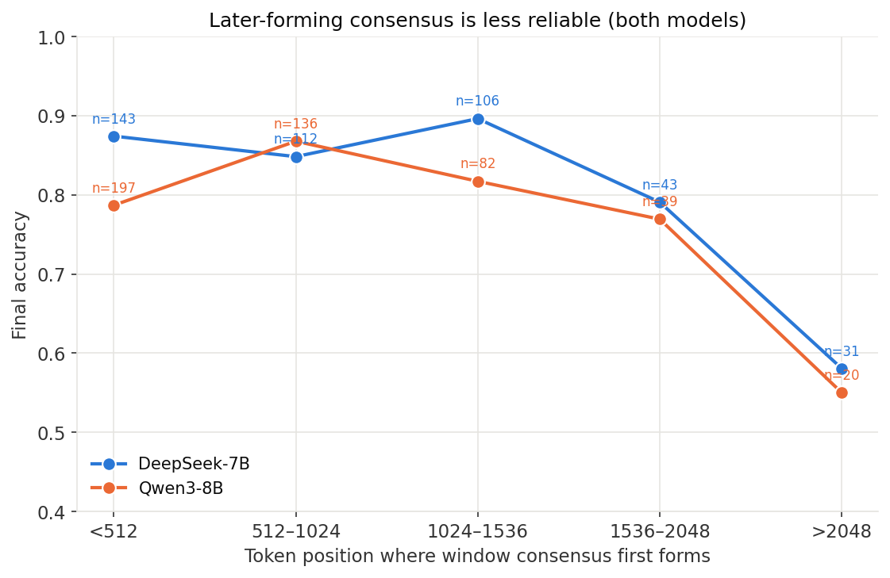
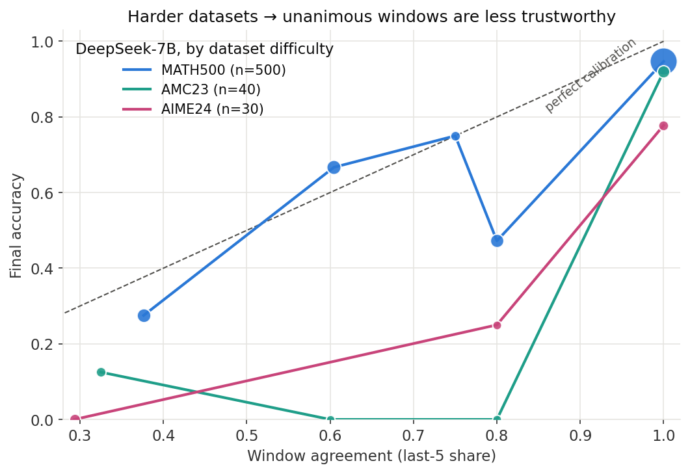
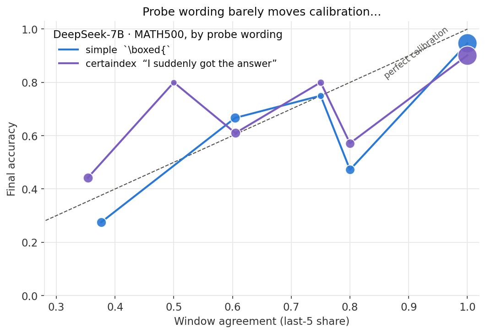

\newpage

# 执行摘要

本报告是 False Consensus 项目 Stage 1–5 首轮结论（`report/report.md`，
DeepSeek-R1-Distill-Qwen-7B × MATH500 × 500 题）的**泛化性验证**，用完全相同的
纯记录 + 离线分析流程（`logging_run.py` / `analyze.py`，仅换 `--model` /
`--dataset` / `--probe-suffix-style`）跑了三组实验：

- **实验 A（Stage 11，跨模型）**：Qwen3-8B × MATH500 × 500 题；
- **实验 B（Stage 12，跨数据集）**：DeepSeek-7B × AMC23（40 题）、AIME24（30 题）；
- **实验 C（Probe 消融）**：DeepSeek-7B × MATH500 × 500 题，把 probe 后缀从裸的
  `**Final Answer** \boxed{` 换成 Certaindex 式"顿悟"前缀
  `... Oh, I suddenly got the answer to the whole problem, **Final Answer** \boxed{`。

**核心结论：Stage 1–5 的诊断不是单一模型/数据集/probe 措辞的伪影 —— 换模型、
换数据集都稳定复现，且 probe 措辞会实质影响早停信号的可靠性。**

## 先厘清几个容易混淆的量

本报告反复出现三种"准确率"，分母不同，务必分清（详见第 7 节）：

| 术语 | 含义 | 分母 |
|---|---|---|
| **整体准确率** | 整个数据集所有题、最终答案答对的比例（系统总分） | 全部题 |
| **停机答案准确率** | 假设用"3-probe 一致即停"规则，在*会触发停机*的那批题上，按**停机瞬间**的答案算对错 | 会停机的子集 |
| **同批到底准确率** | 还是那批会停机的题，但**不停、让它跑到底**，最终答对的比例 | 会停机的子集 |

- **早停的准确率代价** = 同批到底准确率 − 停机答案准确率（在同一子集上比较，越大越亏）。
- 关键陷阱：后两者的分母都是"会停机的子集"，**不是整个数据集** —— 例如实验 A
  的"同批到底 89.7%"是 340 道会停机的题的数字，该模型的整体准确率其实只有 78.2%，
  两者不可混用。
- 另外两个量：校准曲线/表的纵轴是**最终答案**准确率；而 **false consensus（假共识）**
  计数看的是*探针窗口那个一致答案本身*对不对（窗口一致但答错），二者可差几个点，
  差值即"窗口曾错、后续翻对"的题。

## 六条主要发现

1. **跨模型稳健（实验 A）**：Qwen3-8B 上 window share=1（最后 5 个探针全一致）的
   372 题里，那个一致答案只有 **89.0% 是对的**，即 **41 例（11.0%）是假共识** ——
   比 DeepSeek 的 6.5% 还高。"局部一致 $\neq$ 终局正确"在另一个模型上不仅复现，
   量级还更明显。
2. **早停代价跨模型一致（实验 A）**：3-probe 一致即停会在 340/500 题触发；这批题
   **停机就交卷只有 83.5% 对**，**放它们跑完能到 89.7%** —— 早停白白亏掉 6.2 个
   百分点，**56 题停在了错误答案上**，平均省 1,306 tokens。
3. **翻盘依旧普遍（实验 A）**：第一个探针就答错的 371 题里，**72.2% 最终自己翻盘
   答对**；161 题曾形成异于终答的稳定共识，其中 108 题（67.1%）最终改对 —— 早停会
   系统性没收这些翻盘。与 DeepSeek 高度一致。
4. **难数据集放大早停风险（实验 B）**：AMC23 整体准确率 60.0%、AIME24 仅 26.7%；
   AIME24 上早停亏掉 **26.6 个百分点**（停机 26.7% vs 跑完 53.3%），且**无一题在
   budget 内自然收尾**、全程完美共识从未出现。小样本（30–40 题）方差大，取方向性。
5. **Probe 措辞是早停可靠性的旋钮（实验 C，最值得注意）**：把探针后缀从裸的
   `\boxed{` 换成 Certaindex 式"我突然想到了答案"前缀，**整体准确率几乎不变**
   （79.6% vs 81.2%），但**同一条早停规则白白亏掉的准确率从 16.4pp 缩到 1.3pp**，
   错误停机从 128 题降到 35 题（详见第 5 节的逐字解释）。代价是触发更保守、停得更
   晚、省的 token 减半。单 seed 观察，待受控复跑确认。
6. **可视化速览**：图 1 用一张图讲清"每组实验早停到底亏多少准确率" —— 橙点=停机
   就交卷的准确率，灰点=放它跑完的准确率，两点之间的距离就是早停的代价。

{width=88%}

# 背景与实验设置

## 研究问题

Stage 1–5 在 DeepSeek-7B × MATH500 上得到一组诊断性结论：agreement 与
correctness 正相关但 **local agreement $\neq$ terminal correctness**，Dynasor 式
"一致即停"会系统性地损失准确率并没收翻盘。一个自然的质疑是：**这些结论是不是
只对这一个模型、这一个数据集、这一种 probe 措辞成立？** 本报告用三组受控替换
回答这个问题。

## 三组实验的设置

除下表标注的替换项外，其余参数与 Stage 1 完全一致（budget 3072、probe 间隔
128 tokens、probe max 10 tokens、temperature 0.6、top_p 0.95、seed 42、
Governor 关闭仅记录、答案等价性用 `math_equal` 分组）。

| 实验 | 模型 | 数据集 | Probe 后缀 | 题数 |
|---|---|---|---|---|
| **基线**（Stage 1–5） | DeepSeek-R1-Distill-Qwen-7B | MATH500 | `simple` | 500 |
| **A**（Stage 11） | Qwen3-8B | MATH500 | `simple` | 500 |
| **B**（Stage 12） | DeepSeek-R1-Distill-Qwen-7B | AMC23 / AIME24 | `simple` | 40 / 30 |
| **C**（Probe 消融） | DeepSeek-R1-Distill-Qwen-7B | MATH500 | `certaindex` | 500 |

两种 probe 后缀（`logging_run.py` 中 `PROBE_SUFFIXES`）：

- `simple`（Stage 1–8）：`**Final Answer**\n\n\[ \boxed{`
- `certaindex`（实验 C）：`... Oh, I suddenly got the answer to the whole problem, **Final Answer**\n\n\[ \boxed{`

两者的 probe 生成上限都是 10 tokens；差别只在续写前缀是否带一句"顿悟"式的
提交诱导语 —— 这正是 Dynasor/Certaindex 论文里 probe 的实际写法。

## 数据集规模与整体结果

| 指标 | 基线 (DS/MATH) | A (Qwen/MATH) | B1 (DS/AMC23) | B2 (DS/AIME24) | C (DS/MATH·CI) |
|---|---|---|---|---|---|
| 题数 | 500 | 500 | 40 | 30 | 500 |
| Probe 记录数 | 8,739 | 10,679 | 836 | 720 | 8,736 |
| 空 probe 答案 | 6.3% | 7.6% | 0.2% | 0.7% | 5.8% |
| budget 内自然结束 | 61.8% | 35.0% | 37.5% | 0.0% | 60.8% |
| **整体准确率** | **81.2%** | **78.2%** | **60.0%** | **26.7%** | **79.6%** |

（DS = DeepSeek-7B，CI = certaindex probe。）Qwen3-8B 生成更长（自然结束率仅
35%，probe 记录多出 22%）；AIME24 无一题在 3072 token budget 内自然收尾，说明
现行 budget/probe 协议在能力边界处已被压满。

# 实验 A：跨模型验证（Qwen3-8B × MATH500）

## Agreement vs Accuracy

Cumulative share（全轨迹）：

| share 区间 | n | 平均 share | 最终准确率 |
|---|---|---|---|
| <0.5 | 70 | 0.378 | 51.4% |
| 0.5–0.6 | 58 | 0.538 | 65.5% |
| 0.6–0.7 | 51 | 0.651 | 80.4% |
| 0.7–0.8 | 80 | 0.748 | 80.0% |
| 0.8–0.9 | 81 | 0.848 | 87.7% |
| 0.9–<1 | 64 | 0.941 | 89.1% |
| **=1.0** | **96** | **1.000** | **87.5%** |

Window share（最后 5 个 probe）：

| share 区间 | n | 平均 share | 最终准确率 |
|---|---|---|---|
| <0.5 | 14 | 0.356 | 21.4% |
| 0.5–0.6 | 5 | 0.500 | 40.0% |
| 0.6–0.7 | 30 | 0.613 | 46.7% |
| 0.7–0.8 | 7 | 0.750 | 42.9% |
| 0.8–0.9 | 43 | 0.800 | 58.1% |
| **=1.0** | **372** | **1.000** | **90.1%** |

- cumulative share=1（非空）：88 题，窗口答案准确率 92.0%，**false consensus 7**；
- window share=1：372 题，**窗口答案准确率 89.0%，false consensus 41（11.0%）**。

（说明：window 表最后一行的 90.1% 是这 372 题的*最终*答案准确率；FC 计数用的是
*窗口共识答案本身*的准确率 89.0%，两者的 1.1pp 差即窗口错、但后续翻对的少数题。）

结论与 Stage 1 完全同向：agreement 与 accuracy 单调正相关（certaindex 方向没错），
但 **share=1 不等于 100% 正确**，且 Qwen3-8B 的窗口假共识比例（11.0%）比 DeepSeek
（6.5%）更高 —— 更强的一致性倾向反而带来更多"自信的错误共识"。图 2 把 DeepSeek
与 Qwen3-8B 两个模型的校准曲线叠在同一张图上：两条线形状几乎一致，Qwen 整体略低，
且在窗口 share 中段（右图）低于对角线更明显。

{width=98%}

## 轨迹分析：共识时间与翻盘

共识形成时间（window share 首次 $\geq$ 0.8）vs 最终准确率：

| 共识形成时间 | n | 最终准确率 |
|---|---|---|
| <512 tokens | 197 | 78.7% |
| 512–1024 | 136 | 86.8% |
| 1024–1536 | 82 | 81.7% |
| 1536–2048 | 39 | 76.9% |
| >2048 | 20 | **55.0%** |
| 从未形成 | 26 | — |

"越晚形成越不可信"在 Qwen3-8B 上继续成立：>2048 tokens 才勉强一致的题准确率
只有 55.0%（Stage 1 为 58.1%）。

- **Recovery**：161 题曾形成异于最终答案的 3-probe 稳定共识，其中 **108 题
  （67.1%）最终改对**；
- **Initial belief**：probe 1 答对仅 129/500；probe 1 答错的 371 题里
  **268 题（72.2%）最终翻盘答对**。

翻盘的普遍程度与 DeepSeek（76.3%）几乎一致 —— 任何"共识首现即停"的策略都会在
Qwen3-8B 上同样系统性地没收翻盘。

{width=72%}

## Consensus Reliability 与 Governor 早停模拟

| 指标 | 数值 |
|---|---|
| CR(cumulative share=1) | 0.920 |
| CR(window share=1) | 0.890 |
| Consensus Calibration Error（cumulative） | 0.092 |
| Consensus Calibration Error（window） | 0.118 |

早停规则同 Stage 5（连续 3 probe 一致、非空、确定即停）：

| 指标 | 数值 |
|---|---|
| 触发停机 | 340/500 题（68.0%） |
| 停机答案准确率 | **83.5%** |
| 同批题跑到底准确率 | **89.7%** |
| 准确率损失 | **6.2 个百分点** |
| 平均节省 tokens（停机题） | 1,306 |
| 停在错误答案上 | **56 题** |

（CR、CCE 的跨实验对比见第 6 节汇总表；早停代价的可视化见图 1。）

# 实验 B：跨数据集验证（DeepSeek-7B × AMC23 / AIME24）

两个数据集样本量小（40 / 30 题），单个 bin 常只有个位数样本，**下列数字方差大，
只作方向性证据**。

## AMC23（40 题，整体准确率 60.0%）

Window share（最后 5 个 probe）：

| share 区间 | n | 平均 share | 最终准确率 |
|---|---|---|---|
| <0.5 | 8 | 0.325 | 12.5% |
| 0.6–0.7 | 3 | 0.600 | 0.0% |
| 0.8–0.9 | 4 | 0.800 | 0.0% |
| **=1.0** | **25** | **1.000** | **92.0%** |

- cumulative share=1：3 题，准确率 100.0%，false consensus 0；
- window share=1：25 题，窗口答案准确率 92.0%，**false consensus 2（8.0%）**。
- Recovery：10 题曾有异于终答的稳定共识（4 题改对）；probe 1 答对 8/40，答错的
  32 题中 18 题（56.2%）翻盘。
- Governor 早停：31/40 触发，停机准确率 **67.7%** vs 同批到底 **74.2%**
  （损失 6.5pp），平均省 1,412 tokens，**10 题停在错误答案上**。
- 可靠性：CR(cum=1)=1.000，CR(win=1)=0.920，CCE cum/win = 0.210 / 0.215。

## AIME24（30 题，整体准确率 26.7%，最难切片）

Window share（最后 5 个 probe）：

| share 区间 | n | 平均 share | 最终准确率 |
|---|---|---|---|
| <0.5 | 15 | 0.293 | 0.0% |
| 0.6–0.7 | 1 | 0.600 | 0.0% |
| 0.7–0.8 | 1 | 0.750 | 0.0% |
| 0.8–0.9 | 4 | 0.800 | 25.0% |
| **=1.0** | **9** | **1.000** | **77.8%** |

- cumulative share=1：**0 题**（全程完美共识从未出现，CR(cum=1)=nan）；
- window share=1：9 题，窗口答案准确率 77.8%，**false consensus 2（22.2%）** ——
  一致窗口里每 4.5 个就有 1 个是错的，是所有实验里 FC 比例最高的；
- Recovery：12 题曾有异于终答的稳定共识（5 题改对）；probe 1 答对 **0/30**
  （最难题上首个 probe 全是被迫猜测），答错的 30 题中 8 题（26.7%）翻盘；
- Governor 早停：15/30 触发，停机准确率 **26.7%** vs 同批到底 **53.3%**
  （损失 **26.6pp**），平均省 1,323 tokens，**11 题停在错误答案上**；
- 可靠性：CR(win=1)=0.778，CCE cum/win = 0.071 / 0.332（window 校准误差是所有
  实验里最大的）。

{width=74%}

**跨数据集结论**：难度越高，早停越危险。在模型能力边界处（AIME24），probe 共识
的校准彻底崩坏 —— 一致窗口里 22.2% 是错的，早停直接损失 26.6pp。这与
"越晚/越难形成的共识越不可信"的机制解释一致，也说明 Governor++ 的 validity
filter 必须随数据集难度自适应，不能用 MATH500 上标定的固定阈值。

# 实验 C：Probe 措辞消融（Certaindex 顿悟前缀）

同模型、同数据集、同 500 题，仅把 probe 后缀换成带"顿悟"提交诱导语的
`certaindex` 风格，直接对照 Stage 1 基线。

## 与基线的直接对比

| 指标 | 基线（simple） | 实验 C（certaindex） | 差异 |
|---|---|---|---|
| 整体准确率 | 81.2% | 79.6% | −1.6pp |
| budget 内自然结束 | 61.8% | 60.8% | −1.0pp |
| 空 probe 率 | 6.3% | 5.8% | −0.5pp |
| window share=1 题数 | 338 | 336 | $\approx$持平 |
| window share=1 准确率 | 93.5% | 89.6% | −3.9pp |
| window share=1 中 false consensus | 22（6.5%） | 35（10.4%） | +3.9pp |

Window share 校准表（certaindex）：

| share 区间 | n | 平均 share | 最终准确率 |
|---|---|---|---|
| <0.5 | 43 | 0.353 | 44.2% |
| 0.5–0.6 | 5 | 0.500 | 80.0% |
| 0.6–0.7 | 41 | 0.605 | 61.0% |
| 0.7–0.8 | 10 | 0.750 | 80.0% |
| 0.8–0.9 | 35 | 0.800 | 57.1% |
| **=1.0** | **336** | **1.000** | **90.2%** |

## Governor 早停：最值得注意的差异

| 指标 | 基线（simple） | 实验 C（certaindex） |
|---|---|---|
| 触发停机 | 416/500 | 311/500 |
| 停机答案准确率 | 69.2% | **88.7%** |
| 同批题跑到底准确率 | 85.6% | 90.0% |
| **准确率损失** | **16.4pp** | **1.3pp** |
| 平均节省 tokens | 1,321 | 683 |
| **停在错误答案上** | **128 题** | **35 题** |

### "16.4pp 降到 1.3pp"到底指什么

这句话说的是**同一条早停规则、在两种 probe 措辞下，各自白白亏掉多少准确率**，
逐字拆开：

- 在 **simple probe** 下，规则会在 416 题上触发停机。这 416 题如果**停机就交卷**，
  只有 **69.2%** 对；如果**放它们跑到底**，能有 **85.6%** 对。停机比跑完低了
  85.6 − 69.2 = **16.4 个百分点** —— 这就是早停在 simple probe 下付出的准确率代价。
- 在 **certaindex probe** 下，规则改为在 311 题上触发。这 311 题**停机交卷 88.7%**
  对、**跑到底 90.0%** 对，两者只差 90.0 − 88.7 = **1.3 个百分点**。

也就是说：换一句 probe 措辞，"早停"这个动作从"平均每次亏 16.4pp"变成"几乎不亏
（1.3pp）"，错误停机从 128 题降到 35 题（−73%）。注意这两个"损失"都是在各自
*会停机的子集*内比较的（分母 416 vs 311，见第 1 节概念表），**不是**在说整体准确率
变化 —— 整体准确率其实几乎没动（81.2% → 79.6%）。代价则是：certaindex 触发更保守
（311 < 416）、停得更晚，平均只省 683 tokens（约 simple 的一半）。

**解释（谨慎）**：带"顿悟"前缀的 probe 似乎让模型只在推理确有进展时才提交一个
稳定答案，从而"3-probe 一致"这个信号更能反映真实信念 —— 这正是 Stage 1 提出的
"Stop = Agreement AND Reliable"里 **Reliable 分量被 probe 措辞增强**的直接证据。
但需注意：这是单 seed 结果，更低的 token 节省部分来自更高的自然结束率（可省空间
本就更小）；且 window share=1 的假共识比例反而略升（10.4% vs 6.5%），说明
certaindex probe 改善的是*早停规则的选择性*（该停才停），而非消除窗口假共识本身。
应做一次预算/温度对齐的受控复跑再下强结论。

{width=74%}

# 横向对比与总结

## 汇总表

| 实验 | 模型 / 数据集 | n | 整体准确率 | win=1 题数 | 其中 FC | Governor 触发 | 停机 vs 同批到底 | 省 tokens | 错误停机 |
|---|---|---|---|---|---|---|---|---|---|
| 基线 | DS / MATH500 | 500 | 81.2% | 338 | 22 (6.5%) | 416/500 | 69.2% / 85.6% | 1,321 | 128 |
| A | Qwen3-8B / MATH500 | 500 | 78.2% | 372 | 41 (11.0%) | 340/500 | 83.5% / 89.7% | 1,306 | 56 |
| B1 | DS / AMC23 | 40 | 60.0% | 25 | 2 (8.0%) | 31/40 | 67.7% / 74.2% | 1,412 | 10 |
| B2 | DS / AIME24 | 30 | 26.7% | 9 | 2 (22.2%) | 15/30 | 26.7% / 53.3% | 1,323 | 11 |
| C | DS / MATH500·CI | 500 | 79.6% | 336 | 35 (10.4%) | 311/500 | 88.7% / 90.0% | 683 | 35 |

## 可靠性指标汇总

| 实验 | CR(cum=1) | CR(win=1) | CCE(cum) | CCE(win) |
|---|---|---|---|---|
| 基线 | 0.989 | 0.935 | 0.149 | 0.080 |
| A（Qwen） | 0.920 | 0.890 | 0.092 | 0.118 |
| B1（AMC23） | 1.000 | 0.920 | 0.210 | 0.215 |
| B2（AIME24） | nan | 0.778 | 0.071 | 0.332 |
| C（certaindex） | 0.936 | 0.896 | 0.132 | 0.100 |

## 三条主结论

1. **诊断跨模型、跨数据集成立**：window share=1 从来不是 100% 正确（89.0%–92.0%
   在 MATH/AMC，AIME 上更低到 77.8%），Governor 式早停在每一组里都损失准确率并
   停在错误答案上。Stage 1–5 的核心发现不是 DeepSeek/MATH500 的特例。
2. **难度是放大器**：从 MATH500（FC 约 11%、早停损失 6pp）到 AIME24（FC 22%、早停
   损失 27pp），越靠近模型能力边界，probe 共识越不可信、早停越危险。固定阈值的
   停机规则不可跨难度迁移。
3. **probe 措辞是可调的可靠性旋钮**：仅改 probe 续写前缀（certaindex 顿悟语），
   就能把同一早停规则的准确率损失从 16.4pp 降到 1.3pp、错误停机减少 73% —— 说明
   "让 probe 更忠实地反映真实信念"是一条独立于聚合/阈值之外、可直接提升早停安全性
   的路径（单 seed，待受控确认）。

# 方法学与数据质量注记

1. **"同批到底"$\neq$"整体准确率"**：所有 Governor 模拟里的"同批题跑到底准确率"
   （A=89.7%、B1=74.2%、B2=53.3%、C=90.0%）都只在**该实验触发停机的子集**上计算，
   分母是停机题数（340/31/15/311），**不是整个数据集**。整体准确率见汇总表首列
   （78.2% / 60.0% / 26.7% / 79.6%）。两者切勿混用。
2. **小样本警示**：实验 B 的 AMC23（40）与 AIME24（30）单 bin 常仅个位数样本，
   逐 bin 准确率（如 AMC23 "1536–2048 tokens 100%"）不可当作稳定估计，只用于
   趋势判断。
3. **单 seed**：全部三组均为单 seed（seed 42）、单模型规模，尚未做多 seed 置信
   区间与多模型规模分析（plan.md §9.1 的第 3+ 个模型、§11 统计规范）。
4. **评估口径**：沿用 Stage 1–5 已修正的 `analyze.py`（`\text{}` 剥离、空串不计
   共识、`x\in` 前缀归一化），跨模型/数据集未引入新的判分修正；AIME24 全部触碰
   token 上限，其"未自然结束"是 budget 约束而非评估 bug。

# 对 Governor++ 的启示与下一步

本轮把 Stage 1–5 的 **Stop = Agreement AND Reliable** 从"一个模型上的观察"升级为
"跨模型/跨数据集的规律"，并新增一条可操作杠杆：

1. **validity filter 需难度自适应**：MATH500 上标定的窗口/阈值在 AIME24 上会严重
   高估可信度（FC 22.2%）；Governor++ 应把数据集难度（或在线难度代理，如 Stage 9
   的 hit_token_cap / level）纳入停机门槛。
2. **probe 措辞进入设计空间**：certaindex 顿悟前缀几乎零成本地把早停损失压到
   1.3pp —— probe 文本本身应作为 Governor++ 的一个可调超参，而非固定为 Stage 1
   的裸 boxed 续写。
3. **跨模型阈值不可直接搬运**：Qwen3-8B 的窗口假共识率（11.0%）高于 DeepSeek
   （6.5%），同一"3-probe 一致"规则在不同模型上的安全边界不同。

**下一步**（对应 plan.md §9.1 / §10.1 / §18）：

- 补 Stage 11 的第 3+ 个模型与多 seed；补 Stage 12 的 GSM8K / GPQA-Diamond；
- 对实验 C 做预算/温度对齐的受控复跑，确认 certaindex probe 的早停增益是否稳健；
- 把三组数据折进 Stage 10 Governor++ 的规则设计（难度自适应 validity filter +
  probe 措辞超参）。

# 附录：产出物与复现

## 文件清单

| 路径 | 内容 |
|---|---|
| `results/stage11_cross_model/qwen3_8b_math500/` | 实验 A：probes.csv（10,679 行）+ 500 轨迹 + analysis/ |
| `results/stage12_cross_dataset/deepseek7b_amc23/` | 实验 B1：probes.csv（836 行）+ 40 轨迹 + analysis/ |
| `results/stage12_cross_dataset/deepseek7b_aime24/` | 实验 B2：probes.csv（720 行）+ 30 轨迹 + analysis/ |
| `results/probe_suffix_ablation/deepseek7b_math500_certaindex/` | 实验 C：probes.csv（8,736 行）+ 500 轨迹 + analysis/ |

每个 `analysis/` 目录含 `report.md`、`per_problem.csv`、
`false_consensus_cases.{json,md}` 与 `fig1/1b/2/4/5*.png`。

## 复现命令

```bash
# 实验 A：跨模型
python logging_run.py --model Qwen3-8B --dataset math500 \
  --start 0 --end 500 --output results/stage11_cross_model/qwen3_8b_math500
python analyze.py --input results/stage11_cross_model/qwen3_8b_math500

# 实验 B：跨数据集（AMC23 / AIME24）
python logging_run.py --dataset amc23  --start 0 --end 40 \
  --output results/stage12_cross_dataset/deepseek7b_amc23
python logging_run.py --dataset aime24 --start 0 --end 30 \
  --output results/stage12_cross_dataset/deepseek7b_aime24

# 实验 C：probe 措辞消融
python logging_run.py --dataset math500 --start 0 --end 500 \
  --probe-suffix-style certaindex \
  --output results/probe_suffix_ablation/deepseek7b_math500_certaindex
```

实验于 2026-07-24 在 vast.ai 单卡 RTX 5090（vLLM）上完成；数据经本地
`git fetch` + `--ff-only merge` 合入 `main`（commit `799e827`）。
