更新日期：2026-08-01

用途：把论文中的每个 finding/claim 拆成可核验陈述，记录直接实验、证据边界、可靠性和下一步。本文是研究台账，不替代论文正文。

引用约定：每个原子 claim 都在对应章节顶部映射到一个或多个附录证据项 `A1-A28`。点击 PDF 中的附录编号可跳转到具体数据表、图、聚合口径和源 artifact；`A15` 专门记录尚未完成、仅探索性或被现有消融削弱的证据，`A16-A28` 记录后续新增的 scale、human evaluation、long-window、probe、related-work frontier、matched-signal、held-out Test、仲裁与 Oracle 证据。

# 1. 可靠性标准

| 等级 | 判定标准 | 论文中允许的表达 |
|---|---|---|
| **高** | 有直接实验；数据完整且通过审计；claim 的模型、benchmark、split 和计费口径与实验一致；通常还具有多 seed、held-out 或确定性复算支撑 | `we find/show`，但仍须写明适用范围 |
| **中** | 有直接证据，但只覆盖少量模型/seed/domain，或依赖 frozen adaptation、小样本宏平均、未完成人工审计等 | `we observe/provide evidence`；必须紧跟限制 |
| **低** | 仅探索性、单子集、间接比较、缺少关键消融/held-out，或现有消融与 claim 冲突 | 不作为主结论；改写为 hypothesis/limitation/future work |

可靠性评估的是“当前数据能否支撑这句话”，不是 finding 是否有研究价值。精确、窄范围的 claim 可以是高可靠；更宏大的外推即使方向合理，也可能只有中或低可靠。

PDF claim 表采用颜色审计：\textcolor{ClaimGreen}{绿色}表示已有直接支撑且量词已收窄；
\textcolor{ClaimRed}{红色}表示被反例削弱、不可支持或仅能作为限制；
\textcolor{ClaimBlue}{蓝色}表示依赖独立远端 unseen-model 增量、当前仍未完成。

# 2. 五项主 finding 总览

| Finding | 当前可守住的核心结论 | 总体可靠性 | 最薄弱环节 |
|---|---|---:|---|
| F1 False consensus | 在两模型 × 三 benchmark × 六 seeds 的已测数学推理轨迹中，短 local consensus 并不等于终止；提高 persistence 可改善可靠性，但 prompt 从 Simple 换成 CertaIndex 并未延后共识或消除错误早停 | **高（范围内）** | 仍只有竞赛数学；taxonomy 已仲裁，但原始双标的 A/D 边界一致性较低 |
| F2 Searched-space negative result | 在预注册的 17,712 个 consensus 规则及既定 dense-probe 计费下，dev 上没有规则通过 conservative gate；post-hoc 加入 15,552 个长窗口规则后 gate 仍为空 | **高/中** | 原搜索结论为高；长窗口扩展是 post-hoc sensitivity，不能改称预注册 |
| F3 Accuracy tax / probe tax | 停在中间答案会损失后续纠错机会；真实 cap × interval 消融表明 interval 同时改变 accuracy-saving trade-off，而 8/16/32-token probe cap 基本不改变 frontier | **高（当前协议）** | output-token probe tax 已量化；prompt/prefill、KV reuse 与在线轨迹改变仍未解决 |
| F4 Related-work contrast | 同一 frozen harness 中，DEER、TJE、CertaIndex 均已从单点扩展成动态 operating frontier；严格同位、同候选、同提交和同计费的 CPU 对照进一步隔离了 confidence 与 persistence 信号 | **中高（本 harness）** | matched bank 只覆盖 67.69% 的 DEER events；仍非原论文完整 online deployment |
| F5 Boundary confidence | Fast path 有 train/dev 配对正面证据；完整 online controller 的 36 个 run directories、1,368 rows 已统一审计，dev 三 seed 宏平均接近中性且有较高 saving | **中（探索性）** | verification branch 当前没有带来净纠错，且没有 test / 新模型验证 |

**总览证据索引**：F1 -> [A1](#app-a1)、[A2](#app-a2)、[A3](#app-a3)、[A4](#app-a4)、[A17](#app-a17)、[A18](#app-a18)、[A19](#app-a19)、[A27](#app-a27)；F2 -> [A5](#app-a5)、[A6](#app-a6)、[A8](#app-a8)、[A9](#app-a9)、[A16](#app-a16)、[A22](#app-a22)、[A25](#app-a25)、[A28](#app-a28)；F3 -> [A7](#app-a7)、[A14](#app-a14)、[A18](#app-a18)、[A20](#app-a20)、[A28](#app-a28)；F4 -> [A10](#app-a10)、[A18](#app-a18)、[A21](#app-a21)、[A23](#app-a23)、[A24](#app-a24)、[A26](#app-a26)；F5 -> [A11](#app-a11)、[A12](#app-a12)、[A13](#app-a13)、[A23](#app-a23)。

# 3. F1：False consensus

**逐 claim 附录索引**：F1.1 -> [A1](#app-a1), [A2](#app-a2)；F1.2 -> [A1](#app-a1), [A3](#app-a3), [A18](#app-a18), [A19](#app-a19)；F1.3 -> [A3](#app-a3), [A7](#app-a7), [A18](#app-a18)；F1.4 -> [A3](#app-a3)；F1.5 -> [A2](#app-a2), [A18](#app-a18)；F1.6 -> [A4](#app-a4), [A17](#app-a17), [A27](#app-a27)；F1.7 -> [A19](#app-a19), [A27](#app-a27)；F1.8 -> [A5](#app-a5), [A7](#app-a7), [A19](#app-a19)。

| ID | 原子 claim | 直接实验与主要结果 | 可靠性 | 安全措辞与缺口 |
|---|---|---|---:|---|
| F1.1 | Whole-trajectory consensus 与 online 可见的 recent-window consensus 不同 | Governor v2 的 18 environments：全轨迹一致 coverage 11.5% pooled / 4.7% macro，正确率 97.5% / 98.1%；last-5 unanimous coverage 78.7% / 84.4%，false consensus 9.7% / 16.0%。见 [A1](#app-a1)-[A2](#app-a2) | **高（tested bank）** | 可跨本次两模型、三 benchmark、三 seeds 报告；不外推到未测模型或 probe prompt |
| F1.2 | 短窗口 naive consensus early stop 会显著损害准确率 | 18-environment strict replay：w=3/5/8 macro accuracy drop 为 -46.60/-29.99/-17.29 pp；扩展到 w=30 后 stop accuracy 仍仅为 74.5% macro / 85.3% pooled | **高（配对反事实）** | 明确这是 simplified strict heuristic；结论是短 consensus 高风险，而非 persistence 完全无效 |
| F1.3 | Continued reasoning 经常恢复正确答案 | w=5 first consensus：1,137 recovery vs 39 overthinking（29.15:1）；六个 model × benchmark cells 均同向。1,411 个 first-consensus 与 final 不同样本中 1,139 个最终正确 | **高** | Recovery 是跨当前环境的主要机制；Probe-1 的 86.0%/78.0% 仅作 early-readout control |
| F1.4 | Consensus 出现得更晚不代表更可靠 | 绝对位置从 `<512` 的 90.5% 降至 `≥8K` 的 39.1%；但按完整轨迹相对位置分箱为 85.6%、93.7%、95.1%、91.7%、84.4%，不单调 | **低-中（描述性）** | 只能说 absolute-token correlation 受难度/长度混杂；不得写成稳健或因果规律 |
| F1.5 | Window share 不是校准良好的 correctness confidence | 18-environment w=3/5/8 macro CCE 为 0.201/0.203/0.200；strict window 扩展到 w=30 后 stop accuracy 在 pooled/macro 仍只有 85.3%/74.5% | **高（tested windows）** | 可说本次 windows/settings 下 miscalibrated；同时承认更长 persistence 明显改善 trade-off |
| F1.6 | False-consensus errors 可分成数值/表达式坍缩、符号错误、推导缺口、格式伪影等类型 | Task A 两位标注者均完成 134/134；原始一致率 47.76%、kappa=0.286。仲裁后 A/B/C/D/E 为 24/2/1/82/25，其中 61 个 A/D 冲突按预先明确的项目定义归 D | **中** | 仲裁给出 labels of record，但不会提高原始 inter-rater reliability；类别比例须同时披露操作定义 |
| F1.7 | 更换为 CertaIndex probe prompt 是否会消除或延后 false consensus | 36-environment paired ablation 中，CertaIndex prompt 反而平均提前 115 main tokens 达成共识，accuracy 比 Simple 低 2.6 pp；两者均有约 99% stop coverage | **中高（两种 prompt）** | 反驳“CertaIndex 通过延后共识解决问题”；不能由两种 prompt 推断所有 probe prompts 等价 |
| F1.8 | False consensus 不只存在于 Stage 1 的 3072-token 截断设置或单一 prompt | Governor v2 16K/32K caps 的六个 model × benchmark cells 均观察到 last-5 false consensus；Simple/CertaIndex 双 prompt、六 seeds 配对实验也均出现严重 accuracy tax | **高（tested bank）** | 已跨 cap 与两种 probe prompt；仍限定于两模型和三个竞赛数学 benchmark |

# 4. F2：预注册搜索与 “no safe-and-saving rule”

**逐 claim 附录索引**：F2.1 -> [A14](#app-a14)；F2.2 -> [A5](#app-a5), [A14](#app-a14), [A22](#app-a22)；F2.3 -> [A5](#app-a5)；F2.4 -> [A5](#app-a5)；F2.5 -> [A5](#app-a5), [A8](#app-a8)；F2.6 -> [A5](#app-a5)；F2.7 -> [A5](#app-a5), [A6](#app-a6), [A14](#app-a14)；F2.8 -> [A6](#app-a6)；F2.9 -> [A8](#app-a8), [A25](#app-a25)；F2.10 -> [A8](#app-a8), [A25](#app-a25)；F2.11 -> [A9](#app-a9), [A16](#app-a16)；F2.12 -> [A15](#app-a15), [A28](#app-a28)。

| ID | 原子 claim | 直接实验与主要结果 | 可靠性 | 安全措辞与缺口 |
|---|---|---|---:|---|
| F2.1 | 评估协议将 stopping rule 与 main reasoning trajectory 解耦 | 每题先生成并冻结一条 main trajectory，再对固定 prefixes 离线 probing；规则只改变 stop/readout，不改变 main trajectory。配置、manifest、probe banks 和 sweep archives 均保留 | **高** | 这是协议事实；应称 `probe-independent frozen-trajectory evaluation`，不是 online deployment |
| F2.2 | 搜索覆盖统一的 7 个规则维度和 4 个 family | 17,712 个规则覆盖 schedule、maturity、evidence、persistence、certainty、validity、history，规则哈希与归档可复算 | **高（枚举事实）** | “覆盖该 schema”可靠；“覆盖所有合理 consensus 方法”不成立 |
| F2.3 | 搜索规模为 637,632 个 rule-environment-split rows | `17,712 × 18 × 2 = 637,632`，分析文件复算一致，见 [direction_of_effect.txt](../benchmark/FalseConsensus/governor_v2/analysis/direction_of_effect.txt) | **高** | 纯覆盖/完整性 claim |
| F2.4 | Dev 上 conservative gate 为空 | 两模型 × 三 benchmark × seeds 42/43/44；没有规则同时满足 per-model drop ≤1.5 pp、per-benchmark drop ≤2.0 pp、PSF ≥0.8 | **高** | 论文最强 negative claim；必须限定 `in the preregistered searched space, on dev` |
| F2.5 | Dev 上最安全规则的 worst-case per-model drop 为 1.85 pp | 最小值 1.852 pp；但 bootstrap 95% CI 约 `[0, 5.56]`，同一规则 test 为 0.11 pp | **中** | 可作为 dev point estimate；不能把 `1.85 pp` 写成稳定、普适下界 |
| F2.6 | 所有 17,712 个规则在 Development selection 上的 worst-case per-model drop 都为正 | train+dev selection 为 17,712/17,712；development cells 中 67.72% 掉点、6.75% 提升、25.53% 不变 | **高（Development 搜索空间）** | 不能再用混入无效 Llama run 的四模型 Test 统计扩张该全称；held-out 支撑改由 A8 同两模型 cross-split 提供 |
| F2.7 | 正净节省至少要付出 4.87 pp 的 per-model drop | 在 dense simple@32、interval 64 等既定 probe 计费下，获得至少三个 positive-saving rules 的最低 worst-case drop 为 4.87 pp，且对 PSF 0.5-0.8 稳定 | **中** | 必须和 dense-probe accounting 绑定；不是 probe 成本下降后的普适 frontier |
| F2.8 | Adaptive event probing 在当前规则池中被 simple window share 支配 | Dev family frontier：adaptive 最佳 positive-saving 点 worst-case drop 9.70 pp、mean saving 14.2%；window share 对应 4.87 pp | **中高（当前 grid）** | 可说 `did not help in our sweep`；不能否定其他 adaptive trigger/controller |
| F2.9 | Dev frontier 在同模型 held-out test 上稳定 | 17,712 个规则的同两模型 dev/test worst-case drop Pearson `r=0.962`；扩展 33,264 池只用 Train/Dev 冻结的三个代表点在 Test 分别为 -0.15/6.20、0.73/18.96、2.49/24.15 pp drop/saving（pooled） | **高（同模型 held-out）** | Test 未参与冻结；长 persistence 候选仍须标记 post-hoc sensitivity |
| F2.10 | Test 上直接选出的“赢家”不能泛化回 dev | 272 个 test-alone gate passers 在 dev 的 per-model drop 为 4.98-5.65 pp，0 个同时通过 | **高** | 直接支撑 held-out selection 的必要性 |
| F2.11 | Negative frontier 跨规模/架构延伸 | Qwen-32B 有 114 trajectories、3 benches、seed 45 的 scale evidence；修复后 Llama-8B 又完成 3 benches × seeds 42/43/44 的 1,710 条 development trajectories 与 17,712-rule replay | **中** | Llama 修复恢复了跨架构 development evidence，但旧 seed-45 confirmation 仍无效；不得把 dev sweep 当 held-out confirmation |
| F2.12 | “任何 consensus-based early exit 都不可能安全且省 token” | 当前没有直接实验能覆盖无限规则空间、其他 probe prompt 或其他 domain | **低/不支持** | 必须改为 `no rule in the searched space`; 这是论文措辞的硬边界 |

完整性补充：seen-model confirmation 已审计 18/18 environments、684 trajectories、无缺行/运行错误，截断率 3.2%。Held-out scale 的 Qwen-32B 完成预注册单-seed范围；Llama 原计划 3 个 environments，实际只有 2 个，且输出退化，因此不得并入有效 confirmation，见 [A9](#app-a9)。

# 5. F3：Accuracy tax 与 probe tax

**逐 claim 附录索引**：F3.1 -> [A14](#app-a14), [A20](#app-a20)；F3.2 -> [A14](#app-a14), [A20](#app-a20)；F3.3 -> [A7](#app-a7), [A18](#app-a18)；F3.4 -> [A5](#app-a5), [A7](#app-a7), [A18](#app-a18), [A20](#app-a20)；F3.5 -> [A14](#app-a14), [A18](#app-a18), [A20](#app-a20)；F3.6 -> [A14](#app-a14), [A15](#app-a15), [A20](#app-a20)；F3.7 -> [A28](#app-a28)。

| ID | 原子 claim | 直接实验与主要结果 | 可靠性 | 安全措辞与缺口 |
|---|---|---|---:|---|
| F3.1 | 总 output-token 成本可分成 main stopping cost 与 consumed probe cost | 定义为 `T=s+p`；gross saving `(B-s)/B`，net saving `(B-s-p)/B`；所有相关报告按字段可复算 | **高** | 这是计费定义；当前不包含 prompt/prefill、wall time、KV-cache memory |
| F3.2 | Accuracy drop 来自 stop position，而不是 probe output token 数量 | 在 frozen trajectory 中，给定 stop position 和 committed answer，改变 `p` 不改变 correctness；这是协议内的确定性性质 | **高（frozen 协议内）** | 可称 stop-position accuracy tax；online probing 若改变主生成则需另测 |
| F3.3 | Consensus stopping 破坏 recovery 远多于挽救错误 full answer | Named rules ratio 为 14.59-35.17；strict unanimous 的 harm/rescue 随 window 从 w=3 的 33.44 降至 w=12 的 5.95、w=30 的 2.03 | **高（多规则、多 window）** | Ratio 衡量 harm/rescue，不等于 stop accuracy；长窗口 ratio 变好仍可能含大量 persistent-wrong false stops |
| F3.4 | Dense probing 可把 gross saving 变成负 net saving | 最安全 entropy family 停得晚，仍支付大量 probes；dev 最安全点 net saving 约 `-8%` 至 `-9%` | **高（当前计费）** | 可解释当前负 savings；不可据此说 stop 本身增加 main tokens |
| F3.5 | Probe density 与 output cap 如何影响 probe tax/frontier | 684 Dev trajectories 的真实 probe 消融：interval 64/128/256/512 显著改变 accuracy 与 saving；cap 8/16/32 在所有 cell 中差异不超过约 0.02 | **高（当前 grid）** | interval 是主要控制杆；多数 probe 在 cap 前遇到 stop，因此本 prompt 下缩短 cap 收益有限 |
| F3.6 | Accuracy tax 对任何 probing scheme 都不可消除 | 稀疏 interval 确实降低 stop coverage 并改善 accuracy，但同时减少 saving；它没有在当前三策略中免费移除 trade-off | **中高（frozen grid）** | 仍不能外推到改变 main trajectory 的 online controller 或未测 KV-reuse 实现 |
| F3.7 | Fixed simple@32 probe bank 是否包含足够早的正确信息 | 使用 reference label 的不可部署 Oracle 在 3,420 条轨迹上把 strict accuracy 从 76.55% 提到 80.56%，同时 micro saving 46.70%；77.75% 轨迹至少有一个合法正确 probe | **高（诊断上界）** | 只证明信息可达，不提供可学习或可部署的 stopping signal；不得参与规则选择 |

# 6. F4：Related-work baselines 与 signal 对比

共同证据为 [related-work aggregate report](../benchmark/FalseConsensus/results/related_work/aggregate/report.md)：两模型、三 benchmark、seeds 42/43/44 的 train+dev/frozen-trajectory reproduction；主表为 dev benchmark-macro。

**逐 claim 附录索引**：F4.1 -> [A10](#app-a10), [A21](#app-a21), [A26](#app-a26)；F4.2 -> [A10](#app-a10), [A14](#app-a14), [A18](#app-a18), [A21](#app-a21), [A24](#app-a24), [A26](#app-a26)；F4.3 -> [A10](#app-a10), [A18](#app-a18), [A21](#app-a21), [A24](#app-a24), [A26](#app-a26)；F4.4 -> [A10](#app-a10), [A15](#app-a15), [A18](#app-a18), [A21](#app-a21), [A24](#app-a24)；F4.5 -> [A10](#app-a10), [A14](#app-a14), [A18](#app-a18), [A21](#app-a21), [A22](#app-a22), [A25](#app-a25), [A26](#app-a26)；F4.6 -> [A14](#app-a14), [A15](#app-a15), [A23](#app-a23), [A26](#app-a26)。

| ID | 原子 claim | 直接实验与主要结果 | 可靠性 | 安全措辞与缺口 |
|---|---|---|---:|---|
| F4.1 | CertaIndex effort 形成从保守到激进的 accuracy-saving frontier | Test macro：mild/p8 为 16.58 pp drop / 66.69% saving；low/p5 为 31.48/78.97；mid/p3 为 52.81/88.61；high/p2 为 65.18/94.27 | **高（本 harness）** | 四点均为 interval-64 frozen replay；不代表原论文端到端数字，也不包含 interval-32 `crazy` |
| F4.2 | TJE 表现高度依赖 confidence threshold | Test macro：top1 `Almost certain` 为 10.16 pp drop / 31.83% saving；放宽至 top2 立即变为 42.65/66.90，top3-top6 只增加少量 saving | **中高（阈值异质性）** | top1 是唯一低-drop operating point；仍是 frozen adaptation，不能称完整原方法复现 |
| F4.3 | DEER confidence frontier 可提供低-drop saving | Cap-30 direct-submit Test：threshold 0.995 为 -0.15 pp drop / 44.13% saving；严格 matched-signal Test macro 下 threshold 0.995 为 1.50 pp drop / 24.11% saving | **中高（本 harness）** | 两个数字回答不同问题：完整 DEER bank 的 operating point vs 只保留 DEER/TJE 同位事件的信号隔离 |
| F4.4 | “问题主要在短 consensus signal，而不是 early exit 本身” | 同候选、同位置、同 direct-submit 和同 token 计费下，Test macro 的 persistence w=8 为 0.28 pp drop / 11.21% saving；DEER confidence 0.995 为 1.50/24.11%，体现更多 saving 对少量 drop 的交换 | **中高（matched bank）** | matched events 只占 DEER trials 的 67.69%；结果支持信号差异，但不是 confidence 对 persistence 的普适支配 |
| F4.5 | Related-work frontiers 与 Governor/consensus candidates 的 Pareto 相对位置可审计 | 同一 frozen trajectories、robust grader 与 all-generated output-token accounting；A24 严格固定 trigger/candidate/action/cost，A25-A26 补充 held-out Test | **高（artifact 可审计）** | 方法效果比较仍须区分 faithful adaptation、direct-submit frontier 与 matched-signal counterfactual |
| F4.6 | Baseline 数字可视为原论文报告水平 | 本实验没有复现所有原始部署细节，也没有在原论文全套 benchmark/settings 上运行 | **低/不支持** | 只能称 `reproduction/adaptation on our harness` |

# 7. F5：Boundary confidence、fast path 与 verification branch

Online 证据分两层：seed 42 有正式的 [aggregate report](../benchmark/FalseConsensus/results/deer_inspired/online_dev/aggregate/report.md) 和 [audit](../benchmark/FalseConsensus/results/deer_inspired/online_dev/aggregate/audit.json)；统一 [Appendix evidence audit](../benchmark/FalseConsensus/results/appendix_evidence_upgrade/report.md) 又逐目录检查了 seed 42/43/44 的 36 个 method × model × benchmark runs、1,368 method-problem rows。36/36 manifests 完整、protocol version 与 config hash 唯一且一致、无缺题。后两 seed 的采集目录仍保留 `nonformal` provenance 标签，但“缺统一审计”已不再是证据缺口。

**逐 claim 附录索引**：F5.1 -> [A11](#app-a11)；F5.2 -> [A11](#app-a11)；F5.3 -> [A12](#app-a12)；F5.4 -> [A12](#app-a12), [A13](#app-a13)；F5.5 -> [A13](#app-a13)；F5.6 -> [A13](#app-a13)；F5.7 -> [A13](#app-a13)；F5.8 -> [A15](#app-a15)；F5.9 -> [A10](#app-a10), [A11](#app-a11), [A12](#app-a12)；F5.10 -> [A15](#app-a15)；F5.11 -> [A14](#app-a14), [A15](#app-a15)。

| ID | 原子 claim | 直接实验与主要结果 | 可靠性 | 安全措辞与缺口 |
|---|---|---|---:|---|
| F5.1 | DEER 的高置信 trial answer 后再生成 formal readout 可能冗余 | 固定脚本重算 486 个 Dev readout pairs：trial/readout 72 次不一致（14.81%）；accuracy 88.68%/88.48%；readout 平均 470.5 output tokens | **中高（Dev配对）** | 原始 artifact 与 grader 可复算；仍无 test，且该比较不等于部署式 latency 消融 |
| F5.2 | `confidence > 0.995` 时直接交付 valid trial answer 的 fast path 有独立价值 | Dev：Qwen `-0.33/+2.39 pp`，DeepSeek `+1.44/+2.01 pp`；Train 也为 Qwen `+0.65/+3.04 pp`、DeepSeek `+1.41/+1.90 pp`。Dev 335/684 fast commits | **中高（train/dev配对）** | 组件级方向在两个 split、两个模型上多数同向；尚无 test，Dev Qwen 有轻微 accuracy trade-off |
| F5.3 | 完整 DEER-inspired online controller 在 dev 三 seed 上接近中性宏准确率并显著省 token | 36/36 run directories 与 1,368 rows 统一审计通过；environment-macro Δacc `-0.75 pp`、fair saving `34.2%`；seed 范围 `[-6.1,+4.2] pp`、`[25%,44%]` | **中高（Dev bank）** | 数据完整性已强化；结果仍 seed-sensitive、无 test，且 online full baseline 并非严格同轨迹反事实 |
| F5.4 | 完整 controller 比 online DEER 同时更准、更省 | Environment-macro：accuracy difference `+1.96 pp`，95% CI `[-5.04,+8.97]`；saving difference `+12.11 pp`，CI `[+0.68,+22.85]` | **中低** | “宏平均下 saving 更高、accuracy 不可区分”可说；不能声称 accuracy 显著更高 |
| F5.5 | DEER-inspired 相对 DEER 的 saving 优势不依赖聚合方式 | Problem-pooled 684 题：Inspired saving 36.26%，DEER 37.74%，即 Inspired 反而低 1.48 pp；accuracy 为 88.74% vs 84.65% | **低/被反例削弱** | 必须明确 macro 是 benchmark/environment 等权；正文的 “saves more” 不能不加口径限定 |
| F5.6 | Verification branch 提升了 Stage-1 candidate 的正确率 | 固定 raw audit：117 个首 branch candidates 中，最终正确数净变化 0（79 对->对、36 错->错、各 1 次正反翻转）；100 次 branch commits accuracy 69%，matched full 78% | **高可靠反证/claim不支持** | 不应写 “verification protects accuracy” 或把收益归功于 branch |
| F5.7 | Verification branch 的 64-token 成本换来了有效验证 | 117/117 个 first-branch verification 均恰好 64 tokens 且 `finish_reason=length`；直接 Stage-1 commit 的反事实宏准确率不变，saving +0.764 pp，少 38,990 output tokens | **高可靠反证/claim不支持** | 现设计更像被截断的继续推理；需要新 verdict 设计或删除这一贡献表述 |
| F5.8 | 128/256-token falsification verdict 可解决 verification 问题 | 单个真实 branch 的 MLX 3-bit smoke 在 128 和 256 tokens 均未稳定产出 verdict | **低** | 仅为 feasibility smoke；不能进入主结果 |
| F5.9 | Boundary confidence 是有效 signal | DEER frozen contrast、fast-path replay、online 三 seed 结果共同同向 | **中** | 可写 `promising / provides constructive evidence`；尚不能写成完成验证的通用方法 |
| F5.10 | Boundary-confidence controller 已跨 split、规模和架构泛化 | 当前 online full test、新模型/32B confirmation 尚缺 | **低/未完成** | 这是优先级最高的新增大算力实验之一 |
| F5.11 | 当前方法实现了 DEER-Pro 的校准置信度 `C_cali` | 可行性审计确认现有日志每个 transition 只有 1 个 inducer，无法重建论文所需 N=4；token-MAD surrogate 仅显示更保守筛选可提高 accepted accuracy | **低/不支持** | 不得暗示 faithful `C_cali`；A23 只作为实现边界与未来实验设计证据 |

# 8. 跨 finding 的共同依赖

| 依赖 | 影响范围 | 当前状态 | 对可靠性的影响 |
|---|---|---|---|
| 最终答案 grader 正确性 | 几乎所有 accuracy、recovery、direction-of-effect 结果 | Task B 两位标注者均完成 89/89；是否判对的一致率 94.38%，kappa=0.706；5 个冲突已仲裁，labels of record 中 8/89 为 grader error | 该 8.99% 只针对 risk-enriched audit sample，不是总体 grader error rate |
| Taxonomy 人工一致性 | F1.6-F1.7 | Task A 两位标注者均完成 134/134；原始一致率 47.76%、kappa=0.286；70 个冲突全部仲裁，其中 61 个 A/D 冲突按项目定义归 D | 可报告仲裁后 taxonomy，但必须同时披露低原始一致性与操作定义 |
| Token accounting 口径 | F2、F3、F4、F5 的所有 saving claims | output-token 计费可复算；不同章节存在 net dense-probe、fair/all-generated、macro/pooled 多种视图 | 图表和正文必须同时写清 numerator、probe/readout 是否收费、聚合权重 |
| Preregistration provenance | F2 的可信度 | split、gates、rule hashes 和 artifacts 已留存 | 建议在最终 release 中提供一份不可变 manifest/commit 对照表 |
| Domain scope | 所有 finding | 仅 MATH500、AMC23、AIME24，均为可判分竞赛数学 | 任何对 code、open-ended、agentic reasoning 的外推都只有低可靠 |
| Sampling comparability | F5 online vs full | online 多请求会改变 sampling path，full 并非严格 paired trajectory | F5 的 vs-full accuracy 只能称 approximate；同 controller 间 paired comparison 更可信 |

# 9. 剩余实验与收口任务（2026-08-01）

下列编号保留为 2026-08-01 的执行台账。CPU 项目 2-6 与 Oracle 已完成并固化到 A24-A28；项目 1 是独立远端 GPU 补充，不是本次 CPU 收口的阻塞项。

1. **Unseen-model Test 多 seed 补齐（进行中）**：Llama-8B 与 Qwen-32B，三个 benchmark，补 seeds 46/47，并与已有 seed 45 合并。验收必须检查题数、模型 revision、chat template/BOS、probe 顺序、cap 与截断。
2. **Matched-signal CPU 对照（完成，A24）**：3,420 trajectories；30,606 个 exact-position matches；同 candidate/action/cost 下比较 DEER confidence、answer persistence 与 TJE labels。
3. **扩展 Governor 冻结选择与 Test（完成，A25）**：Train/Dev 冻结三点后才读取 684 条 Test；冻结 manifest 明确 `test_data_read=false`，长窗口标记 post-hoc sensitivity。
4. **Related-work Test 报告（完成，A26）**：修复 scope-aware expected count；3 方法 × 684 = 2,052 rows、54 method-environments 全部通过覆盖检查。
5. **Human adjudication（完成，A27）**：Task A 70 个冲突和 Task B 5 个冲突全部写入独立 derivative CSV；原始 rater 文件未修改。
6. **证据与论文收口（本 PDF 完成）**：A24-A28 已加入图表、计费口径、聚合标签与 artifact 指针；本节保留项目 1 为外部增量。
**Oracle upper bound（完成，A28）**：扫描全部 3,420 条 dense interval-64 `simple@32` trajectories 的首次合法正确 probe；结果只表示固定 probe bank 的信息上界，不参与任何选择。

不列为投稿前硬要求：跨 domain 的 GPQA/code 复现，以及 DEER-inspired verification controller 的大规模 Test。前者要求论文把结论严格限定在竞赛数学；后者若不升格为核心方法贡献，应保留为 exploratory evidence。

# 10. 建议立即修订的论文措辞

| 当前倾向 | 更可靠的写法 |
|---|---|
| “Consensus is not a useful stopping signal.” | “Short local consensus is severely miscalibrated; longer persistence reaches a TJE-like trade-off, but pure agreement remains below DEER stop safety in our tested window range.” |
| “No consensus rule can be safe and saving.” | “No rule in our preregistered 17,712-rule consensus space clears the conservative gate on development, and none clears it jointly on development and held-out test.” |
| “The safest stop costs 1.85 pp.” | “The development minimum is 1.85 pp; the confirmed result is frontier stability and an empty joint gate, not the exact floor.” |
| “DEER stays within about 1 pp on the same models.” | “DEER is near-neutral on Qwen3-8B but loses 4.83 pp on DeepSeek-7B, while still outperforming the consensus frontier near the low-drop region.” |
| “The verification branch escapes the accuracy tax.” | “Boundary confidence, especially the high-confidence fast path, provides exploratory evidence beyond consensus; the current verification branch has not shown independent accuracy benefit.” |
| “Inspired saves significantly more than online DEER.” | “Under environment-macro weighting, Inspired saves 12.1 pp more (95% CI +0.7 to +22.9); problem-pooled saving is 1.5 pp lower, so the advantage is aggregation-dependent.” |
| “Adaptive probing does not work.” | “The preregistered adaptive-event family is dominated within our current trigger and rule grid.” |

# 11. 维护规则

新增实验后只做三件事：

1. 在对应 claim 行加入实验范围、主结果和 artifact；
2. 检查 claim 的量词是否与新实验范围一致，再升降可靠性；
3. 若不同聚合、模型或 split 给出相反方向，不覆盖旧结果，而是拆成新的原子 claim。

论文中出现的新数字或结论，在进入 abstract/introduction/conclusion 前，应先在本文件拥有独立 ID、直接 artifact 和明确可靠性。

\newpage

# Appendix：具体实验数据与图表

本附录提供主矩阵中原子 claim 的实验落点。百分比均按对应实验自己的聚合口径报告；不同实验之间不得跨口径直接相减。A1-A3 使用同一 Governor v2 multivariate diagnostic 重算；A5-A13 的扩展核查由 [统一 evidence audit](../benchmark/FalseConsensus/analyze_appendix_evidence.py) 固化，并输出 [summary JSON](../benchmark/FalseConsensus/results/appendix_evidence_upgrade/summary.json) 与逐环境 CSV；A16-A23 记录后续 scale、human、probe 与 frontier 实验，并分别链接固定 artifact。

## A1. Governor v2 多元数据范围与完整性 {#app-a1}

统一设置：DeepSeek-R1-Distill-Qwen-7B 与 Qwen3-8B，MATH500/AMC23/AIME24，seeds 42/43/44，共 18 个 development environments；dense simple@32 每 64 main tokens probe。MATH500/AMC23 main cap 为 16K，AIME24 为 32K。`pooled` 按题加权；`macro` 对 18 个环境等权，避免 MATH500 的题量主导结论。

| 指标 | Problem-pooled | Environment-macro |
|---|---:|---:|
| Main trajectories | 2,736 | 18 environments |
| Probe rows | 229,693 | - |
| Empty probe answers | 1,406 (0.6%) | 0.4% |
| Natural completion | 2,590 (94.7%) | 91.3% |
| Mean main tokens | 5,404 | 9,059 |
| Final accuracy | 88.6% | 78.9% |
| Whole-trajectory unanimous coverage | 11.5% | 4.7% |
| Whole-trajectory unanimous accuracy | 97.5% | 98.1% |

| Model | Benchmark | n（3 seeds） | Full accuracy | Last-5 unanimous false consensus |
|---|---|---:|---:|---:|
| Q3-8B | AIME24 | 72 | 73.6% | 23.1% |
| Q3-8B | AMC23 | 96 | 86.5% | 4.0% |
| Q3-8B | MATH500 | 1,200 | 91.2% | 6.4% |
| DS-7B | AIME24 | 72 | 47.2% | 48.5% |
| DS-7B | AMC23 | 96 | 85.4% | 4.5% |
| DS-7B | MATH500 | 1,200 | 89.8% | 10.1% |

数据源：[统一重算报告](../benchmark/FalseConsensus/results/governor_v2/multivariate_a1_a3/report.md)、[cross-axis CSV](../benchmark/FalseConsensus/results/governor_v2/multivariate_a1_a3/cross_axis_summary.csv)、[可复现脚本](../benchmark/FalseConsensus/governor_v2/analyze_multivariate_a1_a3.py)。本项将 F1.1-F1.2 的主要证据升级为跨模型、跨 benchmark、跨 seed 的 matched-protocol 数据；早期 Stage 1 单次实验仅保留为 provenance audit。

## A2. Agreement calibration、false consensus 与 window sensitivity {#app-a2}

Calibration 使用轨迹末尾 last-\(w\) window、至少 3 个非空答案，以最终答案正确性作为 \(y\)；CCE 同时报告 problem-pooled 与 environment-macro。完全一致答案的正确性使用项目 grader；下表中的 false-consensus rate 是其补集。作为对照，全轨迹 cumulative CCE 为 0.204 pooled / 0.241 macro；cumulative unanimous coverage 为 11.3% / 4.6%，其中 false consensus 为 1.9% / 1.5%。

| Window \(w\) | CCE pooled / macro | Unanimous coverage pooled / macro | Unanimous accuracy pooled / macro | False consensus pooled / macro |
|---:|---:|---:|---:|---:|
| 3 | 0.124 / 0.201 | 83.7% / 88.0% | 89.1% / 83.6% | 10.9% / 16.4% |
| 5 | 0.124 / 0.203 | 78.7% / 84.4% | 90.3% / 84.0% | 9.7% / 16.0% |
| 8 | 0.117 / 0.200 | 73.9% / 80.6% | 91.9% / 84.7% | 8.1% / 15.3% |

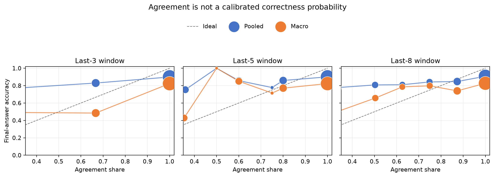{width=72%}

作为反事实敏感性检查，strict stop 在首次出现连续 \(w\) 个非空、规范化等价答案时提交，并计入已消费的 probe output：w=3/5/8 的 macro accuracy drop 分别为 -46.60/-29.99/-17.29 pp，macro net saving 为 82.3%/66.1%/51.4%。w=3 产生 1,478 次错误提交；在实际停止的轨迹上平均节省 4,706 main tokens。因此增大 window 明显降低风险，但不能单独解决错误早停。

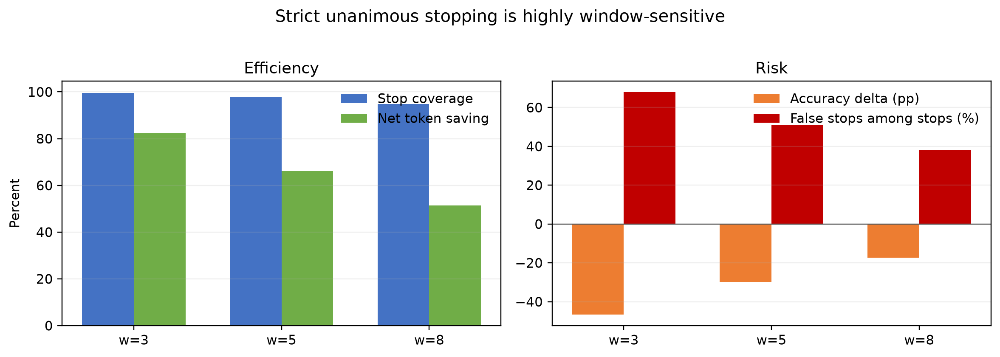{width=66%}

数据源：[calibration CSV](../benchmark/FalseConsensus/results/governor_v2/multivariate_a1_a3/a2_calibration_summary.csv)、[strict-stop CSV](../benchmark/FalseConsensus/results/governor_v2/multivariate_a1_a3/a2_stop_summary.csv)。A2 现在直接支撑 tested windows/settings 下的 agreement miscalibration 和 window sensitivity，不再依赖单 seed 的 `w=5, n=36` 局部点。

## A3. Probe-1、first-consensus recovery 与 consensus time {#app-a3}

`Probe-1` 是 64 main tokens 处的第一次 completion，只作为 early-readout control。主要 recovery 证据使用首次 trailing window（至少 3 个非空答案）达到 share \(\geq 0.8\) 的 dominant answer。

| Window \(w\) | Reached pooled / macro | Recovery | Overthinking | Recovery:overthinking | Probe-1 wrong -> correct final pooled / macro |
|---:|---:|---:|---:|---:|---:|
| 3 | 98.9% / 99.6% | 1,204 | 36 | 33.44:1 | 86.0% / 78.0% |
| 5 | 98.8% / 99.5% | 1,137 | 39 | 29.15:1 | 86.0% / 78.0% |
| 8 | 95.8% / 98.1% | 867 | 44 | 19.70:1 | 86.0% / 78.0% |

主分析 \(w=5\) 的 1,137 次 recovery 与 39 次 overthinking 在六个 model × benchmark cells 中方向一致；各 cell 的原始比值至少为 24.4:1，两个 AIME24 cell 没有观察到 overthinking。首次共识答案与 final answer 不同的轨迹为 1,411 条，其中 1,139 条最终正确。由此，consensus-recovery claim 明显强于 Probe-1 控制项。

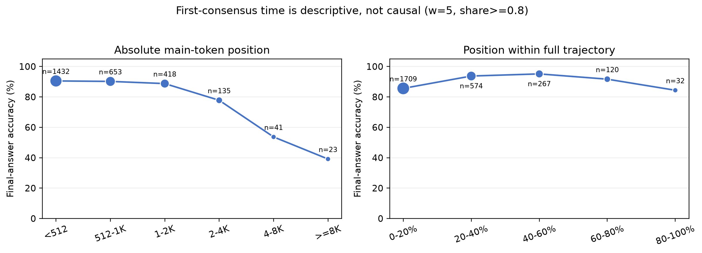{width=72%}

数据源：[mechanism CSV](../benchmark/FalseConsensus/results/governor_v2/multivariate_a1_a3/a3_mechanism_summary.csv)、[consensus-time CSV](../benchmark/FalseConsensus/results/governor_v2/multivariate_a1_a3/a3_consensus_time.csv)。A3 直接支撑 F1.2-F1.3；“晚共识更差”不再作为稳健 F1.4 证据，因为归一化位置不支持单调关系。

## A4. False-consensus taxonomy 与当前人工审计状态 {#app-a4}

**状态：尚无可报告的人工标注结果。** 完整导出包含 134 个去重案例，已进入
[Task A taxonomy 页面](../taskA_taxonomy.html)，但 repo 中尚未出现 Task A/Task B
返回的 `annotations_P*.csv`。双人标注、inter-annotator agreement 和冲突仲裁均未完成。

早期 28 例 AI-assisted 分类只能用于设计 taxonomy 和标注界面，不能视为人工实验结果，
也不能支撑类别比例或“probe 格式伪影占比”等正文 claim。A4 当前只记录数据准备状态；
F1.6-F1.7 均标为**未验证**，待双人标注回收后再填入类别计数、比例、agreement 和仲裁结果。

## A5. 17,712-rule Development sweep 与 conservative gate {#app-a5}

每条规则覆盖 \(2\) models × \(3\) benchmarks × \(3\) seeds × train/dev 两个 split，
即 36 个 environment-split cells；17,712 条规则共形成 637,632 行。下表先单独定义
selection 使用的三个量，避免把规则级和 cell 级统计混在一起。

| 规则级量 | 明确定义 |
|---|---|
| `D_model(r)` | 对每个 `(split, model)`，先对其 benchmark × seed cells 的 accuracy drop 取宏平均，再取所有 train/dev `(split, model)` 中的最大值；越小越安全 |
| `D_benchmark(r)` | 对每个 `(split, benchmark)`，先对其 model × seed cells 的 accuracy drop 取宏平均，再取所有 train/dev `(split, benchmark)` 中的最大值；越小越安全 |
| `PSF(r)` | 36 个 train/dev cells 中 net total-token saving 严格为正的比例；越大越稳健 |

Conservative gate 要求
`D_model <= 1.5 pp`、`D_benchmark <= 2.0 pp`、`PSF >= 0.8`。结果是
0/17,712 条规则通过；即使只看 `D_model <= 1.5 pp` 也仍为 0 条。

下面的“分位数”是：先为**每一条规则**计算上述
`D_model(r)`，再对 17,712 个规则级数值组成的分布取分位数；
它不是 problem、probe、environment cell 或 token saving 的分位数。

| 规则集合 | Min | P1 | P5 | P25 | P50 |
|---|---:|---:|---:|---:|---:|
| Development selection：`D_model(r)` | 1.852 | 3.370 | 4.259 | 10.722 | 20.074 |

数值单位为 percentage points，使用 development phase 的 train+dev selection rows。
早期版本曾并列完整四模型 Test 分位数，但其中 Llama run 已确认发生退化乱码生成，
因此该行撤回。有效的同两模型 Dev/Test cross-split 比较独立放在 A8。

作为方向性补充，在 637,632 个 development rule-cell 中，67.72% accuracy 下降、
6.75% 上升、25.53% 不变。达到最小 `D_model = 1.852 pp` 的规则在 Dev
仍为负净节省：DeepSeek -8.9%，Qwen -8.3%。这些是另外两种统计口径，不再塞入
规则分位数表。

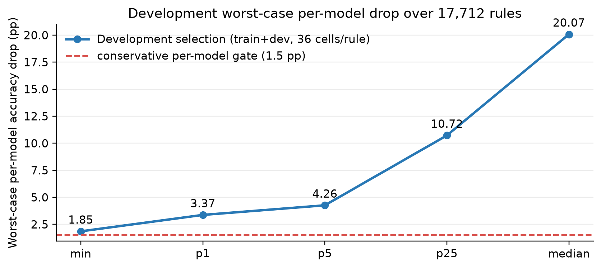{width=62%}

数据源：[direction-of-effect audit](../benchmark/FalseConsensus/governor_v2/analysis/direction_of_effect.txt)、[confirmation frontier](../benchmark/FalseConsensus/governor_v2/analysis/confirmation_frontier.txt)、[sweep shards 与 checksums](../benchmark/FalseConsensus/governor_v2/generated/sweep_checksums.sha256)、[selection blocker](../benchmark/FalseConsensus/governor_v2/BLOCKERS.md)。本项支撑 F1.8、F2.2-F2.7 和 F3.4。

## A6. Rule-family frontier 与 adaptive event probing {#app-a6}

四个 family 是统一七维规则 schema 中的四个搜索模板；family 指主要 evidence/schedule
结构，其他 maturity、persistence、certainty、validity 和 history 维度仍在各自网格内变化。

| Family | 简短含义 | 该 family 最小 `D_model` | 同一规则的 Dev `S20` |
|---|---|---:|---:|
| Latest persistence | 最新有效答案需连续保持相同若干次，并可要求跨越最短 token span | 8.20 pp | ≈9.7% |
| Window share | 最近 \(w\) 个有效 probes 中，dominant answer share 达到阈值 | 4.87 pp | ≈0.3% |
| Entropy budget fraction | 达到最小预算比例后，答案分布 entropy 低于阈值才允许接受 | 1.85 pp | -11.0% |
| Adaptive event probe | 不只定期 probe；在结论词、entropy drop、反思转折或答案候选等事件处 probe，再用 latest/window/entropy evidence 判停 | 9.70 pp | ≈4.5% |

这里 `S20(r)` 是该规则在 **18 个 Dev environments** 上
`total-token saving fraction` 的第 20 百分位；total tokens 包括主生成和该规则实际消费的
probe output，因此 `S20 > 0` 表示至少约 80% 的 Dev 环境仍有正净节省。表中每行只是
该 family 内 `D_model` 最小的诊断点，不是四个正式 selected rules。

### Pareto sweep 与预注册选择

实际选择器为每条规则计算三个目标：

1. 最大化 Dev `S20(r)`；
2. 最小化 train+dev 的 `D_model(r)`；
3. 最小化 train+dev 的 `D_benchmark(r)`。

若另一规则在三个目标上都不差且至少一个严格更好，则当前规则被支配；完全同指标的规则
只保留复杂度更低者。17,712 个候选最终形成 93 个非支配点。随后分别对
conservative、balanced、token-efficient 三组预注册 gate 过滤 Pareto 前沿；每组在合格点中
优先选择 Dev `S20` 最大的、尚未被其他 operating point 使用的规则，再以 PSF、
规则复杂度和 rule ID 破同分。

关键结果是：conservative gate 下没有合格点，因此预注册 selector **没有成功冻结三个
operating-point 策略**。A6 上表是 family frontier diagnostic，不能写成
“Pareto sweep 选出的四个策略”。此外，当前实现以 train+dev 共同构造风险约束、以 Dev
`S20` 排序，并不是先只用 train 剪枝、再完全独立用 Dev 选择。

数据源：[selection implementation](../benchmark/FalseConsensus/governor_v2/replay_rules.py)、
[protocol](../benchmark/FalseConsensus/governor_v2/protocol.json)、
[selection blocker](../benchmark/FalseConsensus/governor_v2/BLOCKERS.md)、
[candidate rule registry](../benchmark/FalseConsensus/governor_v2/generated/candidate_rules.jsonl)。
本项支撑 F2.7-F2.8；它只否定当前 Dev grid 中的 adaptive-event family，不否定未来
online adaptive controller。

## A7. Accuracy-tax 的方向强度 {#app-a7}

这里比较同一题目的完整生成与反事实早停结果：

- **Harm（破坏恢复）**：完整生成答对，但早停提交错误答案；
- **Rescue（避免过度思考）**：完整生成答错，但早停提交正确答案；
- **Harm/rescue ratio**：Harm 数量除以 Rescue 数量。大于 1 表示早停破坏正确恢复
  比挽救错误终局更常见。旧缩写 `FC/SW`、`FW/SC` 不再使用。

四个 named Governor rules 均在固定 128-token probe schedule 上运行：

| Rule | 具体停止条件 |
|---|---|
| Naive consensus | 不设最小 token；连续 3 个非空 probe 答案一致即停止，不要求 certainty |
| Conservative | 至少生成 1,024 tokens；连续 8 个 schema-valid 答案一致，且全部标记 certain |
| Balanced-general | AMC/AIME 至少生成 1,536 tokens；连续 5 个 task-aware-valid 答案一致且 certain |
| Balanced-math | MATH level <4 至少 768 tokens、level ≥4 至少 2,048 tokens；连续 5 个 schema-valid 答案一致且 certain |

| Named rule | Stopped | Harm：完整对、早停错 | Rescue：完整错、早停对 | Harm/rescue |
|---|---:|---:|---:|---:|
| Naive consensus | 2,649 | 1,055 | 30 | 35.17 |
| Conservative | 2,157 | 467 | 32 | 14.59 |
| Balanced-general | 325 | 60 | 4 | 15.00 |
| Balanced-math | 1,946 | 476 | 26 | 18.31 |

Naive 的模型拆分也同向：Qwen 为 575/16 = 35.94，DeepSeek 为
480/14 = 34.29。它们不是额外规则，因此不再混入主表。

下面两个 diagnostic 必须区分。`First local consensus` 在最近最多 \(w\) 个 probes 中
至少有 3 个有效答案、dominant share ≥0.8 时触发，可能在窗口尚未填满时触发；
`Strict unanimous` 则要求恰好连续 \(w\) 个非空答案全部一致。

\Needspace{9\baselineskip}

**First local consensus（share ≥0.8，至少 3 个有效答案）**

| Window \(w\) | Reached | Harm | Rescue | Harm/rescue |
|---:|---:|---:|---:|---:|
| 3 | 2,707 | 1,204 | 36 | 33.44 |
| 5 | 2,702 | 1,137 | 39 | 29.15 |
| 8 | 2,621 | 867 | 44 | 19.70 |

**Strict unanimous stop（连续 \(w\) 个答案全部一致）**

| Window \(w\) | Stopped | Harm | Rescue | Harm/rescue |
|---:|---:|---:|---:|---:|
| 3 | 2,707 | 1,204 | 36 | 33.44 |
| 5 | 2,620 | 730 | 42 | 17.38 |
| 8 | 2,456 | 415 | 44 | 9.43 |

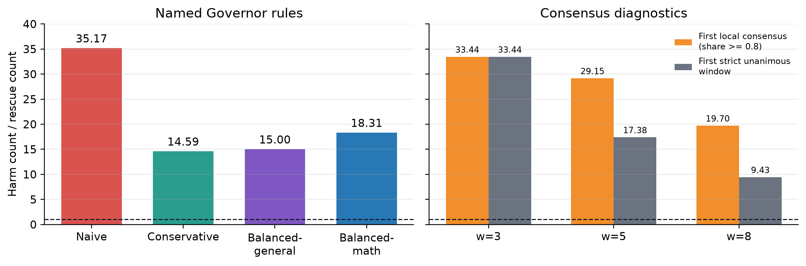{width=72%}

数据源：[named-rule direction audit](../benchmark/FalseConsensus/governor_v2/analysis/direction_of_effect_ratio.txt)、
[local-consensus mechanism CSV](../benchmark/FalseConsensus/results/governor_v2/multivariate_a1_a3/a3_mechanism_summary.csv)、
[strict-stop CSV](../benchmark/FalseConsensus/results/governor_v2/multivariate_a1_a3/a2_stop_summary.csv)。
本项直接支撑 F1.3 与 F3.3；该 ratio 是配对结果的方向强度，不是 causal risk ratio。

## A8. Dev-Test cross-split confirmation {#app-a8}

比较同一两个 development models 上共同存在的 17,712 个规则；Dev 选择与 Test 评估分别使用各自 split。

| 指标 | 结果 |
|---|---:|
| Dev gate pass | 0 |
| Test-alone gate pass | 272 |
| Joint Dev and Test pass | 0 |
| 272 个 Test passers 回看 Dev | drop min 4.98；median 5.09；max 5.65 pp |
| Dev least-bad rule | Dev 1.85 -> Test 0.11 pp |
| Test least-bad rule | Test -0.33 -> Dev 4.87 pp |
| Across-rule correlation | Pearson r = 0.962 |

为直观看完整策略空间，图 A8 对 Dev 和 Test 分别画出全部 17,712 条规则。横轴是
同两模型的 worst per-model accuracy drop，纵轴是 18 个对应 environments 的
total-token saving 第 20 百分位；每个点是一条规则，黑线是“accuracy drop 更低、
saving 更高”的二维非支配前沿。二维线只用于展示，不替代完整 gate 中额外的
per-benchmark drop 和 PSF 约束。

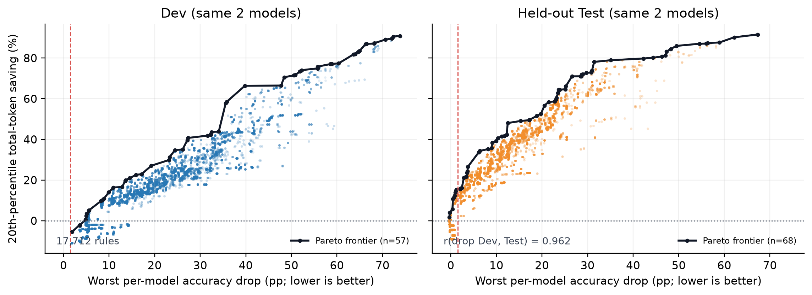{width=78%}

此前报告的“完整 4-model Test 有 204 个 test-only passers”混入了无效 Llama run，
因此不再作为证据。A8 只使用两个采集有效且 Dev/Test 对齐的 development models；
Qwen-32B 作为单独 scale diagnostic 放在 A9，不与同模型 cross-split frontier 混池。

数据源：[cross-split audit](../benchmark/FalseConsensus/governor_v2/analysis/confirmation_cross_split.txt)、
[per-rule plot data](../benchmark/FalseConsensus/results/appendix_evidence_upgrade/a8_strategy_points.csv)、
[rebuild script](../benchmark/FalseConsensus/governor_v2/analysis/build_a8_strategy_points.py)。
本项支撑 F2.5、F2.6、F2.9-F2.10，并说明可靠结论是 joint gate 为空与 frontier 同向，
而非某个精确 floor。

## A9. Confirmation 覆盖与 unseen-model 边界 {#app-a9}

| Model role | Model | 计划范围 | 实际有效性 | 结论 |
|---|---|---|---|---|
| Seen development | Qwen3-8B | 3 benchmarks × seeds 45/46/47 | 342/342 trajectories；13 truncated (3.8%) | 完整有效 |
| Seen development | DeepSeek-7B | 3 benchmarks × seeds 45/46/47 | 342/342；9 truncated (2.6%) | 完整有效 |
| Held-out scale | DeepSeek-Qwen-32B | 3 benchmarks × seed 45 | 114/114；1 truncated (0.9%) | **预注册范围内完整**；只有单 seed，因此只是规模证据 |
| Held-out architecture | DeepSeek-Llama-8B | 原计划 3 benchmarks × seed 45 | 仅 MATH/AMC，共 108 条；缺 AIME；98 length-stop、95 个空 final answer、仅 1/108 正确 | **运行无效，不能作为架构证据** |

32B 并非采集不完整：held-out scale 模型从一开始就只计划 seed 45，以控制 32B confirmation
成本；三 benchmark 的全部 114 题和 probes 均齐全。

Llama 的问题也不只是 cap 设置偏小。98 条 `finish_reason=length` 轨迹达到 16K cap，
但其正文从开头便主要是重复的句点、括号、`and` 等退化乱码，而不是正常数学推理；
95/108 无法抽取答案，最终只有 1 题正确。提交记录说明 AIME24 因 32K
“non-terminating generation”被省略。现有 artifact 没有保存足以唯一归因的 server log、
checkpoint hash 或 tokenizer smoke，因此无法判断具体是 checkpoint、tokenizer/chat
template 还是 serving/解码错误；但可以确定该 run 不应解释成“较弱模型推理更长”。

因此，目录级审计是 **23 个 observed environments 文件齐全**，但预注册计划实际为
24 个 environments、912 条轨迹；最终只有 23/24、906/912，且其中两个 Llama
environments 科学上无效。修复顺序应是：先用固定数学题做可读性与答案抽取 smoke，
核对模型权重/tokenizer/template，再进行 cap pilot，最后补齐三 benchmark。

数据源：[统一 environment audit](../benchmark/FalseConsensus/results/appendix_evidence_upgrade/confirmation_environment_audit.csv)、
[Llama trajectories](../benchmark/FalseConsensus/results/governor_v2/confirmation__deepseek-ai-deepseek-r1-distill-llama-8b__math500__seed_45/main/traj/)、
采集提交 `612cc69b` 与
[seen-model audit](../benchmark/FalseConsensus/results/governor_v2/confirmation_runtime/audit_final.json)。

## A10. Related-work baselines 与 Governor Pareto 位置 {#app-a10}

Dev benchmark-macro；2 models × 3 benchmarks × seeds 42/43/44。`Saving` 为 all-generated output-token saving，包含方法辅助输出，不含 prompt/prefill。

三项 baseline 都进行了**独立的 method-specific GPU probing**，不是把 Governor
`simple@32` probe 改名后重放；每种方法均有 2,736 条逐题记录和 18 个完整
method-environments。但 “有真实 probe 数据” 不等于三者都是端到端 faithful：

| Baseline | 原始覆盖 | 忠实复现的 probe 部分 | 仍存在的 adaptation / 正确标签 |
|---|---:|---|---|
| CertaIndex mid | 2,736 rows；27,193 probe calls | 原作 suffix、64-token interval、20-token cap、patience=3、certainty 与数学等价 stop rule | 只把 live chunk timing 换成相同位置的 frozen prefixes；**probe-level faithful，frozen-timing reproduction** |
| DEER | 2,736 rows；14,017 trial calls | 官方 `Wait` trigger、最多 10 次、20-token trial、0.95 门槛、avg1/avg2、Qwen `</think>` gate 与正式 readout | main path 预先冻结；**official probe/readout replay，不是完整 online controller run** |
| TJE | 2,736 rows；38,672 confidence calls | Figure-2 system instruction、10 个 confidence labels、`Wait` + `</think>` trigger、`Almost certain` 门槛 | main trajectory 未在 TJE system prompt 与低置信 `Wait` 续写下重新生成，且 label 用 constrained choice；**frozen adaptation，不能称 fully faithful** |

因此，A10 数字是可审计的同轨迹、真实 re-probing 比较。CertaIndex 的 probe
faithfulness 最强；DEER 的 trial/confidence/readout 逻辑忠实，但部署路径冻结；
TJE 的 probe 内容有原文依据，因主轨迹分布和 constrained decoding 两项改动，
只能作为较低保真度的 adaptation。三者均不应直接称为“复现了原论文端到端结果”。

| Model | Method | Accuracy | Δacc vs Full | Saving | Main saving | Stop rate |
|---|---|---:|---:|---:|---:|---:|
| Qwen3-8B | Full | 85.44% | 0.00 pp | 0.00% | - | - |
| Qwen3-8B | CertaIndex | 15.33% | -70.11 pp | 90.10% | 91.00% | 99.78% |
| Qwen3-8B | DEER | 86.22% | +0.78 pp | 16.29% | 21.37% | 41.35% |
| Qwen3-8B | TJE | 85.00% | -0.44 pp | 2.03% | 5.82% | 22.50% |
| DeepSeek-7B | Full | 79.76% | 0.00 pp | 0.00% | - | - |
| DeepSeek-7B | CertaIndex | 23.87% | -55.89 pp | 76.68% | 78.60% | 98.67% |
| DeepSeek-7B | DEER | 74.93% | -4.83 pp | 20.16% | 25.68% | 56.07% |
| DeepSeek-7B | TJE | 60.67% | -19.09 pp | 65.00% | 78.45% | 93.44% |

逐 benchmark 的三-seed macro 显示重要异质性：

| Model | Method | Δacc range across benchmarks | Saving range across benchmarks |
|---|---|---:|---:|
| Qwen3-8B | CertaIndex | -83.33 to -43.67 pp | 89.85% to 89.98% |
| Qwen3-8B | DEER | 0.00 to +2.33 pp | 4.83% to 33.36% |
| Qwen3-8B | TJE | -1.33 to 0.00 pp | -1.84% to 4.30% |
| DeepSeek-7B | CertaIndex | -75.00 to -42.67 pp | 63.33% to 83.50% |
| DeepSeek-7B | DEER | -10.33 to 0.00 pp | 4.47% to 39.77% |
| DeepSeek-7B | TJE | -27.78 to -8.67 pp | 56.42% to 73.89% |

同一 matched harness 中，三个 named Governor consensus baselines 的模型宏结果也明显远离低-drop 区：balanced-task-aware 为 Qwen `-34.39 pp / 54.31%`、DeepSeek `-15.13 pp / 40.42%`；conservative 为 `-29.69/47.83%` 与 `-9.94/26.22%`；naive 为 `-56.48/84.36%` 与 `-36.22/68.98%`。

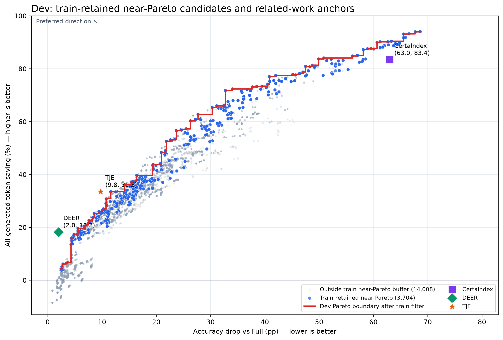{width=72%}

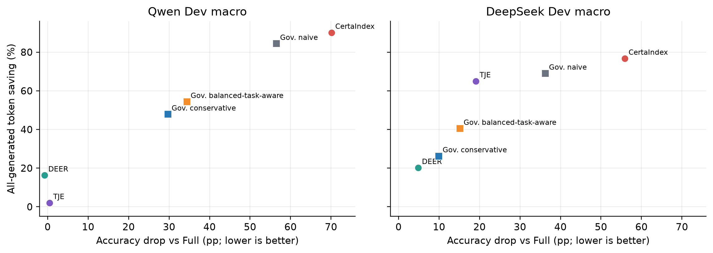{width=68%}

数据源：[related-work protocol/commands](../benchmark/FalseConsensus/related_work/README.md)、
[raw method-specific outputs](../benchmark/FalseConsensus/results/related_work/full/)、
[related-work aggregate report](../benchmark/FalseConsensus/results/related_work/aggregate/report.md)、
[benchmark audit CSV](../benchmark/FalseConsensus/results/appendix_evidence_upgrade/related_work_benchmark_macro.csv)、
[matched Governor macro](../benchmark/FalseConsensus/results/governor_v2/existing_methods_matched/governor_dev_macro.csv)、
[Pareto source CSV](../benchmark/FalseConsensus/report/figures/governor_related_work_pareto_frontiers.csv)。
本项支撑 F4.1-F4.5 与 F5.9；上述 fidelity label 必须随结果出现，现有 artifact
仍无 related-work Test rows。

## A11. Fast-path-only 配对消融与 trial/readout 冗余 {#app-a11}

Fast path 规则：若已有 DEER trial answer 非空且 confidence >0.995，直接交付 trial answer 并省去 formal readout；否则完全保持原 DEER。主轨迹和 branch 均不改变。

| Split / model | Original DEER acc | Fast acc | Δacc | Original saving | Fast saving | Δsaving |
|---|---:|---:|---:|---:|---:|---:|
| Train / Qwen3-8B | 79.10% | 79.75% | +0.65 pp | 17.17% | 20.21% | +3.04 pp |
| Train / DeepSeek-7B | 67.55% | 68.96% | +1.41 pp | 23.61% | 25.51% | +1.90 pp |
| Dev / Qwen3-8B | 86.22% | 85.89% | -0.33 pp | 16.29% | 18.69% | +2.39 pp |
| Dev / DeepSeek-7B | 74.93% | 76.37% | +1.44 pp | 20.16% | 22.17% | +2.01 pp |

Dev 共 684 trajectories：340 个 confidence candidates，5 个 invalid 回退，335 个 fast commits；16 个 readout-wrong -> trial-correct，6 个 readout-correct -> trial-wrong；避免 131,199 output tokens 和 361,079 prompt/prefill tokens。统一 raw audit 又重算 486 个 Dev triggered pairs：72 次 trial/readout 不一致（14.81%），trial/readout accuracy 88.68%/88.48%，formal readout 平均 470.5 output tokens。

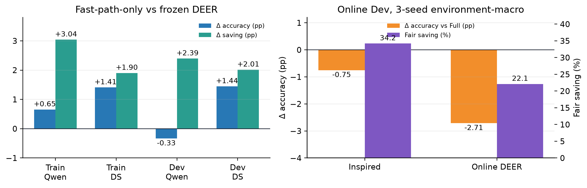{width=78%}

数据源：[fast-path report](../benchmark/FalseConsensus/results/deer_inspired/fast_path_only_replay/report.md)、[fixed summary.json](../benchmark/FalseConsensus/results/deer_inspired/fast_path_only_replay/summary.json)、[统一 evidence summary](../benchmark/FalseConsensus/results/appendix_evidence_upgrade/summary.json)、related-work DEER raw artifacts。Train/Dev fast-path table 支撑 F5.2；固定的 486-pair readout audit 支撑 F5.1。

## A12. 完整 DEER-inspired online controller：三 seed Dev {#app-a12}

每个 seed 含 456 method-problem rows；两模型、三 benchmark。统一 raw audit 检查了 36/36 run directories、1,368/1,368 rows；所有 manifest 完整，36 个 run 使用同一个 protocol version 与 config hash。下表为 benchmark/environment 等权宏平均。逐 seed 与三-seed summary 分开，避免把 macro 当成额外 seed。

| Seed | Inspired Δacc vs Full | Inspired fair saving | Qwen Δacc / saving | DeepSeek Δacc / saving |
|---|---:|---:|---:|---:|
| 42 | -0.36 pp | 43.7% | +2.78 pp / 45.6% | -3.50 pp / 41.8% |
| 43 | +4.17 pp | 33.8% | -1.72 pp / 36.1% | +10.06 pp / 31.5% |
| 44 | -6.06 pp | 25.1% | -5.56 pp / 41.2% | -6.56 pp / 8.9% |

| Method summary | Δacc vs Full | Fair saving | Qwen Δacc / saving | DeepSeek Δacc / saving |
|---|---:|---:|---:|---:|
| Inspired | -0.75 pp | 34.2% | -1.50 pp / 41.0% | 0.00 pp / 27.4% |
| Online DEER | -2.71 pp | 22.1% | -1.54 pp / 18.0% | -3.89 pp / 26.1% |

Paired 18-environment bootstrap（Inspired - DEER）：Δaccuracy +1.96 pp，95% CI [-5.04, +8.97]；Δsaving +12.11 pp，95% CI [+0.68, +22.85]。数据源：[统一 evidence summary](../benchmark/FalseConsensus/results/appendix_evidence_upgrade/summary.json)、[逐环境 metrics](../benchmark/FalseConsensus/results/appendix_evidence_upgrade/deer_online_environment_metrics.csv)、[multiseed report](../benchmark/FalseConsensus/deer_inspired/multiseed_report.txt)、[seed-42 formal aggregate](../benchmark/FalseConsensus/results/deer_inspired/online_dev/aggregate/report.md)。本项支撑 F5.3-F5.4 与 F5.9；数据完整性问题已补齐，但仍尚无 test。

## A13. 聚合敏感性与 verification-branch 消融 {#app-a13}

### A13.1 Environment-macro 与 problem-pooled

| 聚合 | Inspired accuracy / saving | Online DEER accuracy / saving | Inspired - DEER |
|---|---:|---:|---:|
| Environment-macro | Δacc -0.75 pp / 34.2% | Δacc -2.71 pp / 22.1% | +1.96 pp accuracy；+12.11 pp saving |
| Problem-pooled（684 problems） | 88.74% / 36.26% | 84.65% / 37.74% | +4.09 pp accuracy；-1.48 pp saving |

### A13.2 Verification branch raw audit

| 诊断 | 结果 |
|---|---:|
| First branch candidates | 117 |
| Correct -> correct | 79 |
| Wrong -> wrong | 36 |
| Wrong -> correct | 1 |
| Correct -> wrong | 1 |
| Branch commits | 100；accuracy 69% vs matched full 78% |
| Verification termination | 117/117 first branches 恰好 64 tokens，`finish_reason=length` |
| Counterfactual: 直接 Stage-1 commit | 宏准确率不变；saving +0.764 pp；少 38,990 output tokens |

第一张表说明 F5.4 的 saving 优势依赖 environment-macro weighting，直接支撑 F5.5。第二张表现已由 [统一 evidence audit](../benchmark/FalseConsensus/analyze_appendix_evidence.py) 从 3-seed online raw records 固化重算；它以高可靠度反驳 F5.6-F5.7 当前版本，而不是为 verification 提供正面支撑。117 个 first branch records 中只有 1 个包含后续第二次 branch，表中转移统一按 first branch candidate 到最终 delivered answer 定义。

## A14. 协议、置信度与 token accounting {#app-a14}

| 项目 | 固定定义/实现 | 影响 |
|---|---|---|
| Frozen-trajectory Governor | 先冻结 main trajectory，再对固定 prefixes 离线 probe；规则只选择 stop/readout | 支撑 stopping rule 与 main generation 解耦；不是 online deployment |
| `simple@32` | 单次 probe completion，最多 32 output tokens；不是 32 次采样 | 所有 dense-probe 税和 evidence density 解读均依赖此事实 |
| Probe interval | 当前主 sweep 为每 64 main tokens 一个可用 probe | 使 stop position 足够稠密，也造成较高 probe tax |
| Governor `is_certain` | simple@32 文本中不含 uncertainty markers | 不是 token-probability confidence |
| DEER confidence - DeepSeek | Trial-answer token probabilities 的算术平均（`avg1`） | 模型相关 readout |
| DEER confidence - Qwen3 | Trial-answer token probabilities 的几何平均（`avg2`），并要求 `</think>` | 过滤 incomplete thinking；与 DeepSeek 聚合不同 |
| DEER-Pro `C_cali` | 已做 2,736 条 trajectory / 12,024 trials 的 CPU 可行性审计；每个 transition 仅有 1 个 inducer，而原式需要 4 个 | 现有日志不能 faithful 计算 `C_cali`；A23 的 token-MAD 仅是诊断 surrogate |
| Output-token accounting | `T=s+p`；gross `(B-s)/B`；net `(B-s-p)/B` | `p` 为 consumed probe/aux output；不含 prompt/prefill、wall time、KV memory |
| Online fair saving | `(full output - all controller-generated output)/full output` | 包含 main、probe、verification、readout output |

实现/协议来源：[dense probing implementation](../benchmark/FalseConsensus/governor_v2/dense_probe.py)、[related-work README](../benchmark/FalseConsensus/related_work/README.md)、[DEER config](../benchmark/FalseConsensus/related_work/configs/deer.json)、[Governor v2 protocol](../benchmark/FalseConsensus/governor_v2/protocol.json)、[在线 36-run audit](../benchmark/FalseConsensus/results/appendix_evidence_upgrade/summary.json)。本项支撑 F2.1-F2.2、F3.1-F3.2、F3.5-F3.6、F4.2、F4.5-F4.6 和 F5.11 的实现边界。

## A15. Evidence gaps、反证与待完成实验 {#app-a15}

| 对应 claim | 当前缺口/反证 | 升级可靠性所需最小证据 |
|---|---|---|
| F1.6-F1.7 | 134 例双标已完成，但精确一致仅 47.76%、kappa=0.286；A/D 操作定义冲突 | 明确“最终候选答案 vs 中间量/placeholder”边界，仲裁 70 个冲突并输出最终 taxonomy |
| F2.12 | 有限 17,712-rule schema 不能覆盖所有 consensus controller/domain | 只能收窄量词；新增规则空间也不能证明无限全称 |
| F3.5-F3.6 | interval × cap 的真实 probe 消融已完成；尚未测 KV reuse 与 prompt/prefill 的部署成本 | 若论文讨论 wall time/部署成本，再做 KV-cache-aware online profiling；否则限定为 generated-output accounting |
| F4.4/F4.6 | Baselines 在 trigger、trial、readout 等处同时不同；不是原论文完整端到端复现 | matched-signal ablation；在各论文原设置上的独立 sanity check |
| F4.1-F4.5 | Test artifacts 已完整覆盖 3 methods × 684 trajectories；旧 `report.md` 错把 8,208 当 test 期望值而显示 incomplete | 修复 report generator 的 scope-aware expected count，并统一输出最终 Test 表 |
| F5.6-F5.7 | Branch 净纠错为 0；所有 commit verification 均被 64-token cap 截断 | 删除该贡献，或预注册新 verdict/controller 并做组件消融 |
| F5.8 | 单个真实 branch 的 128/256-token smoke 均未稳定输出 verdict | 更简洁的可解析 verdict，先做批量 feasibility，再做 accuracy test |
| F5.10 | 完整 boundary controller 尚无 held-out test、32B 或新架构 online 结果 | Test × 多 seed × 至少一个 scale/architecture holdout |
| F5.11 | `C_cali` 可行性审计完成，但现有每-transition 单 inducer 日志不足以 faithful 重建 N=4 公式 | 如保留此扩展，GPU 补采 3 个 varied inducers；否则只报告 token-MAD surrogate 的诊断边界 |
| F2.11 | 旧 Llama seed-45 confirmation 仍无效；修复后已完成三 benchmark × 三 seed development scale sweep | 若要升级为 held-out architecture confirmation，冻结规则后另跑未参与选择的 Llama split |
| 全部 accuracy claims | 89 个 risk-enriched 困难/分歧 cases 双标已完成，kappa=0.706；5 个 verdict 冲突，且样本不能代表总体 | 完成 5 例仲裁；若要估总体 error rate，按抽样层加权或另抽简单随机样本 |
| 全部 domain claims | 仅竞赛数学 | 至少一个 code 或 open-ended reasoning benchmark |

本项是“证据落点”而非正面结果：凡主矩阵引用 A15，均表示该 claim 当前必须降格、收窄或保留为 future work。

\newpage

## A16. 修复后的 Llama-8B 多 seed scale sweep {#app-a16}

本项只追加新证据，不回写前述历史记录。A9 记录的是旧 seed-45 confirmation run 的
退化乱码与缺失 AIME；A16 使用修复后的 Llama 专属 prompt（显式且仅加入一个 BOS）
重新采集 development 数据。两者不是同一 run，旧数据仍保持无效，不能与新结果混池。

修复后范围为 DeepSeek-R1-Distill-Llama-8B × MATH500/AMC23/AIME24 × seeds
42/43/44，共 9 个 environments。Main、dense simple@32 和 adaptive simple@32
各有 1,710 个逐题文件；所有题号、manifest、model/seed 配置和 probe 顺序完整，
空 final answer 与乱码字符均为 0。

| Benchmark | n（3 seeds） | Full accuracy | Capped | Mean main tokens |
|---|---:|---:|---:|---:|
| MATH500 | 1,500 | 88.40% | 4.00% | 3,882 |
| AMC23 | 120 | 88.33% | 5.83% | 5,620 |
| AIME24 | 90 | 47.78% | 6.67% | 13,160 |
| Overall | 1,710 | 86.26% | 4.27% | 4,492 |

在同一 17,712-rule registry 上，本地 replay 精确产生
\(17{,}712 \times 27 = 478{,}224\) 行，即每条规则各有 9 train、9 dev 和
9 test environment rows。正式三目标 Pareto 定义仍是：最大化 Dev `S20`，同时最小化
train+dev worst-model 和 worst-benchmark accuracy drop；该前沿包含 75 条规则。

| Operating-point gate | 合格 Pareto rules | 最佳规则/结果 |
|---|---:|---|
| Conservative | 0 | - |
| Balanced | 0 | - |
| Token-efficient | 4 | `entropy_budget_fraction__1499bbc05821` |

最佳 token-efficient 规则的 train+dev worst-model drop 为 1.50 pp，
worst-benchmark drop 为 4.17 pp；Dev `S20` 为 1.39%，Dev mean saving 为
9.35%，18 个 train+dev cells 中 88.89% 为正节省。完全不参与选择的 test split 上，
同一规则 worst-benchmark drop 为 1.67 pp、mean drop 为 0.56 pp、mean saving 为
14.29%，但 `S20=-1.59%`；因此均值有利并不代表跨环境稳健节省。全规则
Dev/Test worst-benchmark drop 的 Pearson \(r=0.899\)。

下图沿用此前 Train/Dev 二维图的展示口径：先在每个 benchmark 内汇总三 seed，
再对三个 benchmark 宏平均 accuracy drop 与 total-decode-token saving；Train 使用
2 pp near-Pareto saving buffer，Dev 只对 Train 保留的 3,408 条规则重画前沿。
该二维图得到 98 个 Train strict-frontier 点和 49 个 Dev frontier 点，仅用于直观展示，
不替代上面的 75 点正式三目标 Pareto。

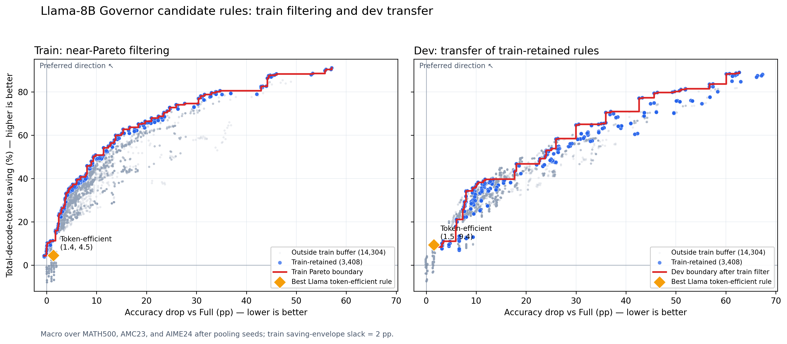{width=93%}

数据源：[完整 sweep](../benchmark/FalseConsensus/governor_v2/generated/sweep_scale_llama.jsonl.gz)、
[逐规则 Pareto CSV](../benchmark/FalseConsensus/governor_v2/analysis/scale_llama_pareto.csv)、
[机器可读摘要与 hashes](../benchmark/FalseConsensus/governor_v2/analysis/scale_llama_pareto_summary.json)、
[验收报告](../benchmark/FalseConsensus/governor_v2/analysis/scale_llama_pareto_report.md)、
[绘图数据](../benchmark/FalseConsensus/report/figures/scale_llama_train_dev_pareto_points.csv)。
该结果恢复了跨架构 development-scale 证据，但不是预注册 seed-45 held-out
confirmation 的替代品。

\newpage

## A17. Human evaluation 双标回收与验收 {#app-a17}

两项任务的原始导出均已完整回收：Task A 两位标注者各覆盖 134/134 个
false-consensus cases；Task B 各覆盖 89/89 个 grader-audit rows。没有重复样本、
未知题号或非法主标签。CSV 文本行数的表面差异来自末行无 newline，而不是缺题。

### A17.1 False-consensus taxonomy

| 类别 | 定义 | Rater 1 | Rater 2 |
|---|---|---:|---:|
| A | Numeric collapse | 27 | 72 |
| B | Expression collapse | 3 | 6 |
| C | Sign error | 1 | 1 |
| D | Reasoning gap | 80 | 28 |
| E | Format hallucination | 23 | 27 |

精确标签一致为 64/134 = 47.76%，Cohen's kappa = 0.286；70 题需要仲裁。
主要分歧是 D -> A：Rater 1 标为 D、Rater 2 标为 A 的案例有 54 个。Rater 1
134/134 均标记 confident，Rater 2 为 129/134。该结果说明 A/D 的操作定义尚未形成
可靠边界；在完成仲裁前，不能把任何一位标注者的类别比例当作最终 taxonomy 分布。

### A17.2 Grader 判分核查

| 指标 | Rater 1 | Rater 2 |
|---|---:|---:|
| 完整覆盖 | 89/89 | 89/89 |
| 标记 grader 错误 | 8/89 = 8.99% | 11/89 = 12.36% |
| Wilson 95% CI（分层样本内） | [4.63%, 16.75%] | [7.04%, 20.79%] |

两位标注者对“grader 是否判对”的一致率为 94.38%，Cohen's
kappa = 0.706。在仲裁前，77 行两人均认为 grader 正确，7 行均认为 grader 错误，
5 行的真实 verdict 冲突；Rater 1 另有第 41、57 行选择了 grader 错误但漏填必填的
true verdict。若只看 84 个无冲突 rows，双方共识样本错误率为 7/84 = 8.33%
（Wilson 95% CI [4.10%, 16.22%]）。

Task B 是故意过采样“字符串不同但 grader 判对”和“答案接近但 grader 判错”的
risk-enriched sample；上述 8.99%/12.36%/8.33% 均不能外推成全体 grader decisions
的无偏 population error rate。5 个冲突完成仲裁后，可以报告该分层审计集上的最终错误数，
但若要估计总体 error rate，仍需按抽样层与母体规模加权，或另抽简单随机样本。

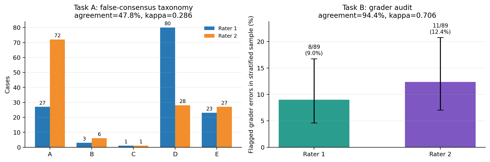{width=88%}

数据源：[Task A rater 1](../taxonomy_review_1.csv)、
[Task A rater 2](../taxonomy_review_2.csv)、
[Task B rater 1](../grader_check_review_1.csv)、
[Task B rater 2](../grader_check_review_2.csv)、
[验收 summary](../benchmark/FalseConsensus/results/human_eval/summary.json)、
[Task A 分歧表](../benchmark/FalseConsensus/results/human_eval/taxonomy_disagreements.csv)、
[Task B 分歧表](../benchmark/FalseConsensus/results/human_eval/grader_disagreements.csv)。
因此，human annotation **回收完成**；本项保留仲裁前状态以审计原始分歧。
最终 labels of record 与仲裁规则见 [A27](#app-a27)。

\newpage

## A18. Consensus window 轨迹、related-work anchors 与边际代价 {#app-a18}

本项补充 A2 的 $w=3/5/8$ window sensitivity，并把 strict consensus
扩展到 $w=2,\ldots,30$。分析复用 A1 的 2,736 条 development trajectories：
2 models × 3 benchmarks × seeds 42/43/44，dense `simple@32` 每 64 main
tokens probe。某条轨迹在**首次出现连续 $w$ 个非空、规范化等价的 probe
answers** 时停止；若始终没有满足条件，则回退到完整生成的 final answer。

所有 saving 均为 all-generated output-token saving：计入停止前的 main output
和已经消费的 probe completions，不计 prompt/prefill。`Stop accuracy` 只在实际
早停的题上计算；`Overall accuracy` 同时包含没有早停、回退到 full generation
的题。因此，增大 $w$ 时 overall accuracy 上升，既可能来自 stop 变准，也可能
只是 stop coverage 降低，不能把二者混为“早停更可靠”。

### A18.1 Problem-pooled 轨迹

Problem-pooled 让每道题等权，因此 MATH500 占较大权重。短窗口虽然极省
token，却会在大量尚未完成推理的题上提交错误答案；窗口增大后 stop accuracy
单调改善到约 85%，但 coverage 与 saving 同时下降。

| Method / w | Token saving | Stop accuracy | Stop coverage | Overall accuracy |
|---|---:|---:|---:|---:|
| Strict $w=3$ | 84.6% | 45.4% | 98.9% | 45.9% |
| Strict $w=5$ | 70.3% | 62.4% | 95.8% | 63.5% |
| Strict $w=8$ | 56.5% | 73.5% | 89.8% | 75.1% |
| Strict $w=12$ | 44.9% | 79.2% | 83.5% | 80.7% |
| Strict $w=16$ | 36.0% | 82.9% | 76.0% | 84.3% |
| Strict $w=20$ | 29.6% | 84.1% | 68.1% | 85.9% |
| Strict $w=25$ | 23.0% | 84.9% | 57.5% | 86.8% |
| Strict $w=30$ | 18.4% | 85.3% | 49.1% | 87.5% |
| TJE (frozen) | 27.1% | 78.8% | 63.9% | 82.4% |
| DEER (frozen) | 28.8% | 89.6% | 72.8% | 84.2% |

在 pooled 口径下，$w=12$ 同时比 TJE anchor 有更高 saving 和略高 stop
accuracy；$w=20$ 与 DEER 的 saving 接近，但 stop accuracy 仍低 5.5 pp。
在测试的 $w\leq30$ 范围内，没有 strict-consensus 点同时达到 DEER 的 saving
和 stop accuracy。

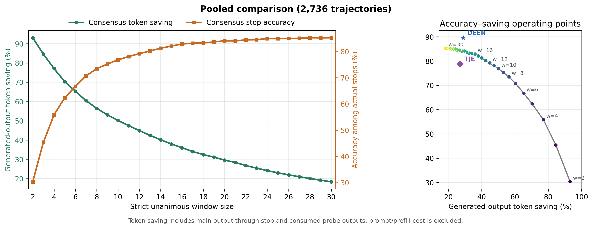{width=96%}

\newpage

### A18.2 Environment-macro 轨迹

Environment-macro 对 18 个 model × benchmark × seed cells 等权，避免
MATH500 主导结论。难度更高的 AMC23/AIME24 权重增加后，strict consensus
的绝对 stop accuracy 明显低于 pooled 结果，但“窗口增大提高可靠性、牺牲
coverage/saving”的方向保持不变。

| Method / w | Token saving | Stop accuracy | Stop coverage | Overall accuracy |
|---|---:|---:|---:|---:|
| Strict $w=3$ | 82.3% | 32.2% | 99.6% | 32.3% |
| Strict $w=5$ | 66.1% | 48.8% | 97.9% | 48.9% |
| Strict $w=8$ | 51.4% | 62.0% | 94.8% | 61.6% |
| Strict $w=12$ | 42.3% | 66.6% | 88.9% | 66.6% |
| Strict $w=16$ | 34.1% | 71.7% | 82.3% | 71.6% |
| Strict $w=20$ | 28.1% | 74.0% | 76.0% | 73.6% |
| Strict $w=25$ | 22.4% | 74.8% | 65.6% | 74.8% |
| Strict $w=30$ | 18.5% | 74.5% | 56.7% | 75.9% |
| TJE (frozen) | 32.4% | 73.0% | 60.8% | 71.0% |
| DEER (frozen) | 19.8% | 86.6% | 53.1% | 75.1% |

Macro 视图下，TJE 落在长-window consensus 轨迹附近：大约在
$w=18$ 至 $w=20$ 之间交换 accuracy 与 saving，二者没有明显的双指标支配。
DEER 则仍位于更高 stop-accuracy 区域；即使 $w=30$，strict consensus 的 stop
accuracy 仍比 DEER 低 12.2 pp。这个对比支持的不是“所有 consensus 都无用”，
而是更精确的结论：

> **短 local consensus 严重失准；提高 persistence 可把它推到 TJE-like
> trade-off，但在当前模型、数学 benchmark 和 $w\leq30$ 范围内，单靠
> answer agreement 仍未达到 DEER 的 stop safety。**

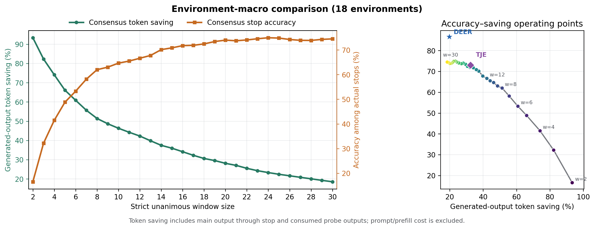{width=96%}

\newpage

### A18.3 边际性价比与推荐搜索区间

为避免只凭某一个 operating point 选 window，定义局部有限差分

$$
C(w)=
\frac{S(w-2)-S(w+2)}
     {A_{\mathrm{stop}}(w+2)-A_{\mathrm{stop}}(w-2)}.
$$

其中 $S$ 为 token-saving ratio，$A_{\mathrm{stop}}$ 为 stop accuracy。
$C(w)$ 的单位是“每提升 1 pp stop accuracy 所损失的 saving pp”；越低表示
用较少 saving 换来较多 stop-accuracy 提升。若分母不为正，则该相邻变化没有
带来可靠性提升，图中以红色叉号标记。该导数只描述**局部交换率**，不能脱离
绝对 stop accuracy、coverage 和目标安全门槛单独选策略。

| Window | Pooled $C(w)$ | Macro $C(w)$ | 解释 |
|---:|---:|---:|---|
| 4 | 0.76 | 0.88 | 边际交换率最高，但绝对 stop accuracy 过低 |
| 8 | 1.50 | 1.28 | 仍有高回报，开始进入可比较区间 |
| 12 | 2.27 | 1.62 | Pooled 已达到 TJE-like stop accuracy |
| 16 | 3.80 | 2.93 | 边际回报明显下降 |
| 20 | 4.84 | 3.18 | Macro 接近 TJE trade-off |
| 24 | 9.07 | 21.35 | 进入强烈 diminishing-return 区 |
| 28 | 13.12 | 12.42 | 极小且不稳定的 accuracy 增益 |

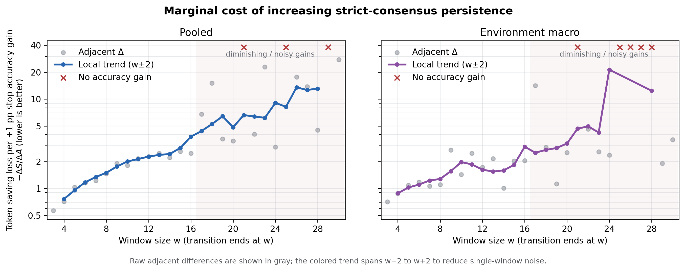{width=94%}

图中 $w>16$ 后边际代价总体上升，且 $w=21/25/29$ 等相邻变化出现
stop accuracy 不升反降，说明逐 window 点已开始受环境异质性与离散 grading
噪声影响。若扩展原 Pareto sweep，优先加入
`{8, 12, 16, 20}` 作为 `strict_unanimous_long` 的主 grid；$w=25/30$
更适合做 saturation ablation，而不是默认搜索中心。

最后，harm/rescue 与 stop accuracy 衡量不同现象。Pooled harm/rescue 从
$w=3$ 的 $1204/36=33.44$ 降至 $w=12$ 的 $262/44=5.95$，再降至
$w=30$ 的 $69/34=2.03$；DEER/TJE 分别为 4.44/5.15。长窗口可以有较低
harm/rescue，却仍有较低 stop accuracy，因为 false-stop 还包含“full generation
本来也错误”的 persistent-wrong cases。因此论文不应以 harm/rescue 代替
reference-answer stop accuracy。

数据源：[window/anchor 完整 CSV](../benchmark/FalseConsensus/report/figures/consensus_window_vs_related_work.csv)、
[边际差分 CSV](../benchmark/FalseConsensus/report/figures/consensus_window_marginal_efficiency.csv)、
[可复现绘图与聚合脚本](../benchmark/FalseConsensus/report/make_consensus_window_comparison.py)、
[related-work false-stop audit](../benchmark/FalseConsensus/results/related_work/false_stop_audit/report.md)。
Strict-consensus replay 对当前 development bank 的证据可靠性为**高**；与
DEER/TJE 的相对位置为**中**，因为两项 related-work points 是同轨迹 frozen
adaptations，而非原论文完整 online deployment。结论范围仍限于两个 7B/8B
模型、三个竞赛数学 benchmark、三 seeds 与 `simple@32` probes。

\newpage

## A19. Simple@32 与 CertaIndex@32 probe-prompt 配对消融 {#app-a19}

本实验回答一个更窄、可证伪的问题：CertaIndex probe prompt 是否通过延后首次
consensus 改善 accuracy-token trade-off。两臂共用完全相同的 frozen main
trajectory、interval 64、32-token probe cap、patience 3 与数学等价判定，唯一变化
是 probe suffix。范围为两模型 × 三 benchmark × seeds 42-47，共 36 environments、
3,420 条 paired trajectories；只报告全体汇总，不用 split 选择策略。

| Pooled metric | Simple@32 | CertaIndex@32 |
|---|---:|---:|
| Accuracy | 46.05% | 43.45% |
| Full-generation accuracy | 89.71% | 89.71% |
| Stop rate | 99.15% | 99.27% |
| Mean first-consensus position | 704 | 588 |
| Median first-consensus position | 384 | 320 |
| All-generated token saving | 79.22% | 81.47% |
| Wrong among actual stops | 54.35% | 56.88% |
| Harm / rescue | 1,535 / 42 | 1,625 / 43 |

在两臂都停止的样本中，CertaIndex 更早停止占 33.98%，更晚占 22.43%，相同占
42.43%；其平均首次 consensus **提前** 114.97 main tokens，而非延后。Paired
correctness shift 为 CertaIndex 修正 Simple 228 题、破坏 Simple 317 题。因此更
准确的结论是：在本次两种 probe prompt 下，改变 prompt 会移动停止时机，但没有
消除短 consensus 的 accuracy tax；CertaIndex 通过更早停止多省约 2.25 pp token，
同时少约 2.60 pp accuracy。

数据源：[analysis report](../benchmark/FalseConsensus/results/probe_prompt_ablation/analysis/report.md)、
[summary JSON](../benchmark/FalseConsensus/results/probe_prompt_ablation/analysis/summary.json)、
[paired rows](../benchmark/FalseConsensus/results/probe_prompt_ablation/analysis/per_problem.csv)。
该消融对“CertaIndex 是否延后 consensus”是**高可靠反证**；对“所有 prompt 均无
差异”不提供支持。

\newpage

## A20. 真实 probe cap × interval 成本消融 {#app-a20}

v2 实验对 684 条 Dev trajectories 进行真实模型 probing，而不是裁剪已有字符串。
范围为两模型 × 三 benchmark × seeds 42/43/44；cap 为 8/16/32 output tokens，
interval 为 64/128/256/512，回放 conservative、balanced 与 naive 三个冻结策略。
24,624 个 trajectory-policy cells、166,722 个 raw probes 均通过审计，cap violation
为 0。主成本为 consumed main + probe output；prompt/prefill 另列，不混入 saving。

下表固定 cap=32，数值为 18-environment macro 的 `accuracy drop / actual-net saving`：

| Policy | Int 64 | Int 128 | Int 256 | Int 512 |
|---|---:|---:|---:|---:|
| Conservative | 26.7 / 43.7% | 19.6 / 33.3% | 14.1 / 21.0% | 10.4 / 8.9% |
| Balanced | 28.4 / 46.7% | 22.1 / 41.3% | 22.0 / 33.3% | 13.8 / 19.6% |
| Naive control | 58.9 / 78.3% | 46.2 / 68.8% | 37.2 / 57.4% | 26.2 / 40.5% |

cap 8/16/32 在任一固定 policy × interval cell 的指标差异不超过约 0.02（fraction）。
原因是 152,835/166,722 probes 在达到 cap 前已遇到 stop string；缩短 cap 很少约束
输出。相反，增大 interval 减少可观察 stop positions，显著降低 accuracy drop，也
同步降低 saving。以 conservative cap-32 为例，interval 64 -> 512 时 accuracy drop
从 26.7 降至 10.4 pp，net saving 从 43.7% 降至 8.9%。

数据源：[v2 report](../benchmark/FalseConsensus/probe_cost_ablation/report_v2.md)、
[acceptance](../benchmark/FalseConsensus/probe_cost_ablation/acceptance_v2.json)、
[macro table](../benchmark/FalseConsensus/probe_cost_ablation/macro_table_v2.csv)。结论仅适用
于 generated-output accounting 与本 simple probe；没有测量 KV reuse 后的 wall time。

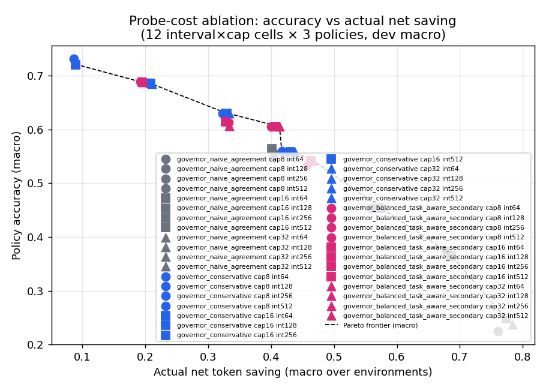{width=84%}

\newpage

## A21. DEER、TJE 与 CertaIndex 的动态 operating frontiers {#app-a21}

单个 related-work anchor 容易把“方法”与“某个阈值”混为一谈。三项新增 bank 在同一
两模型、三 benchmark、六 seeds（Train/Dev 42-44；Test 45-47）上改变各方法自身的
可调门槛，并统一用 robust math grader 与 all-generated output-token saving。

### A21.1 DEER confidence threshold（最多 30 个 Wait trials）

DEER bank 含 3,420 trajectories、45,217 trials，其中 30,436 次为新增模型调用。
这里提交第一个非空且 confidence 严格超过阈值的 trial answer，不再生成 formal
readout；无合格 trial 时回退 full answer。因此这是 DEER-style confidence 的
direct-submit frontier，不等同于 faithful DEER 的 readout 实现。

| Threshold | Full drop / saving | Test drop / saving | Test stopped accuracy |
|---:|---:|---:|---:|
| 0.950 | 2.96 / 46.22% | 2.05 / 52.68% | 94.27% |
| 0.990 | 1.10 / 39.73% | 0.15 / 46.10% | 97.19% |
| 0.995 | 0.55 / 37.10% | -0.15 / 44.13% | 97.51% |
| 0.999 | -0.04 / 32.23% | 0.00 / 37.61% | 98.11% |
| 0.99999 | -0.11 / 15.49% | 0.00 / 19.56% | 100.00% |

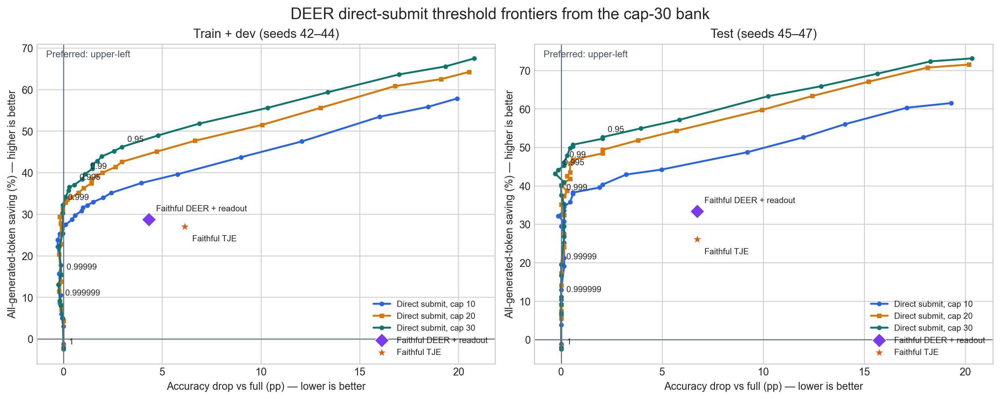{width=88%}

### A21.2 TJE confidence labels（top-1 至 top-6）

TJE bank 含 3,420 trajectories、45,819 confidence triggers 与 6,544 readouts；2,178
个 readouts 复用原结果，4,366 个新增。`top-k` 表示允许 confidence label 排名前 k
的档位触发；答案仍来自 TJE readout。下表为 model-benchmark macro：

| Split | Top-1 drop / saving | Top-2 drop / saving | Top-6 drop / saving |
|---|---:|---:|---:|
| Train | 7.34 / 31.97% | 33.22 / 66.79% | 36.96 / 69.72% |
| Dev | 9.71 / 33.52% | 43.06 / 70.24% | 47.59 / 72.11% |
| Test | 10.16 / 31.83% | 42.65 / 66.90% | 48.36 / 70.51% |

从 top-1 `Almost certain` 放宽到 top-2 `Highly likely` 即出现 accuracy cliff；top-3
至 top-6 只再增加约 0-4 pp saving，却继续降低 accuracy。该轨迹说明 TJE 的有效
低-drop operating region 高度集中在最严格 confidence 档。

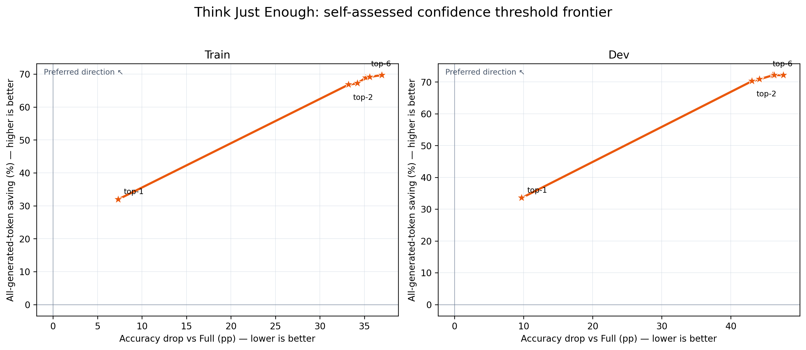{width=82%}

### A21.3 CertaIndex effort levels

CertaIndex bank 覆盖 36 environments、3,420 trajectories 与 97,313 probes；最终
audit 对 3,108 个明确 p8 stop 逐一核查，修复 3 个 timeout 后为 0 mismatch。四个
interval-64 effort points 分别是 high/p2、mid/p3、low/p5、mild/p8：

| Split | Mild p8 | Low p5 | Mid p3 | High p2 |
|---|---:|---:|---:|---:|
| Train | 18.08 / 59.43% | 30.61 / 73.44% | 49.99 / 88.53% | 59.69 / 94.57% |
| Dev | 31.55 / 53.87% | 40.72 / 67.68% | 63.00 / 83.39% | 71.02 / 94.71% |
| Test | 16.58 / 66.69% | 31.48 / 78.97% | 52.81 / 88.61% | 65.18 / 94.27% |

每格为 `accuracy drop / saving` 的 model-benchmark macro。更保守的 p8 明显改善
accuracy，但仍有两位数 drop；本 bank 不包含原作 interval-32 `crazy` 设置。

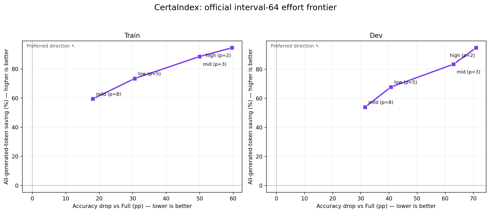{width=82%}

数据源：[DEER report](../benchmark/FalseConsensus/results/related_work/deer_confidence_bank_cap30/aggregate/report.md)、
[DEER frontier](../benchmark/FalseConsensus/results/related_work/deer_confidence_bank_cap30/aggregate/frontier.csv)、
[TJE frontier](../benchmark/FalseConsensus/results/related_work/tje_threshold_readout_bank_top1_6/aggregate/frontier.csv)、
[CertaIndex frontier](../benchmark/FalseConsensus/results/related_work/certaindex_effort_bank/aggregate/frontier.csv)。三条曲线对
“各方法内部如何随门槛变化”可靠；跨方法信号因果解释仍需任务 2 的 matched-signal 分析。

\newpage

## A22. 长 persistence 候选扩展与联合 Pareto 图 {#app-a22}

本项是明确标记的 **post-hoc sensitivity**，不修改原 17,712-rule preregistration。
对 latest-answer persistence 新增 windows 10/12/16/20/25/30，每个 window 2,592
条规则，共 15,552 条新规则、559,872 个 metric rows；合并后候选池为 33,264。
正式三目标 selector 的 frontier 从 93 增至 103，其中 18 个为新长窗口规则；原冻结
conservative、balanced、token-efficient gates 在 incremental-only 与 combined
sweep 中仍全部为 0。

| Window | Rules | New formal-frontier points | Min worst-model drop | Dev q20 saving at that point |
|---:|---:|---:|---:|---:|
| 10 | 2,592 | 3 | 8.31 pp | 7.26% |
| 12 | 2,592 | 4 | 6.93 pp | 5.78% |
| 16 | 2,592 | 4 | 4.15 pp | 3.05% |
| 20 | 2,592 | 3 | 3.81 pp | 1.09% |
| 25 | 2,592 | 1 | 3.81 pp | -1.33% |
| 30 | 2,592 | 3 | 1.96 pp | -2.11% |

下面的二维图是便于阅读的 benchmark-macro projection，不替代正式三目标 selector。
Train projection 中原/扩展 frontier 为 140/152，长窗口 entrants 28；Dev 为
116/126，entrants 44。图中还叠加 A21 的 DEER/TJE/CertaIndex 动态 frontier，
以及 A28 使用 reference labels 的不可部署 Oracle 上界（黑色星形）。

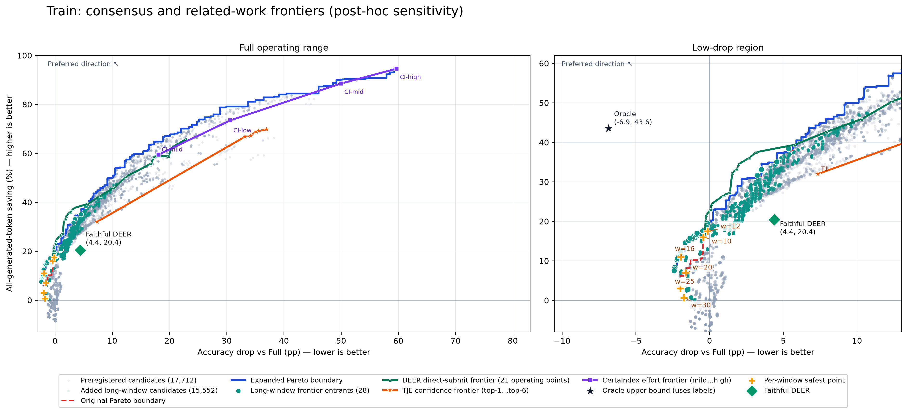{width=96%}

\newpage

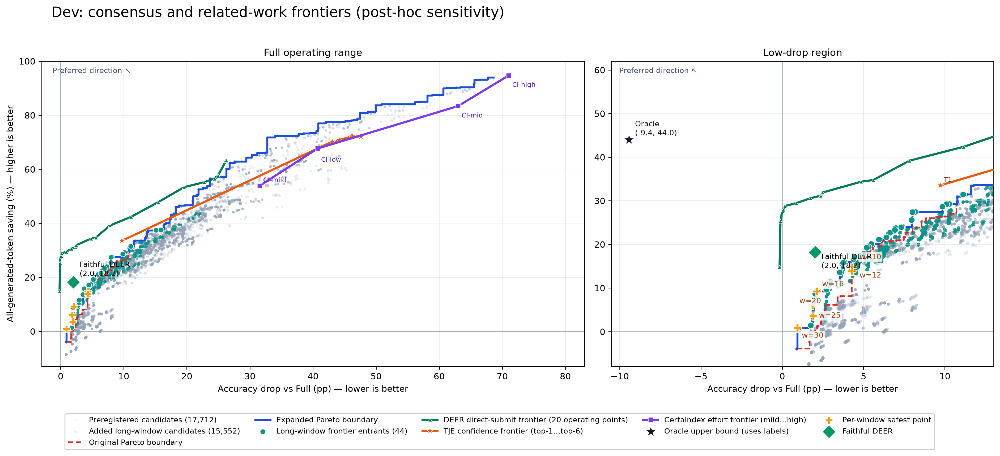{width=96%}

数据源：[sensitivity report](../benchmark/FalseConsensus/governor_v2/analysis/long_persistence_sensitivity/report.md)、
[summary](../benchmark/FalseConsensus/governor_v2/analysis/long_persistence_sensitivity/summary.json)、
[figure manifest](../benchmark/FalseConsensus/report/figures/governor_long_persistence_pareto_manifest.json)。该结果加强了
“更长 persistence 改善但不免费消除 trade-off”，不能加强成无限规则空间上的不可能性结论。

\newpage

## A23. `C_cali` 可行性、token-MAD surrogate 与 Related-work Test 完整性 {#app-a23}

### A23.1 DEER-Pro `C_cali` 可行性审计

CPU 审计覆盖 2,736 条 Train/Dev trajectories、12,024 次已有 DEER trials、1,993
次原 DEER early stops。DEER-Pro 的公式需要同一 transition 上 N=4 个不同 answer
inducers；现有日志每个 transition 最多只有 1 个，因此**不能 faithful 计算
`C_cali`**。以下仅为单次 trial 内 token probability MAD 的诊断 surrogate；拒绝后
直接回退 full，未观测后续 trial，所以 saving 是乐观上界。

| Split | MAD alpha | Accuracy drop | Accept rate | Accepted accuracy | Token saving* |
|---|---:|---:|---:|---:|---:|
| Dev | 0 | 3.65 pp | 71.05% | 88.48% | 29.37% |
| Dev | 0.5 | 3.22 pp | 65.06% | 89.89% | 24.51% |
| Dev | 1 | 2.78 pp | 60.96% | 90.41% | 22.20% |
| Train | 0 | 4.14 pp | 73.44% | 89.91% | 28.62% |
| Train | 1 | 3.17 pp | 63.45% | 91.86% | 22.61% |

结果只说明 variance penalty 使接受集合更保守、accepted accuracy 更高；它不是
DEER-Pro reproduction。数据源：[report](../benchmark/FalseConsensus/results/related_work/c_cali_retrospective/report.md)、
[manifest](../benchmark/FalseConsensus/results/related_work/c_cali_retrospective/manifest.json)。

### A23.2 Related-work Test 数据实际完整

Test 范围为两模型 × 三 benchmark × seeds 45/46/47，每方法 684 trajectories，
三个方法合计 2,052 rows、54 method-environment rows。聚合器已按 test problem counts
验证每个 group；旧 `test_aggregate/report.md` 显示 `2052/8208 incomplete` 是报告层
把 Train/Dev 的 2,736 trajectories/method 误当成 Test 期望值，并非缺数据。

| Test model-macro | CertaIndex mid | DEER faithful | TJE top-1 |
|---|---:|---:|---:|
| Qwen3-8B drop / saving | 59.83 / 91.59% | 0.33 / 21.07% | 2.94 / -0.35% |
| DeepSeek-7B drop / saving | 45.78 / 85.64% | 9.54 / 28.92% | 17.37 / 64.01% |

该表按模型内三个 benchmark 等权；saving 为 all-generated output tokens。最终论文前
report-generator 的 scope-aware header/expected count 已在 A26 修复并通过回归测试。
原始数据源：[Test aggregate](../benchmark/FalseConsensus/results/related_work/test/aggregate/aggregate.json)、
[environment table](../benchmark/FalseConsensus/results/related_work/test/aggregate/environment_split.csv)。

\newpage

## A24. Strict matched-signal CPU 对照 {#app-a24}

本实验专门避免把 trigger、candidate generation、readout 与 signal 混为一谈。
它以 DEER cap-30 bank 为统一动作空间：只在 DEER Wait 与 TJE Wait 的
`trigger_char_position` **完全相同**时保留事件；所有策略提交同一个 DEER trial
answer，使用同一 validity gate，并统一计费为停止前 main tokens 加已消费的 DEER
trial output tokens。TJE confidence query 的输出 token 不计入此处，因为本实验隔离
的是 signal，而不是复现 TJE 的部署成本。

- 3,420 条 Train/Dev/Test trajectories，45,217 个 DEER trials；
- 30,606 个 exact-position matches，占 DEER trials 的 67.69%；
- 3,315/3,420 trajectories 至少有一个 matched event；未匹配事件不插值、不前后挪动。

| Test aggregation | Signal / parameter | Accuracy drop | Saving | Stop accuracy | False-stop | Harm/rescue | Stop coverage |
|---|---|---:|---:|---:|---:|---:|---:|
| Pooled | DEER confidence 0.995 | 3.95 pp | 35.04% | 77.85% | 22.15% | 2.59 | 67.98% |
| Macro | DEER confidence 0.995 | 1.50 pp | 24.11% | 90.90% | 9.10% | 2.59 | 49.81% |
| Pooled | Persistence 8 | 0.73 pp | 12.99% | 82.68% | 17.32% | 1.71 | 18.57% |
| Macro | Persistence 8 | 0.28 pp | 11.21% | 77.71% | 22.29% | 1.71 | 20.35% |
| Pooled | Persistence 12 | 0.58 pp | 5.99% | 86.84% | 13.16% | 2.00 | 11.11% |
| Macro | Persistence 12 | 0.22 pp | 4.20% | 85.74% | 14.26% | 2.00 | 10.67% |

DEER confidence 在 matched bank 上不是对所有 persistence 点的双指标支配：更严格
persistence 可取得更小 accuracy drop；confidence 的价值是以约 1-1.5 pp macro drop
换取明显更高 coverage 和 saving。TJE 的 matched top-k 曲线受 exact-position 子集和
label 分布限制，不能替代 A21 的完整 TJE frontier。

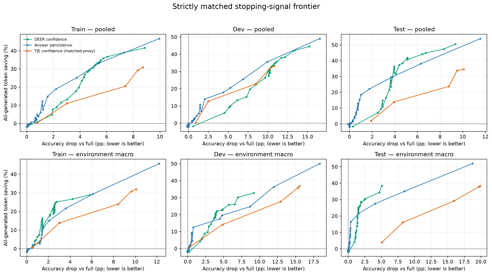{width=88%}

数据源：[完整 frontier](../benchmark/FalseConsensus/results/related_work/matched_signal_cpu/frontier.csv)、
[逐组指标](../benchmark/FalseConsensus/results/related_work/matched_signal_cpu/grouped_metrics.csv)、
[匹配与计费 manifest](../benchmark/FalseConsensus/results/related_work/matched_signal_cpu/manifest.json)、
[报告](../benchmark/FalseConsensus/results/related_work/matched_signal_cpu/report.md)。本项对
“在共同 bank 上 signal 的相对 trade-off”可靠性为**高**；对原论文端到端方法排名为**中**。

\newpage

## A25. 33,264-rule 冻结选择与 held-out Test {#app-a25}

候选池由 17,712 个预注册规则和 15,552 个 post-hoc long-persistence sensitivity
规则组成。冻结程序先读取且只读取 Train/Dev sweep，写出规则 ID、完整规则 JSON、
全部输入 SHA-256 与 `test_data_read=false`；随后独立命令验证这些 hashes，才读取
seeds 45/46/47 的 Test。共同过滤器要求 latest-answer persistence、Dev q20 saving
为正、36 个 Train/Dev cells 中至少 80% 正节省，并在冻结目标上非支配。

| Frozen profile | Persistence / interval | Test pooled drop / saving | Test macro drop / saving | Pooled false-stop | Pooled harm/rescue |
|---|---:|---:|---:|---:|---:|
| Safe | 20 / 256 | -0.15 pp / 6.20% | 0.18 pp / 6.19% | 17.39% | 0.80 |
| Balanced knee | 16 / 128 | 0.73 pp / 18.96% | 0.51 pp / 17.12% | 20.16% | 1.83 |
| Token-efficient | 8 / 128 | 2.49 pp / 24.15% | 1.18 pp / 21.32% | 23.57% | 4.40 |

三点覆盖 684 条 Test trajectories，逐题输出共 2,052 rows，18 个 Test environments
× 3 rules 均完整。Safe 与 Balanced 来自 post-hoc long-window pool；Token-efficient
来自预注册 pool。它们是透明的代表 operating points，不是“原 conservative gate
成功”：原 gate 在预注册和扩展 pool 中仍为空。

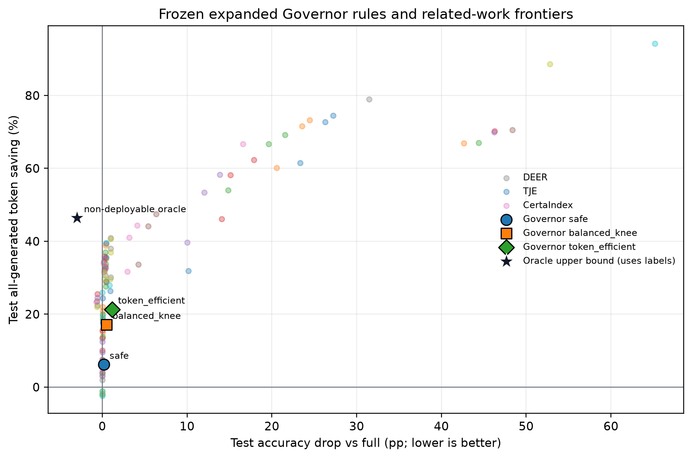{width=84%}

数据源：[冻结 manifest](../benchmark/FalseConsensus/results/governor_v2/extended_frozen_selection/selection_manifest.json)、
[评估 manifest](../benchmark/FalseConsensus/results/governor_v2/extended_frozen_selection/evaluated_manifest.json)、
[Test summary](../benchmark/FalseConsensus/results/governor_v2/extended_frozen_selection/test_summary.csv)、
[报告](../benchmark/FalseConsensus/results/governor_v2/extended_frozen_selection/report.md)。

\newpage

## A26. Related-work held-out Test 统一报告 {#app-a26}

旧报告错误地把每方法 Train/Dev 的 2,736 条期望数用于 Test，因而把实际完整的
2,052 rows 显示为 incomplete。修复后的 aggregator/report generator 自动识别
Test-only scope，期望每方法 684 trajectories，并保留 10,000 次 paired hierarchical
bootstrap。覆盖为 3 方法 × 18 environments × 各环境题数，合计 54 method-environments、
2,052 rows；seeds 为 45/46/47。

| Test model-macro | CertaIndex mid | DEER faithful | TJE frozen |
|---|---:|---:|---:|
| Qwen3-8B drop / saving | 59.83 / 91.59% | 0.33 / 21.07% | 2.94 / -0.35% |
| DeepSeek-7B drop / saving | 45.78 / 85.64% | 9.54 / 28.92% | 17.37 / 64.01% |

上述 saving 均为 main-through-stop 加 probe/trial/readout output 的 all-generated
token saving；prompt/prefill 单列而不进入 numerator。DEER 在 Qwen3 上近中性，
但在 DeepSeek 上掉 9.54 pp；因此任何“DEER 普遍接近无损”的 claim 都不成立。
CertaIndex 极高 saving 来自几乎总是很早停止，同时伴随 45-60 pp accuracy drop。

数据源：[完整 Test 报告](../benchmark/FalseConsensus/results/related_work/test/aggregate/report.md)、
[aggregate JSON](../benchmark/FalseConsensus/results/related_work/test/aggregate/aggregate.json)、
[environment table](../benchmark/FalseConsensus/results/related_work/test/aggregate/environment_split.csv)、
[回归测试](../benchmark/FalseConsensus/related_work/tests/test_postprocess.py)。

\newpage

## A27. Human-evaluation 最终仲裁层 {#app-a27}

原始四份 rater CSV 与两个 HTML 均未修改；仲裁输出位于独立 derivative 目录，并记录
source SHA-256。Task A 的 61 个 A/D 冲突按项目操作定义归为 D：中间量、placeholder
或尚未形成最终候选答案的早停错误属于 reasoning gap；其余 9 个冲突逐条裁定。

| Task A final label | A Numeric | B Expression | C Sign | D Reasoning gap | E Format |
|---|---:|---:|---:|---:|---:|
| Count / 134 | 24 (17.91%) | 2 (1.49%) | 1 (0.75%) | 82 (61.19%) | 25 (18.66%) |

Task B 的 5 个 true-verdict 冲突逐条核对后，labels of record 中 8/89 为 grader
error，即 risk-enriched audit sample 内 8.99%，Wilson 95% CI [4.63%, 16.75%]。
该样本故意过采样等价表达和近似答案，不能外推为总体 grader error rate。

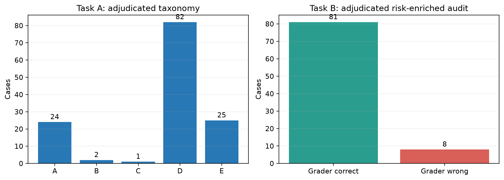{width=78%}

原始 Task A 一致率仍为 47.76%、kappa=0.286；Task B 为 94.38%、kappa=0.706。
仲裁产生最终标签，但不会倒推提高 inter-rater reliability。数据源：
[summary](../benchmark/FalseConsensus/results/human_eval/adjudicated/summary.json)、
[Task A adjudicated CSV](../benchmark/FalseConsensus/results/human_eval/adjudicated/taxonomy_adjudicated.csv)、
[Task B adjudicated CSV](../benchmark/FalseConsensus/results/human_eval/adjudicated/grader_adjudicated.csv)、
[报告](../benchmark/FalseConsensus/results/human_eval/adjudicated/report.md)。

\newpage

## A28. interval-64 simple@32 不可部署 Oracle 上界 {#app-a28}

Oracle 在每条冻结 probe sequence 中扫描第一个**非空、schema-valid 且 reference-correct**
的 simple@32 answer；找到即提交，否则回退观察到的 full trajectory。计费包含停止前
main decode 与截至停止的 probe output；回退则包含 full main 与全部 dense probe
outputs。Full strict accuracy 要求 natural completion 且 final answer 正确；另保留
capped-but-answer-correct 的 observed sensitivity column。

| Scope | n | Full strict acc. | Oracle strict acc. | Correct-probe coverage | Micro saving |
|---|---:|---:|---:|---:|---:|
| Train | 2,052 | 74.95% | 79.24% | 76.66% | 45.94% |
| Dev | 684 | 77.19% | 82.16% | 79.09% | 43.63% |
| Test | 684 | 80.70% | 82.89% | 79.68% | 52.46% |
| All | 3,420 | 76.55% | 80.56% | 77.75% | 46.70% |

| Axis | n | Full strict acc. | Oracle strict acc. | Micro saving |
|---|---:|---:|---:|---:|
| Qwen3-8B | 1,710 | 77.49% | 81.52% | 52.21% |
| DeepSeek-7B | 1,710 | 75.61% | 79.59% | 39.54% |
| MATH500 | 3,000 | 76.70% | 80.10% | 49.13% |
| AMC23 | 240 | 84.58% | 93.75% | 61.90% |
| AIME24 | 180 | 63.33% | 70.56% | 22.83% |

在 2,659 条能找到正确 probe 的轨迹中，首次正确位置的 P25/median/P75 为
64/512/1,216 main tokens，均值 1,236；22.25% 的轨迹没有合法正确 probe，使用
full fallback。逐 seed、逐 environment 与 environment-macro 分解均保存在结构化表中。

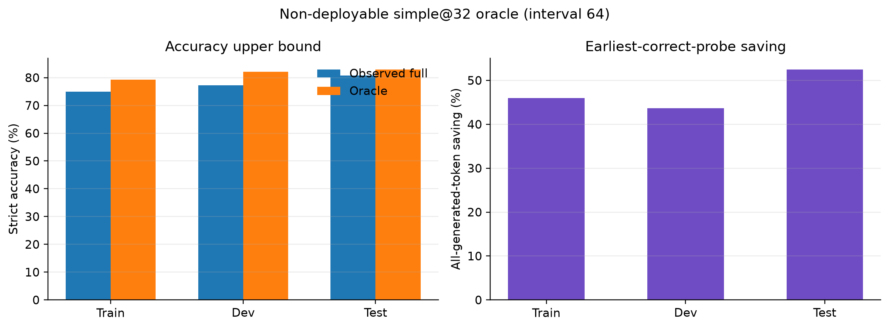{width=80%}

Oracle 在更新后的 A22 Train/Dev Pareto 与 A25 Test 图中均以黑星标出。其负 accuracy
drop（比 full 更准）来自标签选择：Oracle 可从最终错误轨迹中挑出中途正确答案。
因此它证明 dense probe bank 中存在可利用信息，也量化了实际 Governor 与信息上界的
差距；它**不是策略**、不得参与筛选，也不能被写成可实现性能。

数据源：[逐题结果](../benchmark/FalseConsensus/results/governor_v2/simple32_oracle/per_problem.csv)、
[environment table](../benchmark/FalseConsensus/results/governor_v2/simple32_oracle/per_environment.csv)、
[summary](../benchmark/FalseConsensus/results/governor_v2/simple32_oracle/summary.csv)、
[macro summary](../benchmark/FalseConsensus/results/governor_v2/simple32_oracle/macro_summary.csv)、
[防泄漏与计费 manifest](../benchmark/FalseConsensus/results/governor_v2/simple32_oracle/manifest.json)。
